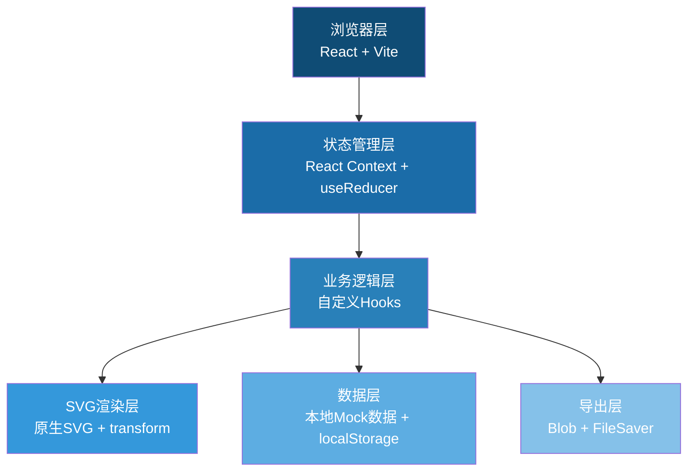

## 1. 架构设计



## 2. 技术描述

- **前端框架**: React@18 + TypeScript + Vite@5
- **样式方案**: TailwindCSS@3 + CSS Variables 主题系统
- **交互实现**: 原生SVG事件 + 自定义变换矩阵
- **状态管理**: React Context + useReducer 统一状态
- **数据持久化**: localStorage 存储处理记录（用于演示"上次运行"对比）
- **导出功能**: 原生 Blob API 生成 CSV/JSON，文件名带 ISO 时间戳
- **图标**: Lucide React 图标库
- **字体**: Google Fonts 在线加载 ZCOOL QingKe HuangYou + Noto Sans SC

## 3. 数据模型

### 3.1 核心类型定义

```typescript
// 展缸数据
interface Tank {
  id: string;
  name: string;
  x: number;
  y: number;
  width: number;
  height: number;
  status: 'normal' | 'warning' | 'error' | 'recovered';
  remark?: string;
  source: 'original' | 'supplement' | 'corrected';
  unit?: string;
  missingUnit?: boolean;
}

// 操作记录（缩放/平移/吸附共用）
interface ActionRecord {
  id: string;
  timestamp: number;
  type: 'zoom' | 'pan' | 'snap' | 'tank-move' | 'scale-change' | 'recovery';
  description: string;
  beforeValue: any;
  afterValue: any;
  operator: string;
  isError?: boolean;
  relatedTankId?: string;
}

// 颜色规则
interface ColorRule {
  status: string;
  color: string;
  label: string;
  description: string;
  handling: string;
}

// 画布状态
interface CanvasState {
  scale: number;
  scaleRatio: string; // "1:100"
  offsetX: number;
  offsetY: number;
  gridSize: number;
  snapEnabled: boolean;
  tanks: Tank[];
  records: ActionRecord[];
  selectedTankId: string | null;
  sessionId: string;
  sessionStartTime: number;
}
```

### 3.2 Mock 样例数据

```typescript
// 样例1：海洋馆二楼旧表（含补录、漏填单位）
const sampleTanksOld: Tank[] = [
  {
    id: 't1',
    name: '热带观赏鱼展缸',
    x: 100, y: 100, width: 200, height: 150,
    status: 'normal',
    source: 'original',
    unit: 'cm'
  },
  {
    id: 't2',
    name: '水母展示缸',
    x: 350, y: 120, width: 180, height: 180,
    status: 'warning',
    source: 'supplement',
    remark: '2024.03.15 补录，原表缺失',
    unit: 'cm'
  },
  {
    id: 't3',
    name: '珊瑚礁生态缸',
    x: 150, y: 300, width: 250, height: 120,
    status: 'error',
    source: 'original',
    missingUnit: true,
    remark: '漏填单位'
  }
];
```

## 4. 核心模块设计

### 4.1 画布变换系统 (useCanvasTransform)
- 统一管理 scale、offsetX、offsetY
- 所有操作（缩放、平移、拖拽）先写入记录再更新状态
- 提供世界坐标 ↔ 屏幕坐标转换函数

### 4.2 网格吸附系统 (useGridSnap)
- 可开关的吸附功能
- 吸附前/后坐标记录到 ActionRecord
- 吸附精度可配置（默认20px）

### 4.3 处理记录系统 (useActionRecords)
- 单例模式，所有模块共用同一记录数组
- 记录包含时间戳、操作类型、前后值、操作人
- 支持按异常快速筛选

### 4.4 颜色规则系统 (useColorRules)
- 集中定义状态→颜色映射
- 每个状态附带"处理意见"字段
- 异常追溯时可直接查看对应规则

### 4.5 导出系统 (useExport)
- 文件名格式：`水族馆展缸排布_${sessionId}_${YYYYMMDD_HHMMSS}.csv`
- 内容包含：展缸数据 + 处理记录摘要 + 颜色规则说明
- 离线素材缺失原因用自然语言描述，避免字段名

## 5. 路由定义

| 路由 | 用途 |
|------|------|
| / | 主页面，包含完整画布和所有面板 |

（单页应用，无额外路由）

## 6. 关键技术点

1. **SVG 缩放平移共用矩阵**：所有变换通过同一 transform 矩阵，确保记录一致
2. **时间戳会话标识**：每次刷新生成新 sessionId，localStorage 保存最近3次会话用于对比
3. **异常追溯链路**：异常记录 → 关联展缸 → 颜色规则 → 处理意见，一键跳转
4. **友好导出文案**：如将 `missingUnit: true` 转为 "该展缸数据未标注长度单位，请核实原始测量记录"
