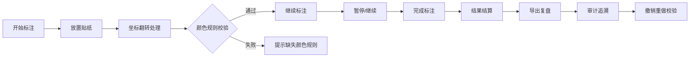
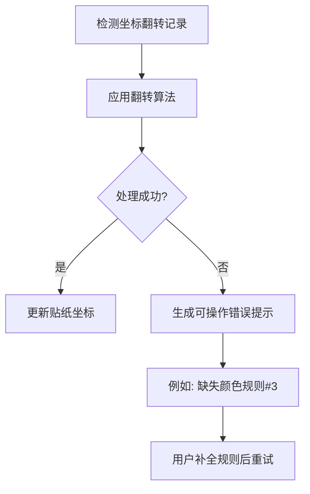
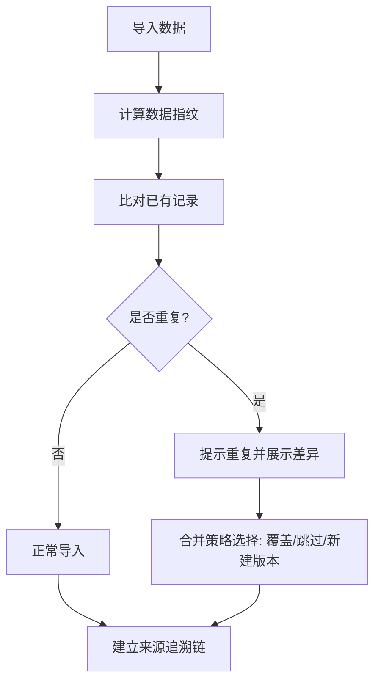

## 1. 产品概述
实验室危化品贴纸图管理系统，将传统依赖经验的贴纸标注流程数字化，支持游戏化操作、全程可追溯、结果可审计。解决标注草稿补录后变更追踪困难、坐标翻转处理不透明、重复导入数据混乱等核心痛点。

## 2. 核心功能

### 2.1 用户角色
| 角色 | 登录方式 | 核心权限 |
|------|----------|----------|
| 车间主管 | 本地访问 | 标注操作、导入导出、复盘查看、撤销重做 |
| 评审老师 | 本地访问 | 结果审计、追溯来源、导出报告 |

### 2.2 功能模块
1. **主操作页面**：贴纸标注画布、游戏化控制栏（开始/暂停/重开）
2. **结算与复盘页面**：结果展示、导出功能、历史记录
3. **审计追溯页面**：坐标翻转记录倒查、处理日志查看
4. **数据管理**：导入补录、去重校验、版本管理

### 2.3 页面详情
| 页面名称 | 模块名称 | 功能描述 |
|----------|----------|----------|
| 主操作页面 | 游戏控制栏 | 开始标注、暂停标注、重新开始、当前进度显示 |
| 主操作页面 | 贴纸标注画布 | 拖拽放置危化品贴纸、坐标翻转处理、颜色规则校验 |
| 结算与复盘页面 | 结果结算 | 标注完成度统计、错误列表、通过/待确认状态展示 |
| 结算与复盘页面 | 导出复盘 | 导出PDF报告、导出JSON数据、界面摘要与导出内容一致性校验 |
| 审计追溯页面 | 记录追溯 | 从结果回溯到来源数据、处理日志完整链条展示 |
| 审计追溯页面 | 撤销重做 | 操作历史时间线、版本对比、回滚指定版本 |
| 数据管理 | 导入补录 | 数据导入、重复检测、合并策略选择 |

## 3. 核心流程

### 3.1 坐标翻转处理流程

### 3.2 重复导入防混乱流程

## 4. 用户界面设计

### 4.1 设计风格
- 主色调：工业蓝 (#165DFF) + 安全警示橙 (#FF7D00) + 危险红 (#F53F3F)
- 按钮风格：圆角矩形，带有微妙阴影，悬停时轻微上浮效果
- 字体：标题使用 Noto Sans SC Bold，正文使用 Noto Sans SC Regular
- 布局风格：卡片式布局，左侧操作区 + 右侧信息面板
- 图标风格：线性图标，配合微动画反馈

### 4.2 页面设计概览
| 页面名称 | 模块名称 | UI元素 |
|----------|----------|--------|
| 主操作页面 | 游戏控制栏 | 大按钮组、进度条、时间计时器、状态指示灯 |
| 主操作页面 | 贴纸画布 | 网格背景、可拖拽贴纸元素、坐标提示、翻转动画 |
| 结算与复盘页面 | 结果面板 | 统计卡片、状态标签、通过/待确认颜色区分 |
| 结算与复盘页面 | 导出区域 | 格式选择器、预览窗口、一致性校验指示器 |
| 审计追溯页面 | 时间线 | 垂直时间线、可展开详情、来源链接 |
| 数据管理 | 导入界面 | 拖拽上传区、重复检测动画、合并策略单选框 |

### 4.3 响应式
- 桌面端优先（1920×1080），支持平板适配
- 触摸优化：贴纸拖拽区域增大，按钮最小尺寸48px
- 画布自适应缩放，保持网格比例不变

### 4.4 视觉体验
- 背景：轻微噪点纹理的深蓝色渐变，营造实验室专业感
- 卡片：毛玻璃效果（backdrop-filter），边框微光
- 动画：贴纸翻转3D效果、状态切换平滑过渡、操作成功微振动反馈
- 错误提示：人性化语言，明确指出缺失项和修复路径
