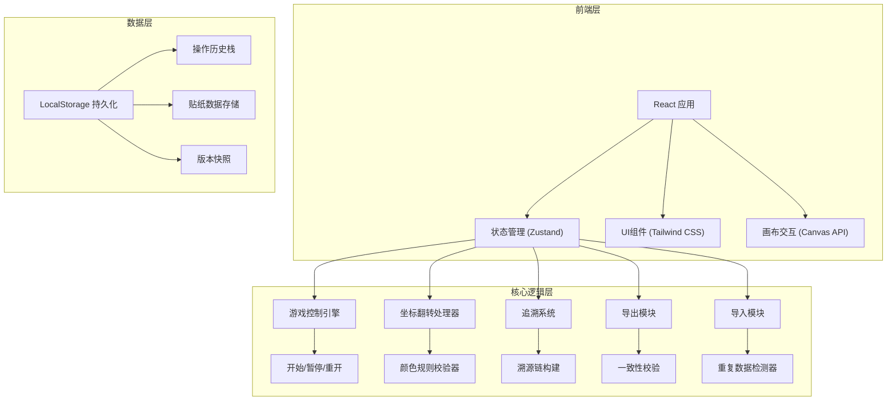

## 1. 架构设计



## 2. 技术描述
- 前端框架: React@18 + TypeScript
- 构建工具: Vite@5
- 样式方案: Tailwind CSS@3
- 状态管理: Zustand
- 图标库: Lucide React
- 数据持久化: LocalStorage + IndexedDB
- 导出格式: JSON / PDF (jsPDF)

## 3. 路由定义
| 路由 | 页面名称 | 用途 |
|------|----------|------|
| / | 主操作页面 | 贴纸标注、游戏控制 |
| /settlement | 结算与复盘 | 结果展示、导出功能 |
| /audit | 审计追溯 | 记录倒查、撤销重做 |
| /import | 数据导入 | 补录数据、去重处理 |

## 4. 核心数据模型

### 4.1 贴纸数据模型
```typescript
interface Sticker {
  id: string;
  type: 'acid' | 'flammable' | 'toxic' | 'oxidizer' | 'corrosive';
  label: string;
  color: string;
  x: number;
  y: number;
  flipped: boolean;
  originalX: number;
  originalY: number;
  createdAt: number;
  updatedAt: number;
  sourceId?: string;
}
```

### 4.2 操作记录模型
```typescript
interface ActionLog {
  id: string;
  type: 'create' | 'move' | 'flip' | 'delete' | 'import';
  stickerId: string;
  before: Partial<Sticker>;
  after: Partial<Sticker>;
  timestamp: number;
  operator: string;
  source?: string;
}
```

### 4.3 颜色规则模型
```typescript
interface ColorRule {
  id: string;
  stickerType: string;
  requiredColors: string[];
  flipColorMap?: Record<string, string>;
}
```

### 4.4 追溯链模型
```typescript
interface TraceChain {
  resultId: string;
  steps: {
    actionId: string;
    description: string;
    timestamp: number;
  }[];
  sourceData: Record<string, unknown>;
}
```

## 5. 核心模块设计

### 5.1 游戏控制引擎
```typescript
interface GameState {
  status: 'idle' | 'playing' | 'paused' | 'finished';
  startTime: number | null;
  elapsedTime: number;
  progress: number;
  totalStickers: number;
  placedStickers: number;
}
```

### 5.2 撤销重做管理器
```typescript
interface HistoryManager {
  undoStack: ActionLog[][];
  redoStack: ActionLog[][];
  push(actions: ActionLog[]): void;
  undo(): ActionLog[] | null;
  redo(): ActionLog[] | null;
  canUndo(): boolean;
  canRedo(): boolean;
}
```

### 5.3 一致性校验器
```typescript
interface ConsistencyChecker {
  checkUISummaryMatchesExport(): boolean;
  getInconsistencies(): { field: string; uiValue: string; exportValue: string }[];
}
```

## 6. 状态管理切片

```typescript
interface AppState {
  // 游戏状态
  game: GameState;
  
  // 贴纸数据
  stickers: Sticker[];
  
  // 操作历史
  history: HistoryManager;
  
  // 当前错误
  errors: {
    type: 'flip_error' | 'color_missing' | 'duplicate';
    message: string;
    actionable: string;
  }[];
  
  // 颜色规则
  colorRules: ColorRule[];
}
```
