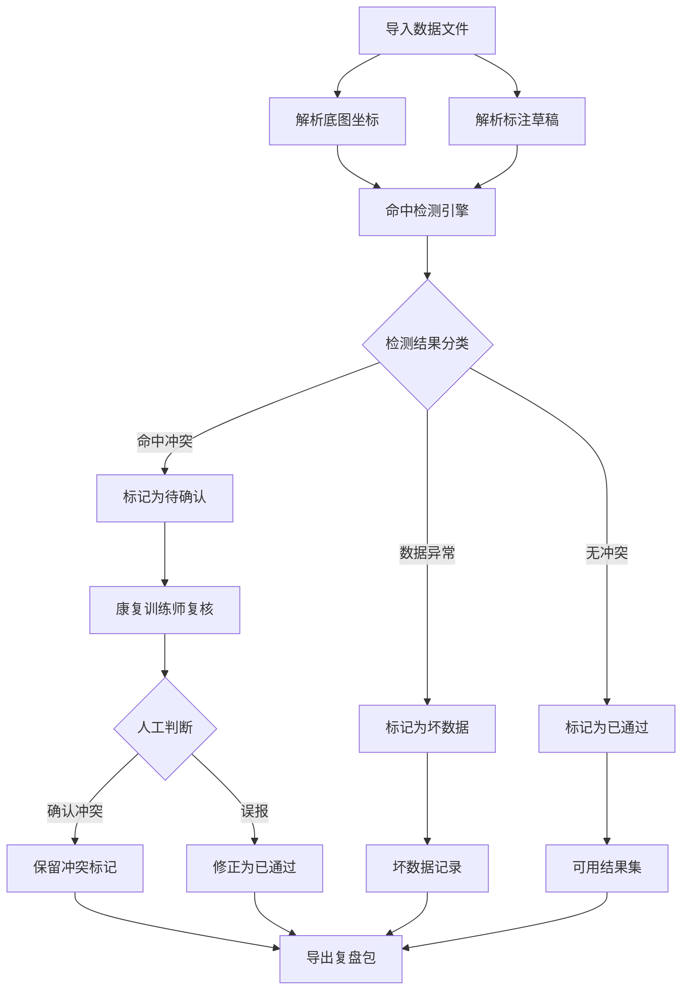

# 农田地块边界修补看板 - 产品需求文档

## 1. 产品概述

针对农田地块边界修补数据处理场景，提供可视化的命中检测看板，支持导入底图坐标与标注草稿数据，自动识别冲突并标记需要人工复核的记录。核心用户为康复训练师（复核人员）和学生（结果接收者），通过统一的看板界面完成数据解释、导出复盘和质量把控。

核心价值：统一数据来源，图表、明细、下载三合一，确保复核结论可追溯至原始记录。

## 2. 核心功能

### 2.1 用户角色

| 角色 | 使用场景 | 核心权限 |
|------|----------|----------|
| 康复训练师（复核人员） | 导入数据、复核冲突、导出报告 | 全部功能，含人工确认权限 |
| 学生（结果接收者） | 查看结果、下载数据 | 仅查看和下载，不可修改 |

### 2.2 功能模块

1. **数据导入模块**：支持 CSV/Excel 导入底图坐标和标注草稿数据
2. **命中检测模块**：自动比对底图坐标与标注草稿，识别边界冲突
3. **看板视图模块**：图表展示命中统计、状态分布、数据质量
4. **明细审查模块**：列表展示所有记录，支持按状态筛选和原始行号跳转
5. **导出复盘模块**：导出处理结果、复核报告、数据溯源信息

## 3. 核心流程

### 3.1 数据处理主流程

### 3.2 数据溯源流程

## 4. 用户界面设计

### 4.1 设计风格

- **主题色**：深青绿 #0D9488（代表农田、自然）、浅灰白 #F8FAFC
- **强调色**：
  - 成功 #22C55E
  - 警告 #F59E0B
  - 错误 #EF4444
  - 待确认 #3B82F6
- **字体**：
  - 标题：思源黑体 Bold / Noto Sans SC Bold
  - 正文：思源黑体 Regular / Noto Sans SC Regular
  - 数据：JetBrains Mono（等宽，便于对齐行号）
- **布局风格**：左侧导航 + 右侧内容区的看板布局，卡片式展示统计数据
- **图标风格**：Lucide Icons，线性风格

### 4.2 页面结构

| 页面 | 模块名称 | UI 元素说明 |
|------|----------|-------------|
| 看板首页 | 统计卡片区 | 总记录数、已通过、待确认、坏数据 四张卡片，带图标 |
| 看板首页 | 图表区 | 饼图展示状态分布、柱状图展示每日处理量 |
| 明细页面 | 数据表格 | 可排序/筛选，显示原始行号、图片名、来源备注、状态标签 |
| 明细页面 | 操作区 | 筛选下拉、搜索框、导出按钮 |
| 详情弹窗 | 记录详情 | 显示完整字段、原始数据、冲突原因说明 |
| 导出页面 | 导出配置 | 选择导出内容（原始数据/处理结果/复核报告）、格式选择 |

### 4.3 响应式策略

- 桌面端优先（1024px 以上）
- 平板适配（768px - 1023px）：导航收起为侧边栏
- 移动端降级（< 768px）：单列布局，表格横向滚动

### 4.4 特殊交互

- **行号点击**：点击原始行号高亮并滚动到对应记录
- **状态标签**：待确认记录显示蓝色脉冲动画，吸引注意
- **数据质量指示器**：坏数据行显示红色警示条
- **图表联动**：点击图表扇形区块筛选对应状态记录

## 5. 样例数据结构

### 5.1 样例数据文件

提供 `sample-data/` 目录，包含：

1. **顺利记录**（已通过）：3 条完整匹配的边界数据
2. **待确认记录**：2 条存在轻微偏差需人工判断的数据
3. **明显坏数据**：1 条坐标缺失、1 条格式错误的异常数据

### 5.2 数据字段规范

| 字段名 | 类型 | 说明 | 示例 |
|--------|------|------|------|
| row_id | integer | 原始行号 | 1, 2, 3... |
| image_name | string | 关联图片文件名 | farmland_001.jpg |
| base_map_x | float | 底图 X 坐标 | 120.5432 |
| base_map_y | float | 底图 Y 坐标 | 30.1234 |
| draft_x | float | 标注草稿 X 坐标 | 120.5435 |
| draft_y | float | 标注草稿 Y 坐标 | 30.1236 |
| deviation | float | 坐标偏差距离（米） | 0.05 |
| status | enum | 状态：passed/pending/failed | passed |
| source_note | string | 来源备注 | 2024年测量数据 |
| reviewer_action | string | 复核操作（可空） | 确认保留 |

## 6. 验收标准

### 6.1 功能验收

- [ ] 可导入 CSV/Excel 格式的底图坐标和标注草稿数据
- [ ] 自动计算坐标偏差并分类为已通过/待确认/坏数据
- [ ] 看板图表与明细表格数据同源，切换筛选时保持一致
- [ ] 点击原始行号可定位到对应明细记录
- [ ] 支持导出处理结果（CSV）和复核报告（PDF）
- [ ] 原始行号、图片名、来源备注完整保留

### 6.2 用户体验验收

- [ ] 学生可一眼区分可用结果（绿色已通过）和待复核结果（蓝色待确认）
- [ ] 坏数据行有明确视觉警示（红色警示条）
- [ ] 页面加载时间 < 2 秒（1000 条记录以内）

### 6.3 文档验收

- [ ] README 包含完整的依赖安装命令
- [ ] README 说明样例数据文件位置
- [ ] 启动命令简明：单条 npm 命令即可运行
