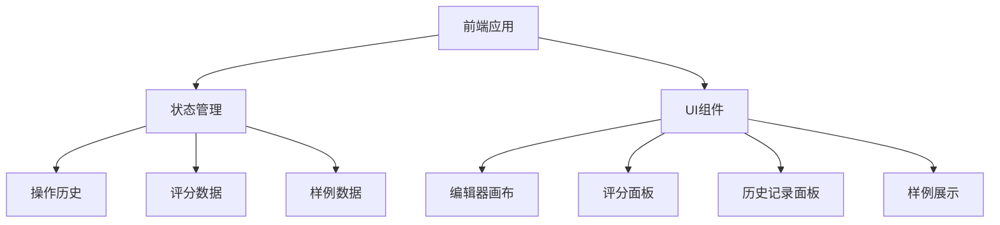
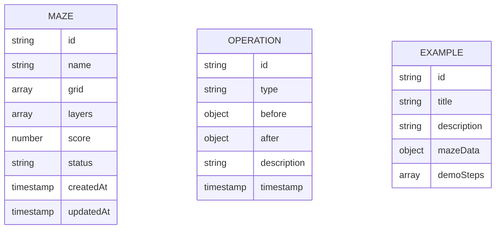

## 1. 架构设计

## 2. 技术描述
- 前端：React@18 + TypeScript + tailwindcss@3 + vite
- 初始化工具：vite-init
- 后端：无（纯前端应用）
- 数据库：LocalStorage（本地存储）
- 状态管理：React useState + useReducer

## 3. 路由定义
| 路由 | 用途 |
|------|------|
| / | 主编辑器界面 |
| /examples | 样例演示页面 |

## 4. API 定义
无后端API

## 5. 服务架构图
不适用（无后端）

## 6. 数据模型

### 6.1 数据模型定义

### 6.2 数据定义语言
使用 LocalStorage 存储，无需 DDL
