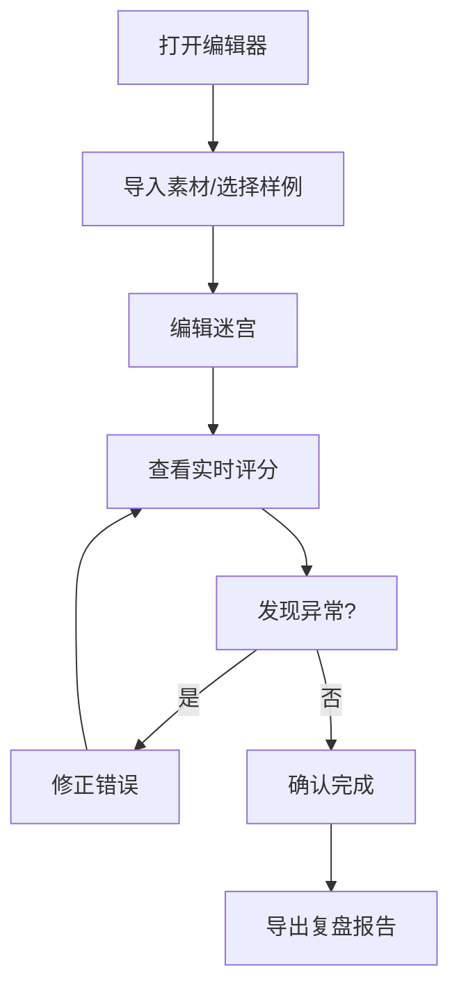

## 1. 产品概述
儿童编程迷宫编辑器是一个面向儿童编程教育的可视化迷宫创作和评分工具，支持素材导入、错误修正、评分导出等功能。
- 帮助儿童创作编程迷宫，自动评分并记录操作历史
- 目标用户为编程教师和儿童学习者

## 2. 核心功能

### 2.1 用户角色
| 角色 | 注册方式 | 核心权限 |
|------|----------|----------|
| 教师 | 无需注册 | 创建迷宫、导入素材、评分、导出复盘 |
| 学生 | 无需注册 | 浏览迷宫、尝试编程、查看评分 |

### 2.2 功能模块
1. **迷宫编辑器**：画布编辑、图层管理、素材导入
2. **评分系统**：自动评分、异常标注、评分历史
3. **操作历史**：导入/修正/确认记录、时间线展示
4. **样例演示**：预设样例、错误操作演示、恢复过程
5. **导出功能**：生成适合非技术人员阅读的报告

### 2.3 页面详情
| 页面名称 | 模块名称 | 功能描述 |
|----------|----------|----------|
| 主界面 | 导航栏 | 功能切换、帮助、导出 |
| 主界面 | 编辑器画布 | 拖拽编辑、图层叠加、素材放置 |
| 主界面 | 评分面板 | 实时评分、异常提示、修正建议 |
| 主界面 | 历史记录 | 操作时间线、状态对比、恢复功能 |
| 样例页 | 样例列表 | 预设日常场景样例展示 |
| 样例页 | 演示流程 | 错误操作演示、恢复步骤 |

## 3. 核心流程
用户打开编辑器 → 导入素材或选择样例 → 编辑迷宫 → 查看实时评分 → 修正错误 → 确认完成 → 导出复盘报告

## 4. 用户界面设计
### 4.1 设计风格
- 主色调：明亮的蓝色和绿色（适合儿童）
- 按钮风格：圆润立体，带轻微阴影
- 字体：Comic Sans MS 或类似友好字体
- 布局：卡片式布局，分区清晰
- 图标：卡通风格emoji

### 4.2 页面设计概述
| 页面名称 | 模块名称 | UI元素 |
|----------|----------|--------|
| 主界面 | 编辑器画布 | 网格背景、彩色方块、拖拽动画 |
| 主界面 | 评分面板 | 进度条、颜色标记、友好提示文字 |
| 主界面 | 历史记录 | 时间线设计、前后对比卡片 |
| 样例页 | 样例列表 | 缩略图卡片、场景描述 |

### 4.3 响应性
桌面端优先，平板适配，触屏优化

### 4.4 3D场景指引
不适用
