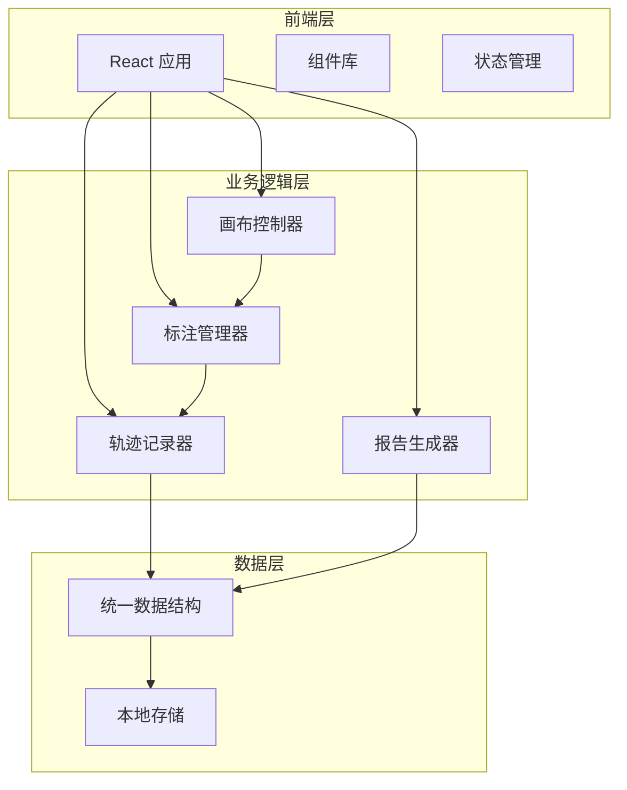
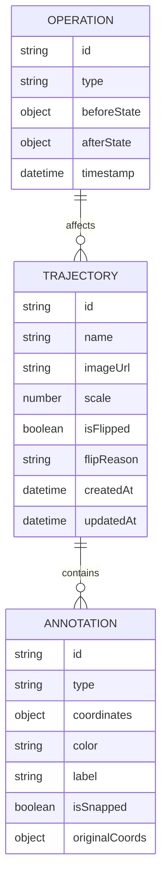

## 1. 架构设计



## 2. 技术描述

- **前端框架**：React@18 + TypeScript
- **构建工具**：Vite
- **样式方案**：Tailwind CSS
- **画布库**：Konva.js（用于医学影像和标注绘制）
- **状态管理**：React Context API + useReducer
- **数据格式**：JSON（统一轨迹记录格式）

## 3. 路由定义

| 路由 | 用途 |
|------|------|
| / | 病灶描绘工作台（主页面） |
| /report | 报告预览页面 |

## 4. 数据模型

### 4.1 数据模型定义



### 4.2 核心数据结构

```typescript
// 统一轨迹记录
interface TrajectoryRecord {
  id: string;
  name: string;
  imageUrl: string;
  scale: number; // 比例尺（像素/毫米）
  scaleUnit: string;
  isFlipped: boolean;
  flipReason?: string;
  flipExplanation?: string; // 普通话解释
  annotations: Annotation[];
  operations: Operation[];
  createdAt: string;
  updatedAt: string;
}

// 病灶标注
interface Annotation {
  id: string;
  type: 'rectangle' | 'circle' | 'polygon' | 'freehand';
  coordinates: { x: number; y: number }[];
  color: string;
  label: string;
  isSnapped: boolean;
  originalCoords: { x: number; y: number }[];
  createdAt: string;
}

// 操作记录
interface Operation {
  id: string;
  type: 'add' | 'update' | 'delete' | 'flip' | 'scale';
  beforeState: any;
  afterState: any;
  timestamp: string;
  description: string;
}

// 网格配置
interface GridConfig {
  enabled: boolean;
  size: number; // 网格大小（像素）
  color: string;
  snapThreshold: number;
}
```

## 5. 核心模块设计

### 5.1 画布控制器 (CanvasController)
- 负责影像加载、缩放、平移
- 网格吸附计算
- 坐标系统转换
- 比例尺管理

### 5.2 标注管理器 (AnnotationManager)
- 标注的增删改查
- 拖拽编辑
- 筛选功能
- 撤销/重做栈

### 5.3 轨迹记录器 (TrajectoryRecorder)
- 统一数据记录
- 重复导入检测
- 操作历史管理
- 坐标翻转记录与解释生成

### 5.4 报告生成器 (ReportGenerator)
- 坐标翻转的普通话解释生成
- 可追溯数据导出
- HTML/PDF报告生成

## 6. 坐标翻转解释库

```typescript
const flipExplanations = {
  'horizontal': '影像在水平方向进行了翻转，就像照镜子一样左右对调了。这样做通常是为了方便医生对照对侧器官进行比较。',
  'vertical': '影像在垂直方向进行了翻转，上下颠倒了。有时这是为了符合特定的读片习惯。',
  'both': '影像同时进行了水平和垂直翻转，相当于旋转了180度。',
  'rotation_90': '影像顺时针旋转了90度。',
  'rotation_180': '影像旋转了180度。',
  'rotation_270': '影像逆时针旋转了90度（或顺时针270度）。',
};
```
