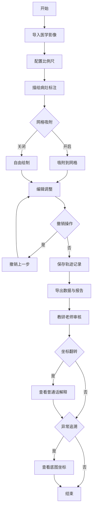

## 1. 产品概述
医学影像病灶描绘系统是面向医学教育的专业工具，解决训练员标注病灶、教研老师审核的协作问题，防止比例尺错用、数据冲突等问题。

## 2. 核心功能

### 2.1 用户角色
| 角色 | 注册方式 | 核心权限 |
|------|---------|---------|
| 训练员 | 无需注册 | 标注病灶、拖拽编辑、筛选、撤销、导出 |
| 教研老师 | 无需注册 | 审核标注、查看报告、追溯异常、复制解释 |

### 2.2 功能模块
1. **病灶描绘工作台**：影像查看、标注绘制、拖拽编辑、网格吸附、撤销重做
2. **数据管理**：轨迹记录导入、重复检测、统一数据存储
3. **报告生成**：坐标翻转化解释、数据导出、可追溯审核
4. **工具面板**：比例尺、筛选器、导出选项

### 2.3 页面详情
| 页面名称 | 模块名称 | 功能描述 |
|---------|---------|---------|
| 病灶描绘工作台 | 影像查看区 | 加载医学影像、缩放平移、网格显示 |
| 病灶描绘工作台 | 标注工具栏 | 绘制工具（矩形、圆形、多边形）、颜色选择、删除 |
| 病灶描绘工作台 | 操作记录区 | 显示操作历史、撤销重做按钮 |
| 病灶描绘工作台 | 网格吸附面板 | 开启/关闭网格吸附、设置网格大小 |
| 数据管理 | 导入对话框 | 选择轨迹文件、重复检测提示 |
| 报告生成 | 报告预览 | 显示标注统计、坐标翻转解释、可追溯数据 |
| 报告生成 | 导出面板 | 选择导出格式、设置报告选项 |

## 3. 核心流程
训练员导入影像 → 配置比例尺 → 描绘病灶（支持网格吸附） → 操作可撤销 → 导出数据与报告。教研老师查看报告，遇到坐标翻转可查看普通话解释，异常可追溯到底图坐标。

## 4. 用户界面设计

### 4.1 设计风格
- **主色调**：专业医疗蓝 (#165DFF) 搭配中性灰 (#333333)
- **辅助色**：警示橙 (#FF7D00) 用于坐标翻转提示、成功绿 (#00B42A)
- **按钮风格**：圆角矩形，轻微阴影，悬停上浮效果
- **字体**：Source Han Sans CN（思源黑体），标题 20px bold，正文 14px regular
- **布局风格**：左右分栏，左侧工具栏，中央画布，右侧操作记录
- **图标**：线性简洁图标，医疗专业感

### 4.2 页面设计概述
| 页面名称 | 模块名称 | UI元素 |
|---------|---------|--------|
| 病灶描绘工作台 | 影像查看区 | 大尺寸画布，网格背景，缩放控制，深色边框 |
| 病灶描绘工作台 | 工具栏 | 垂直排列，图标+文字，选中状态高亮 |
| 病灶描绘工作台 | 操作记录区 | 时间线样式，支持点击回溯 |
| 报告生成 | 报告预览 | 卡片式布局，关键数据突出显示 |

### 4.3 响应式
桌面端优先设计，主画布自适应窗口大小，工具栏在小屏幕可折叠。

### 4.4 交互细节
- 标注绘制时实时预览
- 拖拽标注有吸附反馈
- 坐标翻转让用户看到醒目的橙色提示框
- 操作历史有平滑过渡动画
