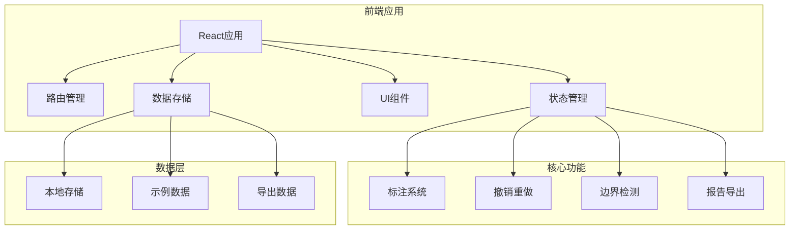
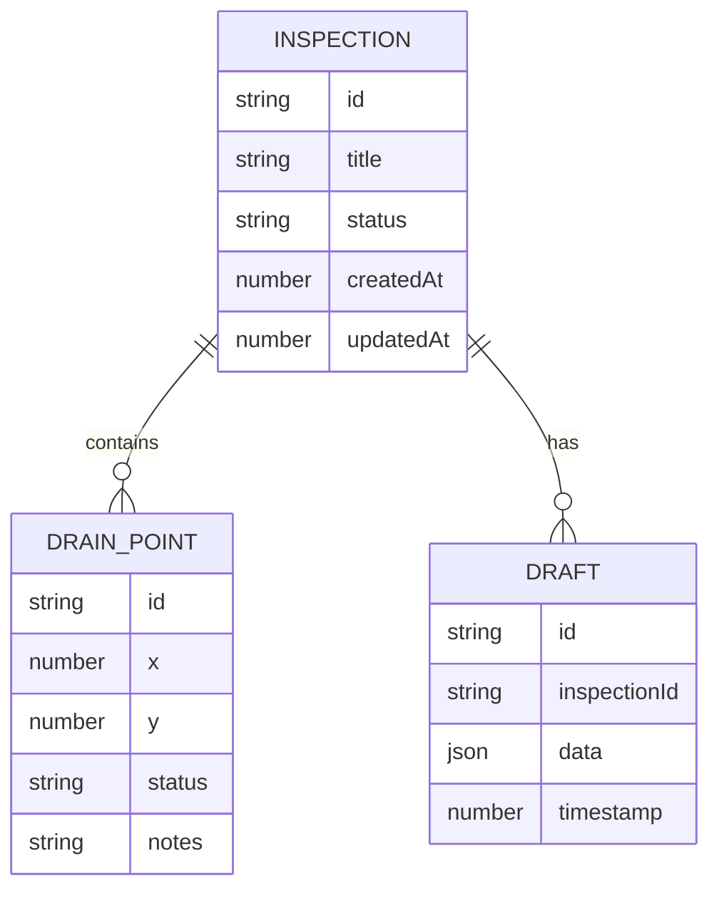

## 1. 架构设计



## 2. 技术描述
- **前端框架**: React@18 + TypeScript + Vite
- **样式方案**: Tailwind CSS@3
- **状态管理**: React Context API + useReducer
- **本地存储**: localStorage + IndexedDB
- **报告生成**: jsPDF + xlsx
- **开发工具**: ESLint + Prettier

## 3. 路由定义
| 路由 | 用途 |
|-------|------|
| / | 首页/日常入口 |
| /level | 关卡页 - 标注操作 |
| /settlement | 结算页 - 结果展示 |

## 4. 数据模型
### 4.1 数据模型定义


### 4.2 TypeScript 类型定义
```typescript
interface DrainPoint {
  id: string;
  x: number;
  y: number;
  status: 'pending' | 'inspected' | 'failed';
  notes: string;
  createdAt: number;
}

interface Inspection {
  id: string;
  title: string;
  status: 'draft' | 'completed';
  drainPoints: DrainPoint[];
  createdAt: number;
  updatedAt: number;
}

interface Draft {
  id: string;
  inspectionId: string;
  data: Partial&lt;Inspection&gt;;
  timestamp: number;
}

interface HistoryState {
  past: Draft[];
  present: Inspection;
  future: Draft[];
}
```
