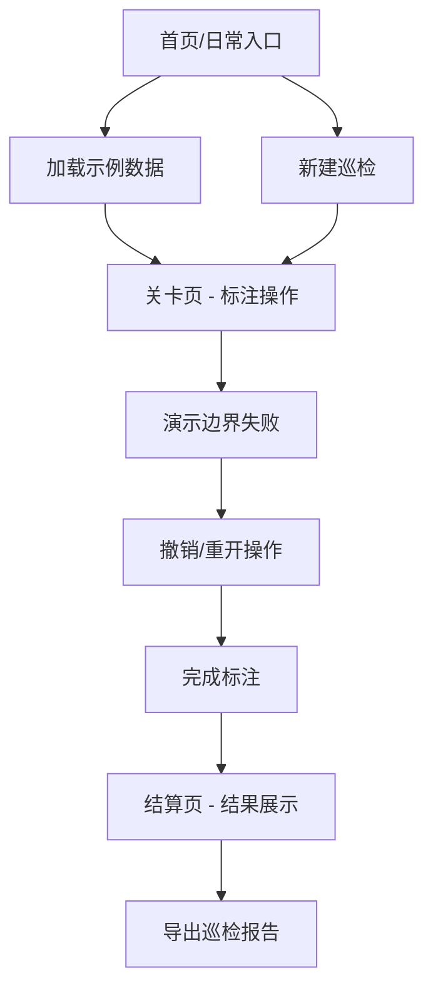

## 1. 产品概述
城市雨水口巡检图是为赛事运营设计的工具，用于整理标注草稿、回看讲解备注、追踪巡检过程。
- 解决赛事运营人员在城市雨水口巡检中的标注管理、过程回溯和结果导出问题
- 提供清晰的关卡设计、撤销重做功能、边界失败演示和详细的结算页面

## 2. 核心功能

### 2.1 用户角色
| 角色 | 注册方式 | 核心权限 |
|------|---------|---------|
| 赛事运营 | 无需注册 | 使用所有功能，包括标注管理、过程回放、导出结果 |

### 2.2 功能模块
1. **首页/巡检入口**：日常入口、示例数据、快速开始
2. **关卡页**：标注草稿、边界失败演示、撤销/重做操作
3. **结算页**：结果展示、命中检测、导出功能

### 2.3 页面详情
| 页面名称 | 模块名称 | 功能描述 |
|---------|---------|---------|
| 首页 | 日常入口 | 快速进入巡检、加载示例数据、查看使用说明 |
| 关卡页 | 标注区域 | 地图展示、雨水口标注、草稿管理 |
| 关卡页 | 操作栏 | 撤销/重做、重置关卡、保存草稿 |
| 关卡页 | 边界失败 | 演示一次边界失败场景，触发警告提示 |
| 结算页 | 结果摘要 | 展示巡检结果、统计信息、命中检测说明 |
| 结算页 | 导出功能 | 导出完整巡检报告，确保与界面摘要一致 |

## 3. 核心流程
用户从日常入口进入，加载示例数据或新建巡检，在关卡中完成标注操作（包含一次边界失败和一次撤销/重开），然后进入结算页查看结果和导出报告。

## 4. 用户界面设计

### 4.1 设计风格
- **主色调**：蓝色系（#165DFF）代表专业与信任，辅以灰色和白色
- **按钮风格**：圆角矩形，带有轻微阴影，悬停时有颜色过渡动画
- **字体**：使用Noto Sans SC中文显示清晰，搭配Inter英文字体
- **布局风格**：卡片式布局，左侧导航，主内容区灵活配置
- **图标风格**：线性图标，简洁明了

### 4.2 页面设计概述
| 页面名称 | 模块名称 | UI元素 |
|---------|---------|--------|
| 首页 | 日常入口 | 大型操作按钮、示例数据卡片、使用流程说明 |
| 关卡页 | 地图区域 | 网格地图、雨水口标注点、边界提示框 |
| 关卡页 | 操作栏 | 撤销/重做按钮、保存/重置按钮、进度显示 |
| 关卡页 | 失败演示 | 红色警告框、动画效果、提示信息 |
| 结算页 | 结果卡片 | 绿色通过标记、统计数据图表、命中检测列表 |
| 结算页 | 导出区域 | 导出按钮、导出预览、格式选择 |

### 4.3 响应性
桌面优先设计，同时适配平板设备，确保在1024px以上屏幕完整显示所有功能。

### 4.4 交互细节
- 标注点拖拽交互
- 边界失败的脉冲动画提示
- 结算页的数字滚动动画
- 按钮的悬停和点击反馈
