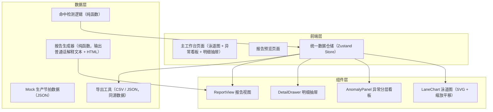
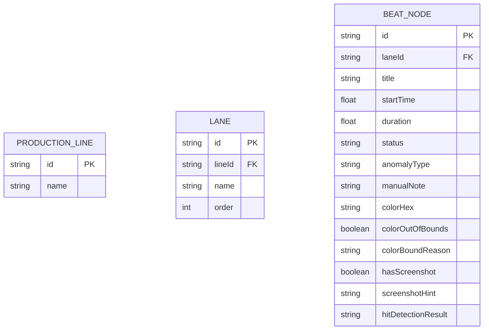

## 1. 架构设计



## 2. 技术说明

- 前端：React@18 + TypeScript + Vite@6
- 样式：TailwindCSS@3
- 状态管理：Zustand（单一 Store 驱动图表、明细、导出，确保数据同源）
- 路由：React Router DOM（/ 主工作台，/report 报告预览）
- 图标：lucide-react
- 后端：无，使用内置 Mock 数据

## 3. 路由定义

| 路由 | 用途 |
|------|------|
| / | 主工作台：泳道图、异常分层看板、明细抽屉、截图补录 |
| /report | 报告预览：普通话解释、异常说明、数据下载 |

## 4. 数据模型

### 4.1 数据模型定义



### 4.2 TypeScript 类型定义

```typescript
export type AnomalyType = 'none' | 'need_material' | 'need_caliber';

export interface BeatNode {
  id: string;
  laneId: string;
  title: string;
  startTime: number;
  duration: number;
  status: 'normal' | 'warning' | 'error';
  anomalyType: AnomalyType;
  manualNote: string;
  colorHex: string;
  colorOutOfBounds: boolean;
  colorBoundReason: string;
  hasScreenshot: boolean;
  screenshotUrl?: string;
  hitDetectionResult: 'pending' | 'passed' | 'failed';
  nextAction: string;
}

export interface Lane {
  id: string;
  name: string;
  order: number;
  nodes: BeatNode[];
}

export interface ProductionData {
  id: string;
  name: string;
  totalDuration: number;
  lanes: Lane[];
  generatedAt: string;
  mandarinExplanation: string;
}
```

## 5. 核心模块说明

### 5.1 统一数据仓储（src/store/productionStore.ts）
- 所有泳道图、明细、下载共用同一份 `productionData` 状态
- `uploadScreenshot(nodeId, file)` 补录截图后自动调用 `rerunHitDetection()`
- `rerunHitDetection()` 基于当前节点状态重新计算命中检测结果
- 任何状态变更同步触发图表、看板、抽屉、导出数据的重新渲染

### 5.2 泳道图组件（src/components/LaneChart.tsx）
- SVG 渲染，支持滚轮缩放（`scale` 状态）与拖拽平移（`offsetX`, `offsetY`）
- 缩放/平移为连续响应式：每次事件单独计算，不做一次性判断
- 节点点击派发 `selectNode(nodeId)` 到 Store，明细抽屉联动

### 5.3 异常分层看板（src/components/AnomalyPanel.tsx）
- 从 Store 派生 `needMaterialNodes` 与 `needCaliberNodes` 两组数据
- 分别展示琥珀橙（补材料）和品红（改口径）标签，附带 `nextAction` 说明

### 5.4 明细抽屉（src/components/DetailDrawer.tsx）
- `manualNote` 以 `<blockquote>` 样式原样渲染，不做任何自动修正
- `colorOutOfBounds` 为 true 时展示拦截理由 `colorBoundReason`

### 5.5 报告生成器（src/utils/reportGenerator.ts）
- `generateMandarinExplanation(data)` 生成可复制的普通话解释文本
- `generateReportHtml(data)` 生成完整 HTML 报告，包含异常逐条说明
- `exportCsv(data)` / `exportJson(data)` 从同一 Store 数据导出

## 6. 目录结构

```
src/
├── components/
│   ├── LaneChart.tsx
│   ├── AnomalyPanel.tsx
│   ├── DetailDrawer.tsx
│   ├── Toolbar.tsx
│   └── ReportView.tsx
├── hooks/
│   └── usePanZoom.ts
├── pages/
│   ├── Workbench.tsx
│   └── ReportPage.tsx
├── store/
│   └── productionStore.ts
├── types/
│   └── index.ts
├── utils/
│   ├── hitDetection.ts
│   ├── reportGenerator.ts
│   ├── exportData.ts
│   └── mockData.ts
├── App.tsx
├── main.tsx
└── index.css
```
