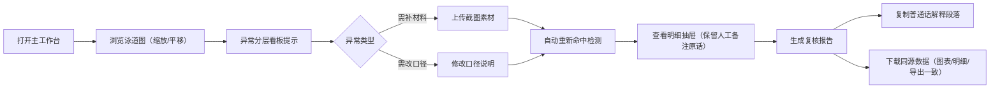

## 1. 产品概述

生产线节拍泳道图是面向文物保护（文保）讲解员与评审老师的可视化复核工具，用于管理生产线上各环节的节拍记录、异常标注、截图素材与复核报告。通过统一数据源驱动图表、明细与导出结果，减少讲解当天的解释成本。

- 目标用户：文保讲解员（主要使用者）、评审老师（查阅导出报告）
- 核心价值：一套数据三重呈现，异常分层指引下一步操作，报告自带普通话讲解文案

## 2. 核心特性

### 2.1 用户角色

| 角色 | 核心权限 |
|------|----------|
| 文保讲解员 | 查看泳道图、缩放平移、标记异常、补录截图素材、生成并下载复核报告 |
| 评审老师 | 查看导出的复核报告（离线即可阅读） |

### 2.2 功能模块

1. **泳道图主界面**：多泳道时间轴、节点卡片、缩放平移、命中检测高亮
2. **异常分层看板**：区分「需补材料」与「需改口径」两类异常，不再合并为单一红色数字
3. **明细面板**：节点详情、人工备注（保留原话不自动润色）、截图素材补录入口
4. **报告生成与下载**：普通话解释段落、异常原因说明（含颜色越界拦截理由）、原始备注保留、与图表同源的导出数据
5. **数据联动**：截图补录后自动重新执行命中检测，视图与导出同步刷新

### 2.3 页面详情

| 页面名称 | 模块名称 | 功能描述 |
|----------|----------|----------|
| 主工作台 | 泳道图 | SVG 渲染多泳道时间轴，支持滚轮缩放、拖拽平移（非一次性判断，支持连续操作） |
| 主工作台 | 顶部工具栏 | 缩放控制、截图补录上传、数据导出、生成报告按钮 |
| 主工作台 | 异常分层看板 | 左右分栏显示「需补材料」和「需改口径」，每类异常列出节点编号与下一步提示 |
| 主工作台 | 明细抽屉 | 点击节点展开详情，展示人工备注原话、命中检测结果、颜色越界说明、操作建议 |
| 报告预览页 | 普通话解释区 | 可一键复制的讲解文案，说明整体节拍、异常类型与处理建议 |
| 报告预览页 | 异常详情区 | 逐条解释，颜色越界等被拦记录附带拦截理由 |
| 报告预览页 | 数据下载 | 导出与图表、明细完全同源的 CSV / JSON |

## 3. 核心流程

文保讲解员打开工作台 → 浏览泳道图（可缩放平移） → 发现异常，查看分层看板判断是「补材料」还是「改口径」 → 若有截图素材则补录，系统自动更新命中检测 → 打开明细抽屉核对人工备注原话 → 生成报告，复制普通话解释给同事 → 下载报告与同源数据供评审老师查阅。

## 4. 用户界面设计

### 4.1 设计风格

- 主色调：深墨青 `#0F2F3C` 作为底，搭配琥珀橙 `#F59E0B`（需补材料）与品红 `#E11D48`（需改口径）区分异常，正常节拍用浅竹青 `#A7F3D0`
- 字体：标题用「思源宋体 / Noto Serif SC」体现文保质感，正文用「思源黑体 / Noto Sans SC」保证易读
- 组件风格：卡片微圆角 6px、1px 描边、悬浮轻微上浮；时间轴节点为胶囊形色块，命中检测用虚线描边
- 图标：Lucide 图标集，统一 18px 线宽

### 4.2 页面设计概述

| 页面名称 | 模块名称 | UI 元素 |
|----------|----------|---------|
| 主工作台 | 泳道图 | 深色画布 + 横向时间标尺 + 多泳道分区 + 节点胶囊 + 拖拽光标 + 缩放平滑过渡 |
| 主工作台 | 异常分层看板 | 左右两列卡片，琥珀橙/品红两色标签，每条异常带节点编号与一句话操作建议 |
| 主工作台 | 明细抽屉 | 右侧滑入，分「节点信息 / 人工备注 / 命中检测 / 操作建议」四段，备注区使用引用样式保留原话 |
| 报告预览页 | 全文报告 | 白底印刷风格，标题居中，普通话解释用蓝色引用框标注「可直接复制」，异常逐条列明拦截原因 |

### 4.3 响应式

桌面端优先（≥ 1280px），三栏布局：左侧异常分层看板 + 中间泳道图 + 右侧明细抽屉。移动端（< 768px）折叠为上下堆叠：顶部工具栏 → 泳道图 → 异常看板 → 明细。

### 4.4 视觉细节

- 泳道图缩放使用 `transform-origin` 跟随鼠标位置，过渡时长 180ms
- 节点命中检测变化时，节点外发光闪烁一次（`box-shadow` 动画 400ms）
- 报告页复制按钮点击后出现「已复制」toast，文案保留 2s
