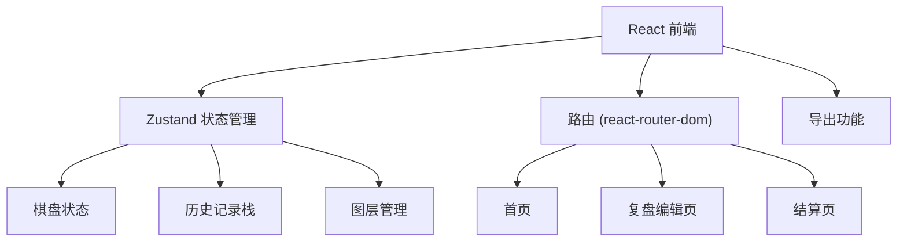

## 1. 架构设计


## 2. 技术描述
- 前端：React@18 + TypeScript + tailwindcss@3 + vite
- 初始化工具：vite-init
- 状态管理：zustand
- 路由：react-router-dom
- 图标：lucide-react

## 3. 路由定义
| 路由 | 用途 |
|------|------|
| / | 首页 - 项目列表 |
| /editor/:id | 复盘编辑页 |
| /result/:id | 结算页 |

## 4. 数据模型

### 4.1 落子记录
```typescript
interface Move {
  id: string;
  x: number;
  y: number;
  player: 'black' | 'white';
  timestamp: number;
  layerId: string;
  status: 'normal' | 'boundary_error' | 'confirmed' | 'pending';
}
```

### 4.2 图层
```typescript
interface Layer {
  id: string;
  name: string;
  visible: boolean;
  color: string;
}
```

### 4.3 复盘项目
```typescript
interface Project {
  id: string;
  name: string;
  moves: Move[];
  layers: Layer[];
  status: 'draft' | 'completed' | 'error';
  issues: string[];
}
```

## 5. 核心模块

### 5.1 撤销重做
使用历史记录栈实现，支持undo/redo操作。

### 5.2 网格吸附
棋盘坐标系统，自动对齐网格。

### 5.3 导出功能
支持导出JSON格式的复盘数据，包含状态标识。

### 5.4 错误处理
友好的错误提示，明确指出缺失的轨迹记录或问题。
