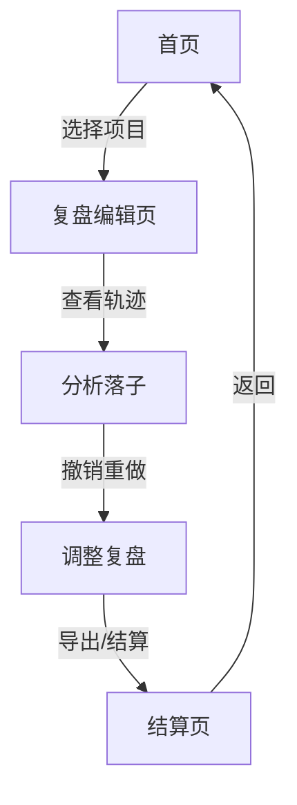

## 1. 产品概述
棋类AI落子复盘工具，用于训练员查看和分析AI下棋轨迹，支持图层管理、撤销重做、网格吸附等功能。核心价值在于提供直观的复盘界面，便于训练员快速定位问题和优化AI策略。

## 2. 核心功能

### 2.1 用户角色
| 角色 | 注册方式 | 核心权限 |
|------|----------|----------|
| 训练员 | 无需注册 | 查看复盘、图层管理、撤销重做、导出结果 |

### 2.2 功能模块
1. **复盘编辑页**：棋盘显示、落子记录、图层控制、撤销重做、导出
2. **结算页**：对局结果展示、状态标识、错误提示
3. **首页**：项目列表、样例入口

### 2.3 页面详情
| 页面名称 | 模块名称 | 功能描述 |
|---------|---------|---------|
| 首页 | 项目列表 | 显示复盘项目，支持创建新项目和打开样例 |
| 复盘编辑页 | 棋盘区域 | 显示棋盘、棋子、轨迹线，支持网格吸附 |
| 复盘编辑页 | 图层面板 | 管理落子图层，支持显示/隐藏、删除 |
| 复盘编辑页 | 操作栏 | 撤销、重做、重置、导出功能 |
| 复盘编辑页 | 轨迹记录 | 显示每一步落子详情 |
| 结算页 | 结果展示 | 显示对局结果、状态标识、问题清单 |

## 3. 核心流程
训练员从首页选择项目或样例进入复盘编辑页，查看落子轨迹，使用撤销重做调整，通过图层管理分析，最后导出结果或查看结算页。

## 4. 用户界面设计
### 4.1 设计风格
- 主色调：深蓝色（#1e40af）、辅助色：橙色（#f59e0b）
- 按钮风格：圆角矩形，轻微阴影，hover状态有缩放效果
- 字体：Geist Mono（等宽）用于轨迹记录，Inter用于界面文字
- 布局：左右分栏，左侧棋盘区域，右侧控制面板
- 图标风格：线性简约图标（lucide-react）

### 4.2 页面设计概述
| 页面名称 | 模块名称 | UI元素 |
|---------|---------|-------|
| 首页 | 项目列表 | 卡片式布局，渐变背景，悬停动画 |
| 复盘编辑页 | 棋盘区域 | 网格线、棋子、轨迹线动画 |
| 复盘编辑页 | 图层面板 | 可折叠列表，颜色标签，开关按钮 |
| 结算页 | 结果展示 | 状态徽章（通过/待确认/失败），问题清单 |

### 4.3 响应性
桌面优先设计，适配中等屏幕，触摸交互优化

### 4.4 配色规则（核心）
- ✅ 绿色（#10b981）：通过/确认
- ⚠️ 橙色（#f59e0b）：待确认
- ❌ 红色（#ef4444）：失败/错误
- 🔵 蓝色（#3b82f6）：正常/进行中
