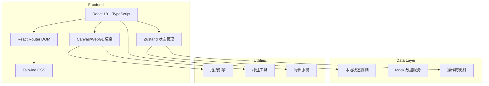

# 港口泊位二维调度工具 - 技术架构文档

## 1. 架构设计



## 2. 技术描述

- **前端**: React@18 + TypeScript + Tailwind CSS@3 + Vite
- **初始化工具**: vite-init
- **状态管理**: Zustand
- **路由**: React Router DOM
- **图形渲染**: HTML5 Canvas
- **后端**: 无（前端纯应用）
- **数据库**: 本地状态存储 + Mock 数据

## 3. 路由定义

| 路由 | 页面组件 | 用途 |
|-------|---------|------|
| / | Dashboard | 调度画布主页 |
| /materials | MaterialsPage | 材料管理页面 |
| /history | HistoryPage | 历史记录页面 |
| /report | ReportPage | 报告导出页面 |

## 4. 数据模型

### 4.1 核心数据类型

```typescript
// 泊位对象
interface Berth {
  id: string;
  name: string;
  x: number;
  y: number;
  width: number;
  height: number;
  status: 'available' | 'occupied' | 'maintenance';
  materialIds: string[];
  createdAt: string;
  updatedAt: string;
}

// 操作记录
interface Operation {
  id: string;
  type: 'move' | 'scale' | 'pan' | 'annotate' | 'create' | 'delete';
  timestamp: string;
  operator: string;
  beforeState: any;
  afterState: any;
  materialId?: string;
  isError?: boolean;
  errorType?: string;
  comment?: string;
}

// 标注材料
interface Material {
  id: string;
  imageUrl: string;
  annotations: Annotation[];
  comments: Comment[];
  createdAt: string;
  updatedAt: string;
}

// 标注
interface Annotation {
  id: string;
  type: 'rect' | 'arrow' | 'text' | 'circle';
  x: number;
  y: number;
  width?: number;
  height?: number;
  text?: string;
  color: string;
  createdAt: string;
}

// 评论/处理意见
interface Comment {
  id: string;
  content: string;
  author: string;
  createdAt: string;
}

// 画布状态
interface CanvasState {
  zoom: number;
  panX: number;
  panY: number;
  selectedId: string | null;
  tool: 'select' | 'move' | 'annotate' | 'delete';
}
```

### 4.2 Zustand Store 结构

```typescript
interface AppState {
  // 数据
  berths: Berth[];
  operations: Operation[];
  materials: Material[];
  
  // UI 状态
  canvas: CanvasState;
  currentPage: string;
  
  // 操作方法
  addBerth: (berth: Berth) => void;
  updateBerth: (id: string, updates: Partial<Berth>) => void;
  deleteBerth: (id: string) => void;
  
  addOperation: (operation: Operation) => void;
  undo: () => void;
  redo: () => void;
  
  addMaterial: (material: Material) => void;
  addAnnotation: (materialId: string, annotation: Annotation) => void;
  addComment: (materialId: string, comment: Comment) => void;
  
  setCanvas: (canvas: Partial<CanvasState>) => void;
}
```

## 5. 文件结构

```
/
├── src/
│   ├── components/
│   │   ├── Canvas/
│   │   │   ├── BerthCanvas.tsx
│   │   │   ├── BerthItem.tsx
│   │   │   └── CanvasToolbar.tsx
│   │   ├── Materials/
│   │   │   ├── MaterialList.tsx
│   │   │   ├── AnnotationEditor.tsx
│   │   │   └── CommentSection.tsx
│   │   ├── History/
│   │   │   ├── Timeline.tsx
│   │   │   ├── DiffViewer.tsx
│   │   │   └── TraceView.tsx
│   │   ├── Report/
│   │   │   ├── ReportGenerator.tsx
│   │   │   ├── ErrorLocator.tsx
│   │   │   └── MaterialTraceView.tsx
│   │   └── Common/
│   │       ├── Sidebar.tsx
│   │       ├── Header.tsx
│   │       └── Button.tsx
│   ├── pages/
│   │   ├── Dashboard.tsx
│   │   ├── MaterialsPage.tsx
│   │   ├── HistoryPage.tsx
│   │   └── ReportPage.tsx
│   ├── store/
│   │   └── useStore.ts
│   ├── utils/
│   │   ├── canvas.ts
│   │   ├── export.ts
│   │   └── mockData.ts
│   ├── types/
│   │   └── index.ts
│   ├── App.tsx
│   └── main.tsx
├── package.json
├── tsconfig.json
├── vite.config.ts
└── tailwind.config.js
```

## 6. 核心功能实现方案

### 6.1 拖拽与缩放

- 使用原生 Canvas 事件实现拖拽
- 鼠标滚轮控制缩放
- 右键拖拽平移视图
- 实现对象吸附对齐效果

### 6.2 历史记录与撤销重做

- 使用命令模式存储操作
- 维护 undo/redo 两个栈
- 每次操作记录前后状态
- 支持差异对比显示

### 6.3 标注系统

- 基于 Canvas 实现标注工具
- 支持矩形、箭头、文字、圆形标注
- 标注数据持久化到本地状态
- 支持标注编辑与删除

### 6.4 导出功能

- 生成 PDF 报告
- 导出 Canvas 为图片
- 导出操作历史为 JSON
- 支持多格式选择
