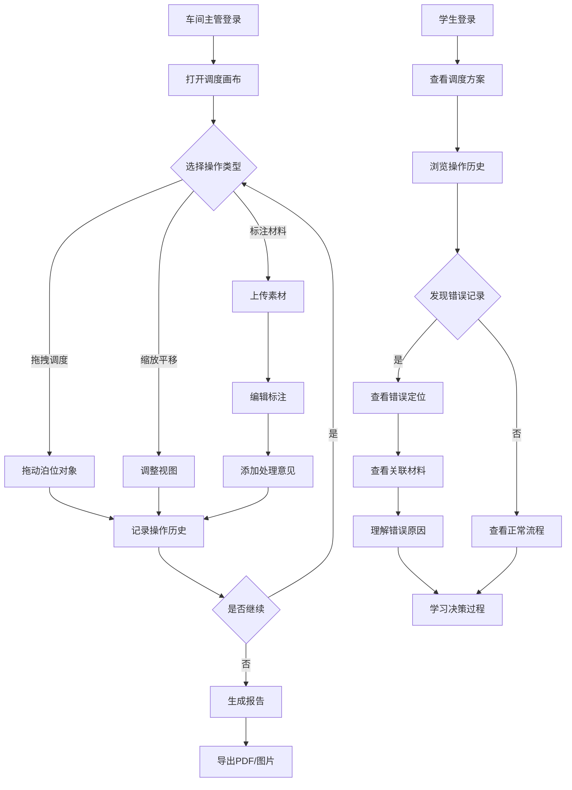

# 港口泊位二维调度工具 - 产品需求文档

## 1. 产品概述
港口泊位二维调度工具是一个面向车间主管和学生的交互式调度管理平台，集成截图素材、标注草稿和处理意见，支持拖拽、筛选、标注、撤销重做、导出等完整工作流。该工具解决传统临时群沟通效率低下的问题，提供可追溯的操作历史和错误定位能力，帮助学生理解调度决策过程。

## 2. 核心功能

### 2.1 用户角色
| 角色 | 注册方式 | 核心权限 |
|------|---------|---------|
| 车间主管 | 系统分配 | 创建/编辑调度方案、标注材料、导出报告、审核确认 |
| 学生 | 系统分配 | 查看调度方案、查看操作历史、查看错误分析报告 |

### 2.2 功能模块
1. **调度画布页面**: 二维泊位调度可视化、拖拽操作、缩放平移
2. **材料管理页面**: 截图素材上传、标注草稿编辑、处理意见记录
3. **历史记录页面**: 操作历史追踪、撤销重做、前后差异对比
4. **报告导出页面**: 生成调度报告、错误定位、材料溯源

### 2.3 页面详情
| 页面名称 | 模块名称 | 功能描述 |
|---------|---------|---------|
| 调度画布页面 | 泊位可视化区域 | 显示泊位二维布局，支持拖拽调度、缩放平移、实时标注 |
| 调度画布页面 | 工具栏面板 | 提供选择、标注、筛选、撤销、重做、导出等操作按钮 |
| 调度画布页面 | 属性面板 | 显示当前选中对象属性，支持编辑修改 |
| 材料管理页面 | 素材库 | 上传和管理截图素材，支持分类和搜索 |
| 材料管理页面 | 标注编辑器 | 在素材上进行标注，添加文字说明和箭头指示 |
| 材料管理页面 | 处理意见 | 为标注添加处理意见，关联到具体操作记录 |
| 历史记录页面 | 操作时间线 | 按时间顺序显示所有操作，支持筛选和搜索 |
| 历史记录页面 | 差异对比 | 并排显示操作前后的状态差异 |
| 历史记录页面 | 材料溯源 | 追溯操作关联的材料来源 |
| 报告导出页面 | 报告生成器 | 选择导出内容、格式、时间范围 |
| 报告导出页面 | 错误定位 | 标注错误发生的具体位置和原因 |
| 报告导出页面 | 材料溯源 | 显示每个决策点关联的材料证据 |

## 3. 核心流程

### 3.1 调度操作流程
车间主管登录系统后，在调度画布上进行泊位调度操作。每次操作（拖拽、缩放、平移、标注）都会自动记录到历史中。当需要标注材料时，可以上传截图素材，在素材上进行标注并添加处理意见。所有操作和标注都关联存储，形成完整的决策链条。

### 3.2 学生查看流程
学生登录后查看已完成的调度方案，可以浏览操作历史时间线。当遇到坐标翻转等错误记录时，系统高亮显示错误位置，并展示关联的材料证据（如比例尺错用的具体材料）。学生可以查看操作前后的差异对比，理解决策过程。

### 3.3 流程图

## 4. 用户界面设计

### 4.1 设计风格
- **主色调**: 深海蓝(#0A4D8C)为主色，代表港口和海洋，搭配工业灰(#2C3E50)作为辅助色
- **强调色**: 警示橙(#E67E22)用于错误标注，成功绿(#27AE60)用于确认状态
- **按钮风格**: 圆角矩形按钮，带轻微阴影和悬停动效，主要操作使用实心填充，次要操作使用描边样式
- **字体**: 标题使用"思源黑体"，正文使用"苹方"，代码和数据使用"JetBrains Mono"
- **布局风格**: 左侧工具栏 + 中央画布 + 右侧属性面板的三栏布局，支持面板折叠
- **图标风格**: 线性图标，2px线宽，圆角连接点，与整体工业风格保持一致

### 4.2 页面设计概览
| 页面名称 | 模块名称 | UI元素 |
|---------|---------|--------|
| 调度画布页面 | 泊位可视化区域 | 深色背景网格，泊位对象使用卡片样式，支持拖拽高亮和吸附效果 |
| 调度画布页面 | 工具栏面板 | 垂直图标按钮组，当前工具高亮显示，悬停显示工具提示 |
| 调度画布页面 | 属性面板 | 可折叠面板，表单式布局，支持实时编辑预览 |
| 材料管理页面 | 素材库 | 网格卡片布局，支持缩略图预览，悬停显示操作按钮 |
| 材料管理页面 | 标注编辑器 | 画布式编辑器，工具栏提供画笔、箭头、文字工具，支持撤销重做 |
| 材料管理页面 | 处理意见 | 评论区样式，支持富文本编辑和附件上传 |
| 历史记录页面 | 操作时间线 | 垂直时间线布局，每个节点显示操作类型、时间、关联材料 |
| 历史记录页面 | 差异对比 | 左右分屏布局，差异部分高亮显示，支持切换对比模式 |
| 历史记录页面 | 材料溯源 | 树状结构展示，点击节点展开关联材料详情 |
| 报告导出页面 | 报告生成器 | 向导式流程，步骤指示器，表单配置选项 |
| 报告导出页面 | 错误定位 | 错误卡片列表，点击跳转到画布对应位置 |
| 报告导出页面 | 材料溯源 | 时间线+材料缩略图组合展示，支持展开查看详情 |

### 4.3 响应式设计
- **桌面优先**: 主要面向桌面端使用，最小支持1366x768分辨率
- **移动适配**: 平板端支持触控操作，手机端提供简化查看模式
- **触控优化**: 拖拽操作支持触控手势，缩放支持双指缩放，标注支持触控笔

### 4.4 交互细节
- **拖拽反馈**: 拖动时显示半透明预览，目标位置高亮，释放时有吸附动画
- **撤销重做**: 工具栏显示撤销/重做按钮，快捷键支持Ctrl+Z/Ctrl+Y，历史面板显示可回退步骤
- **缩放平移**: 鼠标滚轮缩放，右键拖拽平移，工具栏提供缩放比例选择器
- **错误高亮**: 错误对象使用红色边框标注，关联材料使用橙色背景突出显示
- **材料关联**: 操作记录显示关联的材料图标，点击展开材料详情弹窗

## 5. 数据需求

### 5.1 样例数据要求
- **真实性**: 样例数据贴近日常使用场景，包含旧表、补录备注、漏填单位等常见问题
- **错误类型**: 包含坐标翻转、比例尺错用、单位混淆等典型错误
- **数据量**: 至少包含10个泊位对象，5个标注材料，3个错误记录
- **时间跨度**: 操作历史覆盖至少一周的时间范围，展示完整工作流程

### 5.2 数据字段
- 泊位对象: ID、名称、位置坐标、尺寸、状态、关联材料
- 操作记录: ID、操作类型、操作时间、操作者、前后状态、关联材料
- 标注材料: ID、素材图片、标注数据、处理意见、创建时间
- 错误记录: ID、错误类型、错误位置、错误原因、关联材料、修正建议

## 6. 测试要求

### 6.1 功能测试
- **重复运行**: 同一调度方案可多次运行，结果保持一致
- **补录操作**: 支持事后补录操作记录，补录数据标记清晰
- **人工确认**: 关键操作需人工确认，确认流程完整可追溯

### 6.2 性能测试
- 拖拽操作响应时间 < 100ms
- 缩放平移流畅度 > 60fps
- 历史记录加载时间 < 500ms
- 报告生成时间 < 3s

### 6.3 兼容性测试
- 支持Chrome 90+、Firefox 88+、Safari 14+
- 支持Windows 10、macOS 11+、主流Linux发行版
- 支持触控设备和触控笔