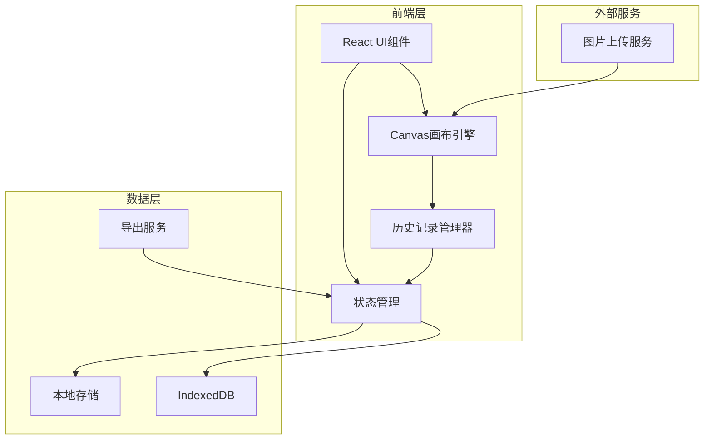
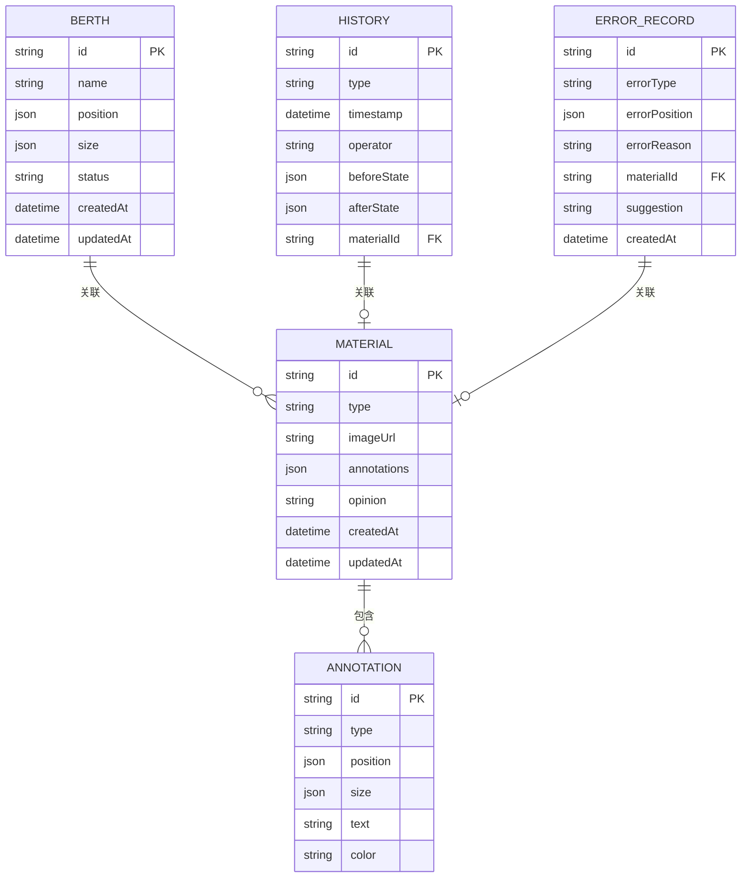

# 港口泊位二维调度工具 - 技术架构文档

## 1. 架构设计



## 2. 技术栈说明

### 2.1 前端技术
- **框架**: React 18 + TypeScript
- **样式**: Tailwind CSS 3
- **构建工具**: Vite
- **画布引擎**: Konva.js (react-konva) - 用于二维图形渲染和交互
- **状态管理**: Zustand - 轻量级状态管理，支持历史记录
- **拖拽**: @dnd-kit/core - 现代化拖拽库
- **图标**: Lucide React
- **导出**: html2canvas + jsPDF - 支持导出PDF和图片

### 2.2 数据存储
- **本地存储**: LocalStorage - 存储用户偏好设置
- **IndexedDB**: 存储调度数据、操作历史、材料数据
- **无后端**: 所有数据存储在本地，支持离线使用

### 2.3 开发工具
- **包管理器**: npm
- **代码规范**: ESLint + Prettier
- **类型检查**: TypeScript strict mode

## 3. 路由定义

| 路由 | 用途 | 权限 |
|-----|------|------|
| `/` | 首页，重定向到调度画布 | 所有用户 |
| `/canvas` | 调度画布页面 | 所有用户 |
| `/materials` | 材料管理页面 | 车间主管 |
| `/history` | 历史记录页面 | 所有用户 |
| `/report` | 报告导出页面 | 所有用户 |

## 4. 核心模块设计

### 4.1 画布引擎模块
```typescript
interface CanvasState {
  berths: Berth[];              // 泊位对象数组
  selectedId: string | null;     // 当前选中ID
  zoom: number;                  // 缩放比例
  panOffset: { x: number; y: number }; // 平移偏移
  gridSize: number;             // 网格大小
}

interface Berth {
  id: string;
  name: string;
  position: { x: number; y: number };
  size: { width: number; height: number };
  status: 'available' | 'occupied' | 'maintenance';
  materialIds: string[];         // 关联材料ID
}

interface HistoryEntry {
  id: string;
  type: 'move' | 'resize' | 'annotate' | 'zoom' | 'pan';
  timestamp: number;
  operator: string;
  beforeState: Partial<CanvasState>;
  afterState: Partial<CanvasState>;
  materialId?: string;
}
```

### 4.2 历史记录管理器
```typescript
interface HistoryManager {
  undo(): void;                  // 撤销操作
  redo(): void;                  // 重做操作
  push(entry: HistoryEntry): void; // 添加历史记录
  canUndo: boolean;              // 是否可撤销
  canRedo: boolean;              // 是否可重做
  getHistory(): HistoryEntry[];  // 获取历史列表
  getDiff(id: string): Diff;     // 获取差异对比
}

interface Diff {
  before: Partial<CanvasState>;
  after: Partial<CanvasState>;
  changes: ChangeRecord[];
}

interface ChangeRecord {
  type: 'position' | 'size' | 'status' | 'zoom' | 'pan';
  path: string;
  oldValue: any;
  newValue: any;
}
```

### 4.3 材料管理模块
```typescript
interface Material {
  id: string;
  type: 'screenshot' | 'draft' | 'opinion';
  imageUrl: string;
  annotations: Annotation[];
  opinion?: string;
  createdAt: number;
  updatedAt: number;
}

interface Annotation {
  id: string;
  type: 'arrow' | 'text' | 'rectangle' | 'circle';
  position: { x: number; y: number };
  size?: { width: number; height: number };
  text?: string;
  color: string;
}
```

### 4.4 导出服务模块
```typescript
interface ExportService {
  exportPDF(options: ExportOptions): Promise<Blob>;
  exportImage(options: ExportOptions): Promise<Blob>;
  exportHistory(format: 'json' | 'csv'): Promise<Blob>;
}

interface ExportOptions {
  timeRange?: { start: number; end: number };
  includeMaterials: boolean;
  includeHistory: boolean;
  highlightErrors: boolean;
}
```

## 5. 数据模型

### 5.1 数据模型定义



### 5.2 IndexedDB Schema

```javascript
const dbSchema = {
  berths: 'id, name, status, createdAt',
  materials: 'id, type, createdAt, updatedAt',
  annotations: 'id, materialId, type',
  history: 'id, type, timestamp, operator',
  errors: 'id, errorType, createdAt'
};
```

## 6. 关键技术实现

### 6.1 拖拽与吸附
- 使用Konva的拖拽事件系统
- 实现网格吸附算法，确保对象对齐网格
- 拖拽时显示半透明预览和目标位置高亮

### 6.2 缩放与平移
- 鼠标滚轮控制缩放，以鼠标位置为中心点
- 右键拖拽实现平移
- 缩放和平移操作记录到历史，支持撤销重做

### 6.3 历史记录与撤销重做
- 使用Zustand的临时存储实现命令模式
- 每次操作生成HistoryEntry对象
- 撤销时恢复beforeState，重做时恢复afterState
- 差异对比使用深度对比算法

### 6.4 材料标注
- 使用Konva的绘图API实现标注工具
- 支持箭头、矩形、圆形、文字等标注类型
- 标注数据序列化存储，支持重新加载编辑

### 6.5 导出功能
- 使用html2canvas将画布转换为图片
- 使用jsPDF生成PDF报告
- 支持导出完整历史记录为JSON或CSV格式

## 7. 性能优化

### 7.1 画布渲染优化
- 使用Konva的分层渲染，静态元素和动态元素分离
- 实现虚拟化渲染，只渲染可视区域内的对象
- 使用requestAnimationFrame优化动画性能

### 7.2 数据存储优化
- IndexedDB使用索引加速查询
- 历史记录分页加载，避免一次性加载大量数据
- 图片素材使用Blob存储，减少内存占用

### 7.3 状态管理优化
- 使用Zustand的selector避免不必要的重渲染
- 大型状态对象使用immer进行不可变更新
- 历史记录使用压缩算法减少存储空间

## 8. 错误处理与日志

### 8.1 错误边界
- React Error Boundary捕获组件错误
- 画布操作错误自动回滚到上一个稳定状态
- 导出失败提供重试机制

### 8.2 操作日志
- 所有操作记录到本地日志
- 错误操作标记错误类型和原因
- 支持日志导出用于问题排查

## 9. 安全考虑

### 9.1 数据安全
- 所有数据存储在本地，不上传到服务器
- 导出的报告不包含敏感信息
- 支持数据加密存储（可选）

### 9.2 权限控制
- 前端路由守卫控制页面访问
- 关键操作需要二次确认
- 操作日志记录操作者信息

## 10. 部署方案

### 10.1 构建产物
- 静态HTML、CSS、JS文件
- 支持部署到任何静态文件服务器
- 支持离线使用（Service Worker缓存）

### 10.2 环境要求
- Node.js 18+ (开发环境)
- 现代浏览器 (Chrome 90+, Firefox 88+, Safari 14+)
- 最小分辨率 1366x768