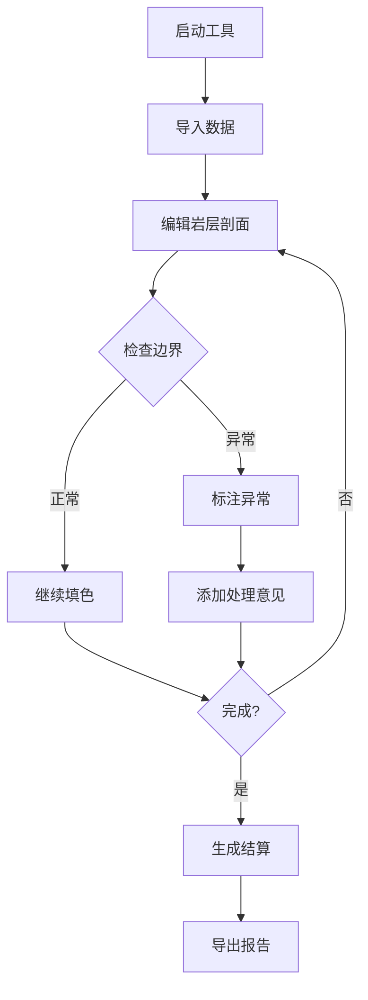

# 岩层剖面填色工具 - 产品需求文档

## 1. 产品概述

岩层剖面填色工具是一款面向地质勘探和安全培训场景的专业辅助工具，主要用于岩层剖面数据的录入、校对、标注和复盘分析。该工具通过直观的可视化界面帮助用户快速完成岩层剖面的填色标注，同时提供完整的异常追踪和导出复盘功能。

### 主要用途
- 地质勘探数据的标准化录入和校验
- 岩层边界的碰撞检测和异常标注
- 安全培训场景中的样例演示和错误分析
- 导出可读性强的复盘报告，供非技术人员查阅

### 目标用户
- 地质勘探工程师
- 安全培训师
- 质检复核人员

---

## 2. 核心功能

### 2.1 用户角色

| 角色 | 权限范围 | 核心功能 |
|------|---------|---------|
| 操作员 | 基础录入、填色、标注 | 导入数据、绘制剖面、添加标注 |
| 复核员 | 所有操作员功能 + 审核、导出 | 边界检测、异常追踪、生成报告 |

### 2.2 功能模块

1. **启动与初始化页面**
   - 系统启动引导
   - 数据导入入口
   - 最近项目列表

2. **岩层剖面编辑页面**
   - 剖面绘制画布
   - 填色工具面板
   - 边界标注工具
   - 撤销/重做控制

3. **异常处理与追踪页面**
   - 异常列表展示
   - 异常详情查看
   - 讲解备注编辑
   - 处理意见记录

4. **结算与报告页面**
   - 工作结算统计
   - 导出选项
   - 复盘报告预览

5. **说明文档页面**
   - 启动说明
   - 导入指南
   - 异常查看说明
   - 导出结果说明

---

## 3. 核心流程

### 3.1 主流程

### 3.2 撤销重做流程

---

## 4. 用户界面设计

### 4.1 设计风格

**视觉方向：工业实用主义**
- 采用沉稳的地质色调，主色为深灰色系
- 界面布局紧凑高效，减少视觉噪音
- 强调功能性和专业感，避免过度装饰
- 使用清晰的信息层级，确保操作直观

**色彩方案：**
- 主色调：`#2D3436`（深灰）
- 次要色：`#636E72`（中灰）
- 强调色：`#E17055`（警示橙）
- 背景色：`#F5F6FA`（浅灰）
- 岩层配色：使用地质标准色谱

**字体选择：**
- 标题：思源黑体 Bold
- 正文：思源黑体 Regular
- 数据：JetBrains Mono

**布局方式：**
- 左侧工具栏 + 右侧主画布
- 顶部标签页切换不同模块
- 底部状态栏显示当前状态

### 4.2 页面设计

#### 启动页面
| 模块 | UI元素 |
|------|--------|
| Logo区 | 工具图标、版本号 |
| 导入区 | 拖拽上传、按钮选择 |
| 最近项目 | 列表展示、历史记录 |

#### 岩层剖面编辑页面
| 模块 | UI元素 |
|------|--------|
| 画布区 | SVG绘制区域、缩放控制 |
| 工具栏 | 填色工具、边界标注、选择工具 |
| 属性面板 | 当前选中元素属性编辑 |
| 操作历史 | 撤销、重做按钮 |

#### 异常追踪页面
| 模块 | UI元素 |
|------|--------|
| 异常列表 | 异常卡片、筛选器 |
| 详情面板 | 异常描述、位置标记、备注编辑 |
| 追溯链路 | 操作记录时间线 |

#### 结算页面
| 模块 | UI元素 |
|------|--------|
| 统计概览 | 完成度、异常数、耗时 |
| 问题汇总 | 异常分类统计 |
| 导出选项 | 格式选择、范围选择 |

### 4.3 响应式设计

采用桌面优先设计，优先保证桌面端的功能完整性和操作效率。平板端支持基本的查看和标注功能，移动端主要用于报告查阅。

---

## 5. 样例数据设计

### 5.1 贴近日常的样例

为安全培训设计一套包含常见问题的样例数据：

**数据场景：旧表补录**
- 某矿场岩层勘测记录表（2023年版本）
- 数据来源标注不完整
- 单位混用（米与英尺）
- 备注信息包含口语化描述

**异常样例：**
1. **边界失败**：岩层分层线跨越标注范围
2. **数据异常**：岩层厚度为负值
3. **单位缺失**：部分数据缺少单位标注
4. **重复标注**：同一位置存在两个标注

### 5.2 边界失败场景设计

在样例中预设一个明确的边界碰撞失败案例：
- 两条岩层线在同一位置相交
- 系统自动标记为异常
- 用户可查看异常原因和处理建议

---

## 6. 导出与报告功能

### 6.1 导出格式

- **PDF报告**：面向非技术人员的完整报告
- **Excel数据表**：面向技术人员的数据导出
- **JSON复盘文件**：保留完整的操作记录

### 6.2 报告可读性要求

**异常说明要通俗易懂：**
- 异常类型使用中文全称（如："边界碰撞" 而非 "BOUNDARY_COLLISION"）
- 异常原因配有示意图
- 处理意见使用操作指导语言
- 关键数据配有单位说明

**追溯链路要清晰：**
- 每个异常可追溯到原始操作
- 展示异常发现时的上下文
- 记录处理过程和结果

---

## 7. 验收标准

### 7.1 功能验收

- [ ] 系统可正常启动
- [ ] 可导入CSV/Excel格式数据
- [ ] 画布可正常绘制和填色
- [ ] 边界检测功能正常工作
- [ ] 撤销/重做功能正常
- [ ] 异常追踪链路完整
- [ ] 可导出PDF报告
- [ ] 报告可读性满足要求

### 7.2 验收场景

1. **边界失败场景**：验证边界碰撞被正确识别和标注
2. **撤销重做场景**：验证撤销和重做功能与导出共用记录
3. **结算场景**：验证结算页面信息完整、可理解
4. **追溯场景**：验证可顺着异常往回查到讲解备注和处理意见

---

## 8. 文档要求

### 8.1 说明文档内容

文档需包含以下四个部分：

1. **启动说明**
   - 系统要求
   - 启动方式
   - 初始配置

2. **导入说明**
   - 支持的格式
   - 数据要求
   - 常见问题

3. **异常查看说明**
   - 如何查看异常
   - 如何追溯异常
   - 如何添加备注

4. **导出说明**
   - 导出选项说明
   - 报告内容说明
   - 查看方式

### 8.2 文档风格

- 使用简洁明了的语言
- 避免宣传性表述
- 重点说明操作步骤
- 配有必要的产品截图或示意图
