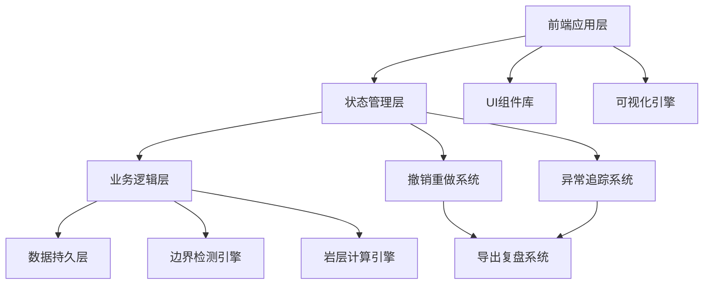
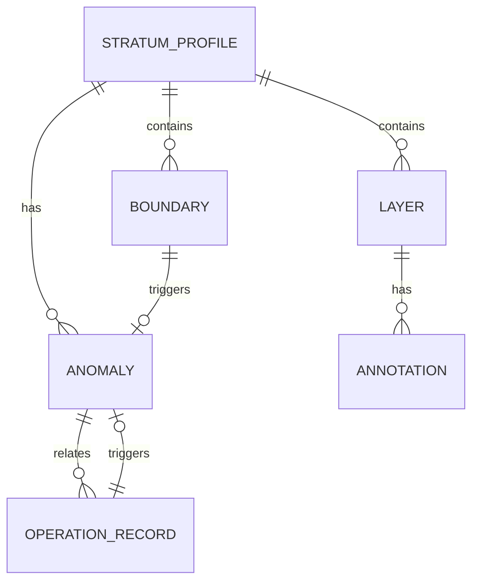

# 岩层剖面填色工具 - 技术架构文档

## 1. 架构设计

### 1.1 系统架构图



### 1.2 层次说明

| 层次 | 职责 | 技术实现 |
|------|------|---------|
| UI层 | 用户界面展示和交互 | React + SVG |
| 状态层 | 应用状态管理 | React Context + useReducer |
| 业务层 | 核心业务逻辑处理 | 纯TypeScript函数 |
| 数据层 | 数据持久化和导入导出 | IndexedDB + 文件API |

---

## 2. 技术选型

### 2.1 前端技术栈

| 技术 | 版本 | 用途 |
|------|------|------|
| React | 18.x | UI框架 |
| TypeScript | 5.x | 类型安全 |
| Vite | 5.x | 构建工具 |
| Tailwind CSS | 3.x | 样式框架 |
| XLSX | 0.20.x | Excel解析 |
| jspdf | 2.x | PDF生成 |

### 2.2 数据存储

| 存储方式 | 用途 |
|---------|------|
| IndexedDB | 本地项目数据持久化 |
| LocalStorage | 用户偏好设置 |
| File API | 导入导出文件处理 |

### 2.3 架构决策

**为什么不用后端：**
- 工具偏向本地使用
- 数据敏感度低
- 降低部署复杂度
- 便于安全培训场景使用

**撤销重做系统设计：**
- 采用命令模式记录所有操作
- 撤销/重做和导出复盘共用同一批操作记录
- 操作记录持久化到IndexedDB
- 支持按时间戳和操作类型筛选

---

## 3. 路由定义

### 3.1 页面路由

| 路由 | 页面名称 | 功能 |
|------|---------|------|
| `/` | 启动页面 | 系统初始化、数据导入 |
| `/editor` | 编辑页面 | 岩层剖面绘制和填色 |
| `/anomalies` | 异常追踪页面 | 异常列表和详情查看 |
| `/settlement` | 结算页面 | 工作统计和报告导出 |
| `/docs` | 说明文档页面 | 操作指南和使用说明 |

### 3.2 路由配置

```typescript
const routes = [
  { path: '/', component: LaunchPage },
  { path: '/editor', component: EditorPage },
  { path: '/anomalies', component: AnomalyPage },
  { path: '/settlement', component: SettlementPage },
  { path: '/docs', component: DocumentationPage }
]
```

---

## 4. 数据模型

### 4.1 核心数据结构

#### 岩层剖面数据 (StratumProfile)

```typescript
interface StratumProfile {
  id: string;
  name: string;
  layers: Layer[];
  boundaries: Boundary[];
  anomalies: Anomaly[];
  metadata: ProfileMetadata;
  createdAt: Date;
  updatedAt: Date;
}
```

#### 岩层数据 (Layer)

```typescript
interface Layer {
  id: string;
  name: string;
  color: string;
  depth: {
    top: number;
    bottom: number;
  };
  thickness: number;
  unit: 'meter' | 'foot';
  annotations: Annotation[];
  remarks: string;
}
```

#### 边界数据 (Boundary)

```typescript
interface Boundary {
  id: string;
  type: 'layer' | 'fault' | 'contact';
  startPoint: Point;
  endPoint: Point;
  status: 'normal' | 'collision' | 'undefined';
  collisionDetails?: CollisionInfo;
}
```

#### 异常数据 (Anomaly)

```typescript
interface Anomaly {
  id: string;
  type: AnomalyType;
  severity: 'low' | 'medium' | 'high';
  location: {
    layerId?: string;
    boundaryId?: string;
    coordinates: Point;
  };
  description: string;
  explanation: string;  // 讲解备注
  suggestion: string;   // 处理意见
  relatedOperations: OperationRecord[];
  status: 'pending' | 'resolved' | 'ignored';
  createdAt: Date;
  resolvedAt?: Date;
}
```

#### 操作记录 (OperationRecord)

```typescript
interface OperationRecord {
  id: string;
  type: OperationType;
  timestamp: Date;
  data: any;
  reversible: boolean;
  relatedAnomalyId?: string;
  description: string;  // 操作描述（用于报告）
}
```

### 4.2 数据关系图



---

## 5. 核心模块设计

### 5.1 岩层计算引擎

**职责：**
- 计算岩层厚度
- 检测边界碰撞
- 验证数据一致性
- 生成专业报告数据

**主要函数：**

```typescript
// 厚度计算
function calculateThickness(layer: Layer): number;

// 边界碰撞检测
function detectBoundaryCollision(
  boundaries: Boundary[],
  threshold: number
): CollisionInfo[];

// 数据一致性校验
function validateLayerData(layer: Layer): ValidationResult;
```

### 5.2 撤销重做系统

**职责：**
- 记录所有可撤销操作
- 管理撤销栈和重做栈
- 提供操作聚合功能
- 与导出系统共享记录

**设计模式：**
- 使用命令模式封装操作
- 支持操作分组
- 操作描述本地化

```typescript
interface Command {
  execute(): void;
  undo(): void;
  getDescription(): string;
  getTimestamp(): Date;
}
```

### 5.3 异常追踪系统

**职责：**
- 自动检测异常
- 维护异常列表
- 管理追溯链路
- 记录处理过程

**追溯链路设计：**

```typescript
interface TraceChain {
  anomalyId: string;
  discoveryPath: OperationRecord[];
  processingHistory: {
    step: number;
    action: string;
    operator: string;
    timestamp: Date;
    notes?: string;
  }[];
  finalResolution: {
    status: 'resolved' | 'ignored';
    conclusion: string;
  };
}
```

### 5.4 导出复盘系统

**职责：**
- 生成PDF报告
- 导出Excel数据
- 保存JSON复盘文件
- 格式化异常说明

**报告生成策略：**
- 异常说明使用中文全称
- 关键数据附带单位说明
- 追溯链路可视化
- 支持自定义模板

---

## 6. 组件架构

### 6.1 组件层次

```
App
├── LaunchPage
│   ├── LogoSection
│   ├── ImportSection
│   └── RecentProjectsList
├── EditorPage
│   ├── Toolbar
│   ├── Canvas
│   │   ├── StratumLayers
│   │   ├── BoundaryMarkers
│   │   └── AnomalyHighlights
│   ├── PropertiesPanel
│   └── OperationHistory
├── AnomalyPage
│   ├── AnomalyList
│   ├── AnomalyDetail
│   └── TraceChainViewer
├── SettlementPage
│   ├── StatisticsPanel
│   ├── ExportOptions
│   └── ReportPreview
└── DocumentationPage
    ├── StartGuide
    ├── ImportGuide
    ├── AnomalyGuide
    └── ExportGuide
```

### 6.2 状态管理

使用React Context提供全局状态：

```typescript
interface AppState {
  currentProfile: StratumProfile | null;
  operationHistory: OperationRecord[];
  anomalies: Anomaly[];
  undoStack: Command[];
  redoStack: Command[];
  settings: UserSettings;
}
```

---

## 7. 样例数据结构

### 7.1 旧表补录样例

```json
{
  "profile": {
    "name": "某矿场岩层勘测记录表（2023年版本）",
    "source": "旧表补录",
    "layers": [
      {
        "id": "L001",
        "name": "表土层",
        "depth": { "top": 0, "bottom": 3.5 },
        "unit": "米",
        "remarks": "2023年3月补录，原记录模糊"
      },
      {
        "id": "L002",
        "name": "砂岩层",
        "depth": { "top": 3.5, "bottom": 12.8 },
        "unit": "米",
        "remarks": "备注缺失，补录时估算"
      },
      {
        "id": "L003",
        "name": "泥岩层",
        "depth": { "top": 12.8, "bottom": -5 },
        "unit": "英尺",  // 单位混用
        "remarks": ""
      }
    ],
    "anomalies": [
      {
        "id": "A001",
        "type": "边界碰撞",
        "severity": "high",
        "location": {
          "layerId": "L002",
          "coordinates": { "x": 150, "y": 200 }
        },
        "description": "岩层分层线跨越标注范围",
        "explanation": "砂岩层底界与下方泥岩层存在边界重叠",
        "suggestion": "需核实原始勘测数据"
      }
    ]
  }
}
```

### 7.2 异常标注样例

每个异常包含：
- **异常类型**：中文全称（边界碰撞、数据异常、单位缺失、重复标注）
- **异常描述**：通俗易懂的问题说明
- **讲解备注**：为什么会发生这个异常
- **处理意见**：应该如何处理这个异常

---

## 8. 导出报告格式

### 8.1 PDF报告结构

1. **封面**
   - 项目名称
   - 导出时间
   - 操作员信息

2. **统计概览**
   - 完成度百分比
   - 岩层数量
   - 异常总数
   - 处理状态分布

3. **异常详情**
   - 异常类型（中文）
   - 异常描述（图文）
   - 讲解备注
   - 处理意见
   - 追溯链路

4. **数据附录**
   - 岩层分层表
   - 单位说明
   - 数据来源

### 8.2 报告可读性要求

- 异常类型不使用代码或缩写
- 所有数据配有单位
- 异常配有示意图
- 处理意见使用操作指导语言

---

## 9. 性能考虑

### 9.1 性能优化

- 使用虚拟列表处理大量异常
- SVG绘制使用Canvas缓存
- 操作历史定期归档
- 数据懒加载

### 9.2 存储限制

- IndexedDB存储配额：50MB
- 操作历史保留期限：30天
- 自动清理过期数据

---

## 10. 浏览器兼容性

| 浏览器 | 最低版本 | 备注 |
|--------|---------|------|
| Chrome | 90+ | 推荐 |
| Firefox | 88+ | 支持 |
| Safari | 14+ | 支持 |
| Edge | 90+ | 支持 |

**不支持IE浏览器。**
