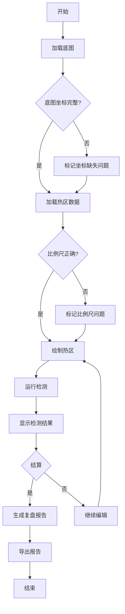

## 1. Product Overview

音乐节人流热区画板是一款教育类网页应用，旨在帮助教研老师检测和分析音乐节人流热区数据中的常见问题，包括底图坐标不完整、比例尺错用没标清、结果导出不匹配等。通过交互式画布和智能检测功能，提升数据质量审核效率。

## 2. Core Features

### 2.1 User Roles
| Role | Registration Method | Core Permissions |
|------|---------------------|------------------|
| 教研老师 | 直接访问 | 查看、检测、导出数据 |
| 评审老师 | 直接访问 | 查看检测结果、评分、复核 |

### 2.2 Feature Module
1. **主画板页面**: 画布展示、坐标标记、热区绘制
2. **数据检测模块**: 坐标完整性检测、比例尺验证、数据一致性检查
3. **状态控制模块**: 开始、暂停、重开、结算功能
4. **复盘导出模块**: 检测结果汇总、问题分类、导出报告

### 2.3 Page Details
| Page Name | Module Name | Feature description |
|-----------|-------------|---------------------|
| 主画板页面 | 画布区域 | 底图展示、热区绘制、坐标标记 |
| 主画板页面 | 工具栏 | 开始、暂停、重开、结算按钮 |
| 主画板页面 | 检测面板 | 实时检测结果展示 |
| 复盘页面 | 结果汇总 | 问题分类统计、评分表展示 |
| 复盘页面 | 导出功能 | 生成并下载复盘报告 |

## 3. Core Process

## 4. User Interface Design

### 4.1 Design Style
- Primary color: #4F46E5 (Indigo) - 专业、稳重
- Secondary color: #F59E0B (Amber) - 警示、强调
- Button style: Rounded-lg, 4px border-radius
- Font: Inter, sans-serif
- Layout: Card-based with sidebar
- Icon style: Lucide React icons

### 4.2 Page Design Overview
| Page Name | Module Name | UI Elements |
|-----------|-------------|-------------|
| 主画板 | Canvas区域 | 响应式画布、网格背景、底图叠加 |
| 主画板 | 工具栏 | 控制按钮组、状态指示器 |
| 主画板 | 检测面板 | 问题列表、严重程度颜色标识 |
| 复盘页面 | 评分表 | 各项指标得分、总分计算 |
| 复盘页面 | 导出区 | 导出按钮、报告预览 |

### 4.3 Responsiveness
- Desktop-first design
- Canvas adapts to viewport size
- Sidebar collapses on mobile

### 4.4 Color Rules
| Severity | Color | Description |
|----------|-------|-------------|
| 正常 | #10B981 | 数据完整可用 |
| 待确认 | #F59E0B | 需要人工复核 |
| 错误 | #EF4444 | 数据问题严重 |

## 5. Sample Data Requirements

### 5.1 Sample Records
1. **顺利记录**: 坐标完整、比例尺正确、数据一致
2. **待确认记录**: 坐标存在空值、需人工复核
3. **坏数据记录**: 坐标翻转、重复数据、备注混写

### 5.2 Data Validation Rules
- 空值检测: 坐标字段为空标记为待确认
- 重复检测: 相同坐标多次出现标记为错误
- 翻转检测: Y轴坐标倒置标记为错误
- 比例尺检测: 未标注或错误标注标记为待确认

## 6. Export Requirements

### 6.1 Report Content
- 检测结果汇总表
- 问题分类统计
- 评分表
- 原始数据引用

### 6.2 Export Format
- JSON格式数据导出
- 带样式的HTML报告
