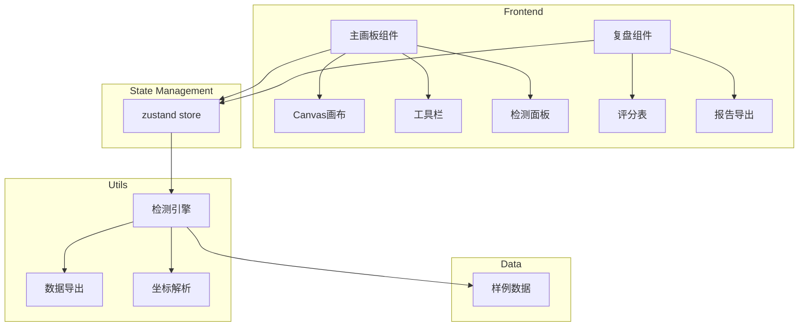

## 1. Architecture Design



## 2. Technology Description

- Frontend: React@18 + TypeScript + TailwindCSS@3 + Vite
- State Management: Zustand
- Icons: Lucide React
- Canvas: HTML5 Canvas API
- Build Tool: Vite

## 3. Route Definitions

| Route | Purpose |
|-------|---------|
| / | 主画板页面，包含画布和检测功能 |
| /review | 复盘页面，展示检测结果和评分 |

## 4. Core Components

### 4.1 Component Structure
```
src/
├── components/
│   ├── Canvas/
│   │   ├── index.tsx          # 画布主组件
│   │   └── useCanvas.ts       # 画布逻辑hook
│   ├── Toolbar/
│   │   └── index.tsx          # 工具栏组件
│   ├── DetectionPanel/
│   │   └── index.tsx          # 检测面板
│   ├── Review/
│   │   ├── ScoreTable.tsx     # 评分表
│   │   └── ReportExport.tsx   # 报告导出
│   └── common/
│       └── StatusBadge.tsx    # 状态徽章
├── store/
│   └── canvasStore.ts         # 状态管理
├── utils/
│   ├── detector.ts            # 检测引擎
│   ├── exporter.ts            # 导出工具
│   └── coordinate.ts          # 坐标处理
├── data/
│   └── samples.ts             # 样例数据
├── types/
│   └── index.ts               # 类型定义
└── App.tsx
```

## 5. Data Model

### 5.1 Type Definitions

```typescript
interface Hotspot {
  id: string;
  x: number | null;
  y: number | null;
  value: number;
  label: string;
  notes?: string;
}

interface MapConfig {
  width: number;
  height: number;
  scale: number | null;
  scaleUnit: string;
}

interface DetectionResult {
  id: string;
  type: 'empty' | 'duplicate' | 'flipped' | 'scale_error' | 'mixed_notes';
  severity: 'normal' | 'warning' | 'error';
  message: string;
  reference: string;
}

interface ReviewScore {
  category: string;
  score: number;
  maxScore: number;
  status: 'pass' | 'review' | 'fail';
}
```

### 5.2 Sample Data Structure

| Field | Type | Description |
|-------|------|-------------|
| id | string | 唯一标识 |
| x | number/null | X坐标 |
| y | number/null | Y坐标 |
| value | number | 热度值 |
| label | string | 标签 |
| notes | string | 备注 |

## 6. Detection Engine Logic

### 6.1 Empty Value Detection
- 检查 x 或 y 字段是否为 null
- 检查 scale 是否为 null

### 6.2 Duplicate Detection
- 比较所有热点的 x, y 坐标组合
- 标记重复出现的坐标

### 6.3 Flipped Coordinate Detection
- 检测 Y 轴坐标是否倒置（值过大）
- 检测坐标值是否超出底图范围

### 6.4 Scale Validation
- 检查比例尺是否标注
- 验证比例尺单位是否合理

### 6.5 Mixed Notes Detection
- 检测备注字段是否包含坐标数据
- 检测坐标字段是否包含非数字内容

## 7. Export Format

### 7.1 JSON Export
```json
{
  "summary": {
    "totalRecords": 10,
    "passCount": 6,
    "reviewCount": 2,
    "failCount": 2
  },
  "detections": [...],
  "scores": [...],
  "rawData": [...]
}
```

### 7.2 HTML Report
- 包含样式的独立HTML文件
- 表格展示检测结果
- 评分可视化
- 问题分类统计

## 8. State Management

### 8.1 Zustand Store Structure
```typescript
interface CanvasState {
  // 画布状态
  isRunning: boolean;
  isPaused: boolean;
  
  // 数据
  hotspots: Hotspot[];
  mapConfig: MapConfig;
  
  // 检测结果
  detections: DetectionResult[];
  
  // 方法
  start: () => void;
  pause: () => void;
  reset: () => void;
  settle: () => void;
  loadSample: (sampleId: string) => void;
  runDetection: () => void;
}
```

## 9. Development Environment

### 9.1 Dependencies
| Package | Version | Purpose |
|---------|---------|---------|
| react | ^18.2.0 | 前端框架 |
| react-dom | ^18.2.0 | DOM操作 |
| react-router-dom | ^6.8.0 | 路由 |
| zustand | ^4.3.0 | 状态管理 |
| tailwindcss | ^3.2.0 | 样式 |
| lucide-react | ^0.263.0 | 图标 |
| typescript | ^4.9.0 | 类型检查 |
| vite | ^4.0.0 | 构建工具 |

### 9.2 Scripts
| Script | Command | Purpose |
|--------|---------|---------|
| dev | vite | 开发服务器 |
| build | tsc && vite build | 生产构建 |
| preview | vite preview | 预览构建结果 |
