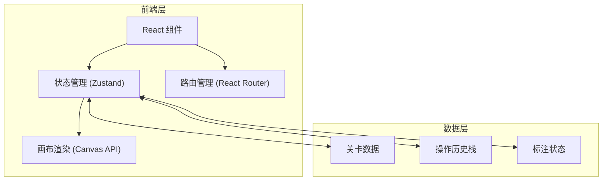
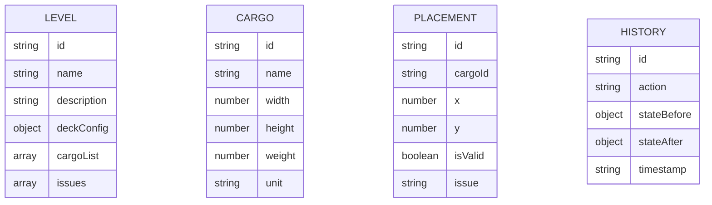

## 1. 架构设计

## 2. 技术描述
- 前端: React@18 + TypeScript + Tailwind CSS + Vite
- 初始化工具: vite-init
- 后端: 无（纯前端应用）
- 数据库: 无（使用 localStorage 存储状态）

## 3. 路由定义
| 路由 | 用途 |
|------|------|
| / | 关卡选择页面 |
| /workspace | 标注工作区主界面 |
| /summary | 结算报告页面 |

## 4. API 定义
无后端 API

## 5. 服务架构图
不适用（无后端）

## 6. 数据模型
### 6.1 数据模型定义

### 6.2 数据定义语言
不适用（无数据库）
