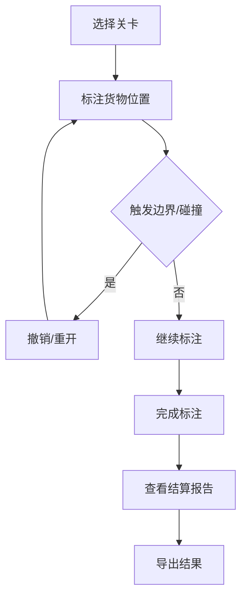

## 1. 产品概述
船舶甲板货位草图标注训练工具，用于训练员处理真实场景下的标注数据，包括处理标注草稿、补录设备清单、修正底图坐标等。

## 2. 核心功能

### 2.1 用户角色
| 角色 | 注册方式 | 核心权限 |
|------|---------|---------|
| 训练员 | 无需注册 | 完成标注任务、查看结算报告 |

### 2.2 功能模块
1. **主界面**：甲板货位草图画布、标注工具栏、状态面板
2. **关卡系统**：包含边界失败、撤销/重开的真实训练场景
3. **导出功能**：生成非技术人员可阅读的报告
4. **结算页面**：展示任务完成情况和问题定位

### 2.3 页面详情
| 页面名称 | 模块名称 | 功能描述 |
|---------|---------|---------|
| 主界面 | 画布区域 | 显示甲板底图，支持拖拽放置货物、网格吸附 |
| 主界面 | 工具栏 | 撤销、重开、网格开关、导出按钮 |
| 主界面 | 状态面板 | 显示当前关卡、标注状态、碰撞检测信息 |
| 关卡选择 | 关卡列表 | 选择不同的训练场景 |
| 结算页面 | 报告展示 | 显示任务完成结果、问题定位、撤销记录 |

## 3. 核心流程
训练员选择关卡 → 在甲板上放置货物 → 遇到边界失败或碰撞检测问题 → 使用撤销/重开功能 → 完成标注 → 查看结算报告 → 导出结果

## 4. 用户界面设计
### 4.1 设计风格
- 主色调：深蓝色（#0F3460）搭配橙色（#E94560）作为警示色
- 按钮风格：圆角矩形，悬停时有轻微上浮效果
- 字体：使用 Inter 字体，标题粗体，正文常规
- 布局风格：三栏布局，左侧工具区、中间画布区、右侧信息区
- 图标风格：使用 Lucide React 线性图标

### 4.2 页面设计概览
| 页面名称 | 模块名称 | UI元素 |
|---------|---------|-------|
| 主界面 | 画布区域 | 网格背景、甲板轮廓、货物拖拽、碰撞高亮 |
| 主界面 | 工具栏 | 功能按钮、状态指示器、操作提示 |
| 结算页面 | 报告区域 | 时间线展示、问题定位卡片、统计图表 |

### 4.3 响应性
桌面优先设计，支持平板适配，触控操作优化

### 4.4 3D场景指南
不适用
