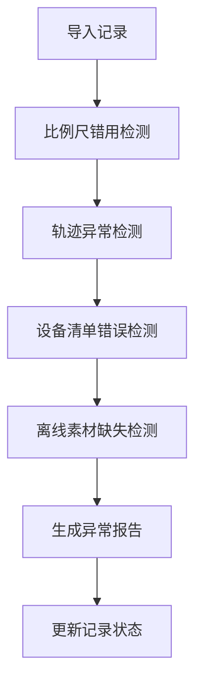
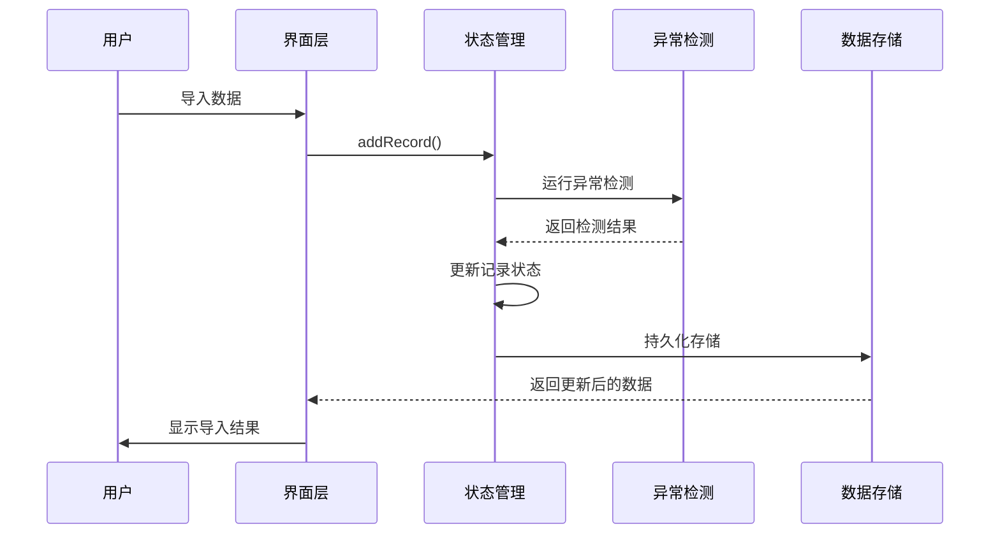

# 平面机构运动演示 - 技术架构文档

## 1. 技术栈选择

### 1.1 前端技术栈
- **框架**：React 18+ with TypeScript
- **构建工具**：Vite
- **状态管理**：React Context + useReducer
- **样式方案**：Tailwind CSS
- **数据处理**：PapaParse (CSV解析)
- **文件导出**：xlsx (Excel导出) + 原生Blob

### 1.2 选择理由
- **React + TypeScript**：提供类型安全和良好的开发体验
- **Vite**：快速启动和热更新，提升开发效率
- **Tailwind CSS**：实用优先的样式方案，适合快速构建数据展示界面
- **轻量级**：不引入过多依赖，保持应用轻量

---

## 2. 项目结构

```
/src
├── /components
│   ├── /common
│   │   ├── StatusBadge.tsx        # 状态标签组件
│   │   ├── FilterBar.tsx          # 筛选栏组件
│   │   └── ExportButton.tsx       # 导出按钮组件
│   ├── /layer-management
│   │   ├── LayerList.tsx          # 图层列表
│   │   ├── LayerItem.tsx         # 图层项
│   │   └── CanvasOverview.tsx     # 画布状态概览
│   ├── /record-detail
│   │   ├── RecordDetail.tsx       # 记录详情页
│   │   ├── SourceInfo.tsx         # 来源信息
│   │   ├── ProcessingHistory.tsx  # 处理历史
│   │   └── ProcessingActions.tsx  # 处理操作
│   └── /import
│       ├── ImportModal.tsx        # 导入弹窗
│       └── DuplicateCheck.tsx     # 重复检测
├── /contexts
│   ├── RecordContext.tsx          # 记录数据上下文
│   └── FilterContext.tsx          # 筛选状态上下文
├── /hooks
│   ├── useRecords.ts              # 记录数据操作
│   ├── useFilters.ts              # 筛选逻辑
│   ├── useExport.ts               # 导出功能
│   └── useDuplicateCheck.ts       # 重复检测
├── /utils
│   ├── anomalyDetection.ts        # 异常检测规则
│   ├── colorRules.ts              # 颜色规则定义
│   ├── dataConsistency.ts         # 数据一致性校验
│   ├── fileParser.ts               # 文件解析工具
│   └── exportGenerator.ts          # 导出生成器
├── /types
│   ├── record.ts                   # 记录相关类型定义
│   ├── processing.ts              # 处理相关类型定义
│   └── filter.ts                  # 筛选相关类型定义
├── /data
│   └── mockData.ts                # 模拟数据
├── App.tsx                        # 应用入口
├── main.tsx                       # React DOM 渲染
└── index.css                      # 全局样式
```

---

## 3. 核心模块设计

### 3.1 状态管理架构

#### 3.1.1 RecordContext（记录上下文）
```typescript
interface RecordContextValue {
  records: Record[];
  addRecord: (record: Record) => void;
  updateRecord: (id: string, updates: Partial<Record>) => void;
  deleteRecord: (id: string) => void;
  getRecordById: (id: string) => Record | undefined;
  importRecords: (records: Record[]) => ImportResult;
  exportRecords: (filter?: FilterCriteria) => ExportData;
}
```

#### 3.1.2 FilterContext（筛选上下文）
```typescript
interface FilterContextValue {
  filters: FilterState;
  setFilter: (key: keyof FilterState, value: any) => void;
  resetFilters: () => void;
  filteredRecords: Record[];
  filterStats: FilterStats;
}
```

### 3.2 异常检测模块

#### 3.2.1 异常检测规则 (anomalyDetection.ts)
```typescript
// 比例尺错用检测
function detectScaleErrors(record: Record): AnomalyResult {
  // 检测比例尺配置是否正确
  // 返回 { isAnomaly: boolean, type: string, details: string }
}

// 轨迹异常检测
function detectTrajectoryAnomalies(record: Record): AnomalyResult {
  // 检测轨迹数据中的异常点
  // 返回 { isAnomaly: boolean, type: string, details: string }
}

// 设备清单错误检测
function detectDeviceListErrors(record: Record): AnomalyResult {
  // 检测设备清单数据不一致
  // 返回 { isAnomaly: boolean, type: string, details: string }
}

// 离线素材缺失检测
function detectOfflineMissing(record: Record): AnomalyResult {
  // 检测依赖素材是否可用
  // 返回 { isAnomaly: boolean, type: string, details: string }
}
```

#### 3.2.2 异常检测流程


### 3.3 颜色规则系统

#### 3.3.1 颜色配置 (colorRules.ts)
```typescript
export const STATUS_COLORS = {
  normal: {
    bg: 'bg-green-100',
    text: 'text-green-800',
    border: 'border-green-500',
    hex: '#22c55e'
  },
  pending: {
    bg: 'bg-yellow-100',
    text: 'text-yellow-800',
    border: 'border-yellow-500',
    hex: '#eab308'
  },
  abnormal: {
    bg: 'bg-red-100',
    text: 'text-red-800',
    border: 'border-red-500',
    hex: '#ef4444'
  },
  offline_missing: {
    bg: 'bg-orange-100',
    text: 'text-orange-800',
    border: 'border-orange-500',
    hex: '#f97316'
  },
  processing: {
    bg: 'bg-blue-100',
    text: 'text-blue-800',
    border: 'border-blue-500',
    hex: '#3b82f6'
  }
};
```

#### 3.3.2 状态映射规则
```typescript
// 状态与颜色的映射关系
const STATUS_MAPPING: Record<RecordStatus, StatusColor> = {
  [RecordStatus.NORMAL]: STATUS_COLORS.normal,
  [RecordStatus.PENDING]: STATUS_COLORS.pending,
  [RecordStatus.ABNORMAL]: STATUS_COLORS.abnormal,
  [RecordStatus.OFFLINE_MISSING]: STATUS_COLORS.offline_missing,
  [RecordStatus.PROCESSING]: STATUS_COLORS.processing
};
```

### 3.4 导入与重复检测

#### 3.4.1 导入流程 (importRecords.ts)
```typescript
interface ImportResult {
  success: boolean;
  imported: number;
  duplicates: number;
  anomalies: number;
  errors: string[];
  duplicateRecords: Record[];
}

async function importRecords(file: File): Promise<ImportResult> {
  // 1. 解析文件
  // 2. 转换为Record对象
  // 3. 检测重复
  // 4. 运行异常检测
  // 5. 合并到现有数据
  // 6. 返回导入结果
}
```

#### 3.4.2 重复检测算法
```typescript
function checkDuplicates(newRecords: Record[], existingRecords: Record[]): DuplicateCheck {
  // 基于关键字段（ID、来源、时间戳）检测重复
  // 返回重复记录列表和唯一性统计
}
```

### 3.5 导出与数据一致性

#### 3.5.1 导出生成器 (exportGenerator.ts)
```typescript
interface ExportData {
  records: Record[];
  summary: ExportSummary;
  processingHistory: ProcessingRecord[];
  metadata: ExportMetadata;
}

interface ExportSummary {
  totalCount: number;
  statusCounts: Record<RecordStatus, number>;
  typeCounts: Record<RecordType, number>;
  anomalyCounts: Record<string, number>;
}

// 导出为CSV
function exportToCSV(data: ExportData): Blob;

// 导出为JSON
function exportToJSON(data: ExportData): Blob;

// 导出为审计报告
function exportAuditReport(data: ExportData): Blob;
```

#### 3.5.2 数据一致性校验
```typescript
function validateDataConsistency(records: Record[]): ConsistencyResult {
  // 校验项：
  // 1. 界面显示状态与数据状态一致
  // 2. 导出内容与界面摘要一致
  // 3. 处理记录完整性
  // 返回校验结果和任何不一致项
}
```

### 3.6 处理记录管理

#### 3.6.1 处理操作类型
```typescript
enum ProcessingAction {
  CONFIRM = 'confirm',           // 确认通过
  MODIFY = 'modify',             // 修改数据
  REJECT = 'reject',             // 驳回重提
  SUPPLEMENT = 'supplement'      // 补充素材
}
```

#### 3.6.2 处理记录生成
```typescript
function createProcessingRecord(
  recordId: string,
  action: ProcessingAction,
  opinion: string,
  operator: string
): ProcessingRecord {
  return {
    id: generateId(),
    recordId,
    action,
    operator,
    opinion,
    timestamp: new Date(),
    previousStatus: getCurrentStatus(recordId),
    newStatus: calculateNewStatus(action)
  };
}
```

---

## 4. 数据流设计

### 4.1 整体数据流


### 4.2 状态更新流程


---

## 5. 关键算法实现

### 5.1 比例尺错用检测算法
```typescript
function detectScaleMisuse(record: Record): AnomalyResult {
  const { scaleValue, scaleUnit, mapScale } = record.data;
  
  // 检测1：比例尺值必须为正数
  if (scaleValue <= 0) {
    return { isAnomaly: true, type: 'scale_error', details: '比例尺值为非正数' };
  }
  
  // 检测2：比例尺单位必须匹配
  const validUnits = ['m', 'km', 'cm', 'mm'];
  if (!validUnits.includes(scaleUnit)) {
    return { isAnomaly: true, type: 'scale_error', details: '比例尺单位无效' };
  }
  
  // 检测3：比例尺配置必须完整
  if (!scaleValue || !scaleUnit) {
    return { isAnomaly: true, type: 'scale_error', details: '比例尺配置不完整' };
  }
  
  // 检测4：检查是否与图幅比例尺匹配
  const expectedScale = calculateExpectedScale(mapScale);
  if (Math.abs(scaleValue - expectedScale) > TOLERANCE) {
    return { isAnomaly: true, type: 'scale_error', details: '比例尺与图幅不匹配' };
  }
  
  return { isAnomaly: false };
}
```

### 5.2 重复检测算法
```typescript
function detectDuplicates(newRecord: Record, existingRecords: Record[]): boolean {
  return existingRecords.some(existing => {
    // 基于唯一标识符检测
    if (existing.id === newRecord.id) return true;
    
    // 基于关键字段组合检测
    const keyFields = ['source.fileName', 'data.timestamp', 'data.deviceId'];
    return keyFields.every(field => {
      return getNestedValue(existing, field) === getNestedValue(newRecord, field);
    });
  });
}
```

---

## 6. 组件层次结构

### 6.1 组件树
```
App
├── Layout
│   ├── Header
│   │   └── Logo
│   └── MainContent
│       ├── LayerManagement (日常入口)
│       │   ├── CanvasOverview (画布状态概览)
│       │   ├── FilterBar (筛选栏)
│       │   │   ├── StatusFilter
│       │   │   ├── TypeFilter
│       │   │   └── DateFilter
│       │   └── LayerList (图层列表)
│       │       └── LayerItem[]
│       │           └── RecordItem[]
│       ├── ImportModal (导入弹窗)
│       │   ├── FileUploader
│       │   ├── DuplicateCheck
│       │   └── ImportProgress
│       └── RecordDetail (详情页)
│           ├── SourceInfo (来源信息)
│           ├── RecordData (记录数据)
│           ├── ProcessingHistory (处理历史)
│           └── ProcessingActions (处理操作)
└── Footer
    └── ExportButton (导出按钮)
```

---

## 7. 性能优化策略

### 7.1 渲染优化
- 使用 `React.memo` 优化列表渲染
- 使用虚拟滚动处理大数据量列表
- 合理使用 `useMemo` 和 `useCallback`

### 7.2 数据处理优化
- Web Worker处理大文件解析
- 批量更新减少重渲染
- 懒加载非关键组件

### 7.3 存储优化
- LocalStorage存储持久化数据
- 增量同步机制减少数据传输
- 压缩存储减少空间占用

---

## 8. 数据持久化方案

### 8.1 存储结构
```typescript
interface StorageSchema {
  records: Record[];                    // 所有记录
  processingHistory: ProcessingRecord[]; // 处理历史
  appState: {
    lastImport: Date;
    filters: FilterState;
    viewPreferences: ViewPreferences;
  };
}
```

### 8.2 数据持久化策略
```typescript
// 自动保存策略
const AUTO_SAVE_DEBOUNCE = 1000; // 1秒防抖

// 导出前保存
// 关键操作后保存
// 定期自动保存
```

---

## 9. 安全考虑

### 9.1 数据安全
- 所有数据存储在浏览器本地，不上传服务器
- 导出文件时提供完整性校验
- 操作日志完整记录

### 9.2 用户操作安全
- 关键操作（删除、清空）需要二次确认
- 提供撤销/重做功能
- 数据变更前自动备份

---

## 10. 浏览器兼容性

### 10.1 支持版本
- Chrome 90+
- Firefox 88+
- Safari 14+
- Edge 90+

### 10.2 必需API
- ES6+ 语法支持
- CSS Grid/Flexbox
- Blob/File API
- LocalStorage
- Web Workers (可选，用于性能优化)

---

## 11. 部署方案

### 11.1 构建配置
```bash
# 开发环境
npm run dev

# 生产构建
npm run build

# 预览生产构建
npm run preview
```

### 11.2 输出产物
- 静态HTML/CSS/JS文件
- 可直接部署到任意静态服务器
- 支持CDN加速

---

## 12. 测试策略

### 12.1 单元测试
- 异常检测算法测试
- 数据一致性校验测试
- 重复检测逻辑测试

### 12.2 集成测试
- 导入流程测试
- 导出功能测试
- 状态管理测试

### 12.3 E2E测试
- 完整导入-检测-处理-导出流程
- 评审演示场景测试
