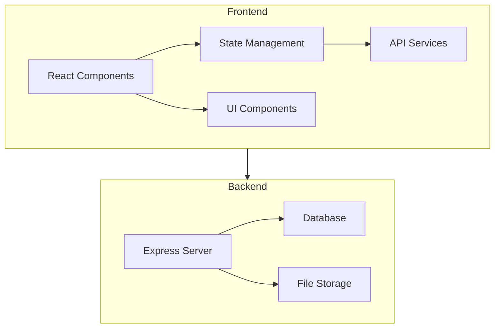
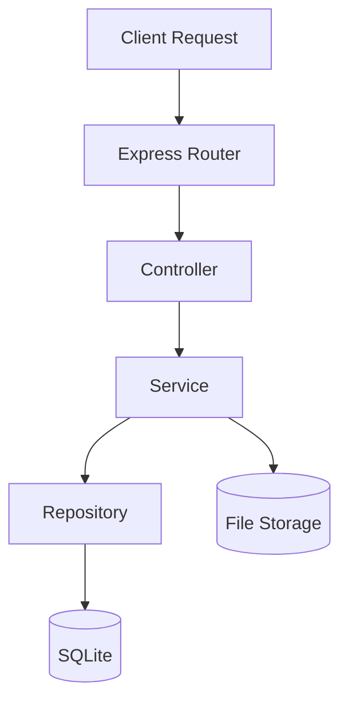
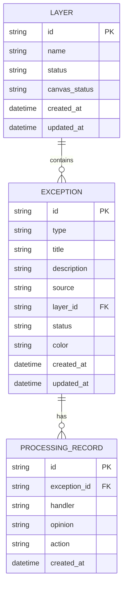

## 1. Architecture Design



## 2. Technology Description
- **Frontend**: React@18 + TypeScript + tailwindcss@3 + vite@6
- **State Management**: Zustand
- **Routing**: react-router-dom@6
- **Icons**: lucide-react
- **Backend**: Express@4 + TypeScript
- **Database**: SQLite (嵌入式，便于演示部署)
- **Initialization Tool**: vite-init

## 3. Route Definitions
| Route | Purpose | Component |
|-------|---------|-----------|
| / | 图层管理首页 | LayerManagement |
| /exceptions | 异常筛选页面 | ExceptionFilter |
| /exceptions/:id | 异常详情页面 | ExceptionDetail |
| /review | 复核管理页面 | ReviewManagement |

## 4. API Definitions

### 4.1 图层管理 API
| Method | Endpoint | Description |
|--------|----------|-------------|
| GET | /api/layers | 获取图层列表 |
| GET | /api/layers/:id | 获取图层详情 |
| PUT | /api/layers/:id/status | 更新图层状态 |

### 4.2 异常记录 API
| Method | Endpoint | Description |
|--------|----------|-------------|
| GET | /api/exceptions | 获取异常记录列表（支持筛选） |
| GET | /api/exceptions/:id | 获取异常详情 |
| POST | /api/exceptions | 导入异常记录 |
| PUT | /api/exceptions/:id | 更新异常状态 |
| DELETE | /api/exceptions/:id | 删除异常记录 |

### 4.3 处理记录 API
| Method | Endpoint | Description |
|--------|----------|-------------|
| GET | /api/exceptions/:id/records | 获取处理记录 |
| POST | /api/exceptions/:id/records | 添加处理记录 |

### 4.4 复核管理 API
| Method | Endpoint | Description |
|--------|----------|-------------|
| GET | /api/review | 获取复核列表 |
| POST | /api/review/batch | 批量复核 |
| GET | /api/review/export | 导出复核报告 |

### 4.5 类型定义

```typescript
interface Layer {
  id: string;
  name: string;
  status: 'active' | 'inactive' | 'warning';
  canvasStatus: string;
  createdAt: string;
  updatedAt: string;
}

interface Exception {
  id: string;
  type: 'scale_error' | 'material_missing' | 'duplicate_import' | 'other';
  title: string;
  description: string;
  source: string;
  layerId: string;
  status: 'pending' | 'processing' | 'approved' | 'confirmed';
  color: string;
  createdAt: string;
  updatedAt: string;
}

interface ProcessingRecord {
  id: string;
  exceptionId: string;
  handler: string;
  opinion: string;
  action: 'review' | 'modify' | 'ignore';
  createdAt: string;
}

interface ReviewBatch {
  ids: string[];
  conclusion: 'approved' | 'rejected' | 'pending';
  comment: string;
  reviewer: string;
}
```

## 5. Server Architecture Diagram



## 6. Data Model

### 6.1 Data Model Definition



### 6.2 Data Definition Language

```sql
CREATE TABLE IF NOT EXISTS layers (
    id TEXT PRIMARY KEY,
    name TEXT NOT NULL,
    status TEXT DEFAULT 'active',
    canvas_status TEXT,
    created_at DATETIME DEFAULT CURRENT_TIMESTAMP,
    updated_at DATETIME DEFAULT CURRENT_TIMESTAMP
);

CREATE TABLE IF NOT EXISTS exceptions (
    id TEXT PRIMARY KEY,
    type TEXT NOT NULL,
    title TEXT NOT NULL,
    description TEXT,
    source TEXT,
    layer_id TEXT,
    status TEXT DEFAULT 'pending',
    color TEXT DEFAULT '#dc2626',
    created_at DATETIME DEFAULT CURRENT_TIMESTAMP,
    updated_at DATETIME DEFAULT CURRENT_TIMESTAMP,
    FOREIGN KEY (layer_id) REFERENCES layers(id)
);

CREATE TABLE IF NOT EXISTS processing_records (
    id TEXT PRIMARY KEY,
    exception_id TEXT NOT NULL,
    handler TEXT,
    opinion TEXT,
    action TEXT,
    created_at DATETIME DEFAULT CURRENT_TIMESTAMP,
    FOREIGN KEY (exception_id) REFERENCES exceptions(id)
);

INSERT INTO layers (id, name, status, canvas_status) VALUES
('layer-001', '机构运动轨迹', 'active', '正常'),
('layer-002', '设备清单', 'active', '正常'),
('layer-003', '比例尺标注', 'warning', '存在异常'),
('layer-004', '离线素材', 'inactive', '部分缺失');

INSERT INTO exceptions (id, type, title, description, source, layer_id, status, color) VALUES
('exc-001', 'scale_error', '比例尺错用', '该图层比例尺设置为1:1000，但实际测量应为1:500', '测绘数据导入', 'layer-003', 'pending', '#dc2626'),
('exc-002', 'material_missing', '离线素材缺失', '设备图标文件未找到', '设备库同步', 'layer-004', 'pending', '#dc2626'),
('exc-003', 'duplicate_import', '重复导入', '同一轨迹数据被导入两次', '数据批量导入', 'layer-001', 'processing', '#f59e0b'),
('exc-004', 'scale_error', '比例尺单位错误', '使用米作为单位，但标注显示为公里', '手动编辑', 'layer-003', 'approved', '#22c55e'),
('exc-005', 'material_missing', '纹理素材缺失', '地面纹理贴图文件不存在', '素材库更新', 'layer-004', 'confirmed', '#f97316'),
('exc-006', 'scale_error', '坐标系不匹配', 'WGS84坐标被误用于平面直角坐标系', '数据转换', 'layer-002', 'pending', '#dc2626');

INSERT INTO processing_records (id, exception_id, handler, opinion, action) VALUES
('rec-001', 'exc-003', '张三', '已确认重复，保留最新版本', 'modify'),
('rec-002', 'exc-004', '李四', '比例尺已修正，复核通过', 'review'),
('rec-003', 'exc-005', '王五', '待补充素材后重新复核', 'review');
```
