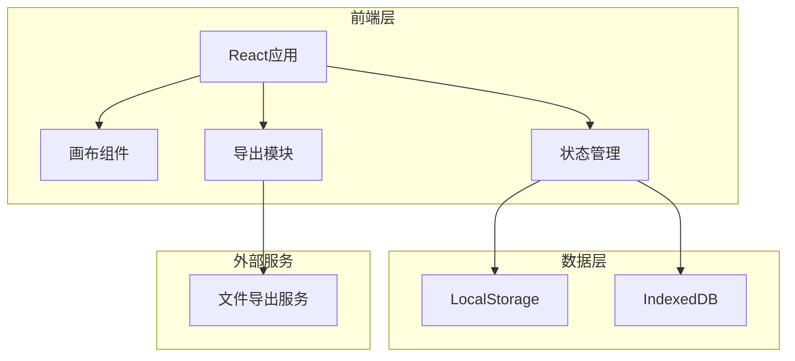
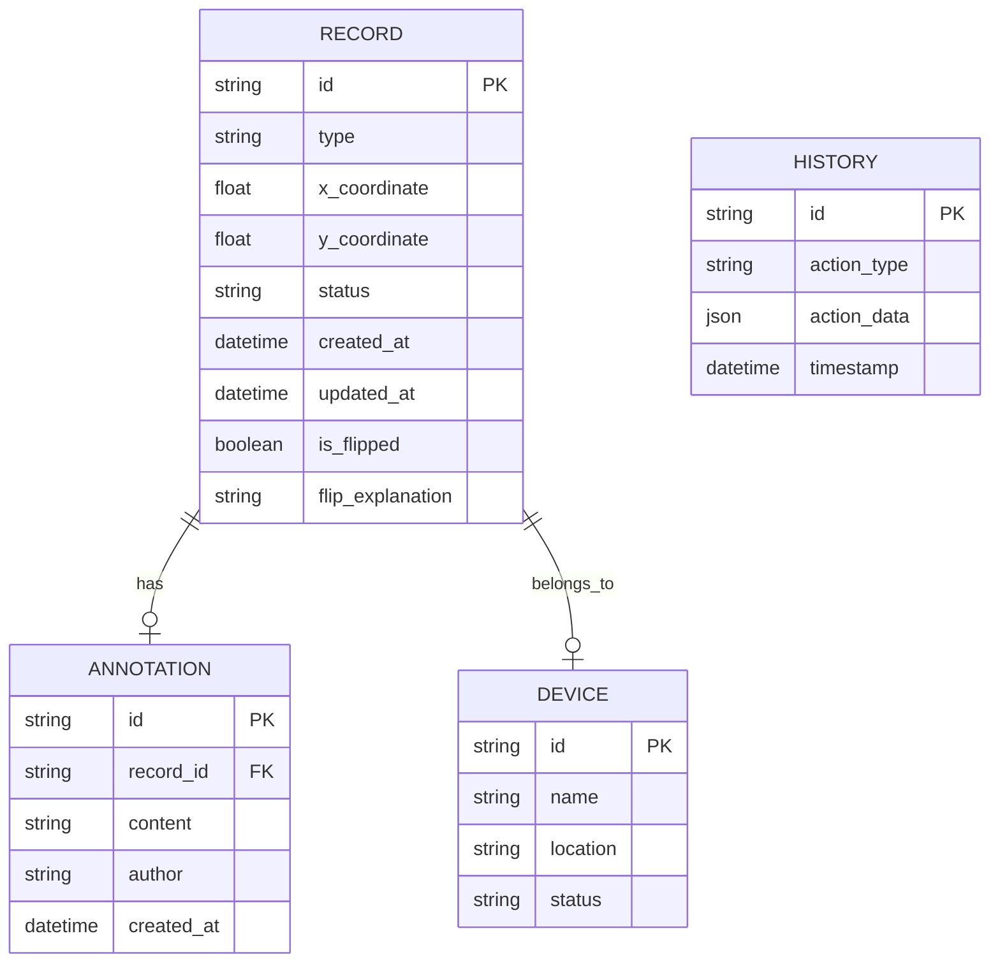
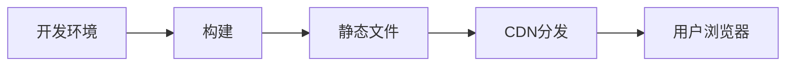

# 地铁站厅导流贴图系统 - 技术架构文档

## 1. 架构设计



## 2. 技术说明

- **前端框架**：React 18 + TypeScript
- **样式方案**：Tailwind CSS 3
- **构建工具**：Vite
- **状态管理**：Zustand (轻量级状态管理)
- **画布渲染**：Konva.js (Canvas操作库)
- **数据持久化**：LocalStorage + IndexedDB
- **导出功能**：jsPDF (PDF导出) + xlsx (Excel导出)
- **撤销/重做**：自定义历史栈管理

## 3. 路由定义

| 路由 | 用途 |
|------|------|
| `/` | 重定向到画布操作页面 |
| `/canvas` | 画布操作页面 - 主要工作区 |
| `/records` | 记录管理页面 - 记录列表和设备补录 |
| `/export` | 导出报告页面 - 生成和下载报告 |

## 4. 数据模型

### 4.1 数据模型定义



### 4.2 数据定义

```typescript
interface Record {
  id: string;
  type: 'guide' | 'warning' | 'info';
  xCoordinate: number;
  yCoordinate: number;
  status: 'success' | 'pending' | 'error';
  createdAt: Date;
  updatedAt: Date;
  isFlipped: boolean;
  flipExplanation?: string;
  deviceId?: string;
  annotation?: Annotation;
}

interface Annotation {
  id: string;
  recordId: string;
  content: string;
  author: string;
  createdAt: Date;
}

interface Device {
  id: string;
  name: string;
  location: string;
  status: 'active' | 'inactive';
}

interface HistoryEntry {
  id: string;
  actionType: 'move' | 'annotate' | 'status_change' | 'device_update';
  actionData: any;
  timestamp: Date;
}

interface CanvasState {
  records: Record[];
  devices: Device[];
  selectedRecordId: string | null;
  zoom: number;
  offset: { x: number; y: number };
}

interface ExportReport {
  exportTime: Date;
  operator: string;
  totalRecords: number;
  statusCounts: {
    success: number;
    pending: number;
    error: number;
  };
  flippedRecords: Array<{
    record: Record;
    explanation: string;
  }>;
  annotations: Array<{
    record: Record;
    originalNote: string;
  }>;
  scoringSummary: {
    colorRules: any;
    scoreTable: any;
    syncStatus: any;
  };
}
```

## 5. 核心算法

### 5.1 坐标翻转检测

```typescript
function detectCoordinateFlip(record: Record): boolean {
  const { xCoordinate, yCoordinate } = record;
  
  // 检测X坐标是否在合理范围内
  if (xCoordinate < 0 || xCoordinate > CANVAS_WIDTH) {
    return true;
  }
  
  // 检测Y坐标是否在合理范围内
  if (yCoordinate < 0 || yCoordinate > CANVAS_HEIGHT) {
    return true;
  }
  
  // 检测坐标是否翻转（X和Y互换）
  if (xCoordinate > yCoordinate && Math.abs(xCoordinate - yCoordinate) > THRESHOLD) {
    return true;
  }
  
  return false;
}

function generateFlipExplanation(record: Record): string {
  if (!record.isFlipped) return '';
  
  return `检测到坐标异常：X坐标为${record.xCoordinate}，Y坐标为${record.yCoordinate}。` +
         `可能原因：坐标值超出画布范围，或X/Y坐标可能发生翻转。` +
         `建议：请核对原始数据，确认坐标是否正确录入。`;
}
```

### 5.2 撤销/重做管理

```typescript
class HistoryManager {
  private undoStack: HistoryEntry[] = [];
  private redoStack: HistoryEntry[] = [];
  private maxHistorySize = 50;
  
  push(entry: HistoryEntry): void {
    this.undoStack.push(entry);
    this.redoStack = [];
    
    if (this.undoStack.length > this.maxHistorySize) {
      this.undoStack.shift();
    }
  }
  
  undo(): HistoryEntry | null {
    const entry = this.undoStack.pop();
    if (entry) {
      this.redoStack.push(entry);
    }
    return entry || null;
  }
  
  redo(): HistoryEntry | null {
    const entry = this.redoStack.pop();
    if (entry) {
      this.undoStack.push(entry);
    }
    return entry || null;
  }
  
  canUndo(): boolean {
    return this.undoStack.length > 0;
  }
  
  canRedo(): boolean {
    return this.redoStack.length > 0;
  }
}
```

### 5.3 状态同步机制

```typescript
function syncCanvasState(
  canvasState: CanvasState,
  updatedDevices: Device[]
): CanvasState {
  const updatedRecords = canvasState.records.map(record => {
    if (record.deviceId) {
      const device = updatedDevices.find(d => d.id === record.deviceId);
      if (device && device.status === 'inactive') {
        return {
          ...record,
          status: 'pending' as const,
          annotation: {
            ...record.annotation,
            content: '设备状态变更，需重新确认'
          }
        };
      }
    }
    return record;
  });
  
  return {
    ...canvasState,
    records: updatedRecords,
    devices: updatedDevices
  };
}
```

## 6. 组件架构

### 6.1 主要组件

```typescript
// 画布操作页面
CanvasPage
├── CanvasToolbar          // 工具栏
│   ├── ZoomControl        // 缩放控制
│   ├── FilterPanel        // 筛选面板
│   └── UndoRedoButtons    // 撤销/重做按钮
├── CanvasArea             // 画布区域
│   ├── BackgroundLayer    // 背景图层
│   ├── GridLayer          // 网格图层
│   ├── RecordLayer        // 记录图层
│   └── DeviceLayer        // 设备图层
└── AnnotationPanel        // 标注面板
    ├── StatusSelector     // 状态选择器
    ├── NoteInput          // 备注输入
    └── QuickActions       // 快捷操作

// 记录管理页面
RecordsPage
├── RecordList             // 记录列表
│   ├── RecordTable        // 记录表格
│   └── RecordFilters      // 记录筛选
├── DevicePanel            // 设备面板
│   ├── DeviceForm         // 设备表单
│   └── DeviceList         // 设备列表
└── ScoreTable             // 评分表

// 导出报告页面
ExportPage
├── ReportPreview          // 报告预览
│   ├── SummarySection     // 摘要部分
│   ├── FlipSection        // 翻转记录部分
│   └── SampleSection      // 样例部分
└── ExportActions          // 导出操作
    ├── PDFExport          // PDF导出
    └── ExcelExport        // Excel导出
```

### 6.2 状态管理

```typescript
// Zustand Store
interface AppStore {
  // 画布状态
  canvasState: CanvasState;
  
  // 历史管理
  historyManager: HistoryManager;
  
  // UI状态
  selectedRecordId: string | null;
  isAnnotationPanelOpen: boolean;
  
  // 操作方法
  moveRecord: (id: string, x: number, y: number) => void;
  annotateRecord: (id: string, annotation: string) => void;
  changeRecordStatus: (id: string, status: RecordStatus) => void;
  updateDevice: (device: Device) => void;
  undo: () => void;
  redo: () => void;
  
  // 导出方法
  generateReport: () => ExportReport;
  exportToPDF: (report: ExportReport) => void;
  exportToExcel: (report: ExportReport) => void;
}
```

## 7. 性能优化

### 7.1 画布渲染优化

- 使用Konva.js的分层渲染机制
- 仅重绘变化的图层
- 使用requestAnimationFrame进行动画
- 大量记录时启用虚拟渲染

### 7.2 状态管理优化

- 使用Zustand的浅比较避免不必要的重渲染
- 历史记录使用增量存储
- 大型数据使用IndexedDB而非LocalStorage

### 7.3 导出优化

- PDF导出使用Web Worker避免阻塞UI
- Excel导出使用流式写入
- 大数据集分批处理

## 8. 测试策略

### 8.1 单元测试

- 坐标翻转检测算法测试
- 撤销/重做逻辑测试
- 状态同步机制测试

### 8.2 集成测试

- 画布操作流程测试
- 设备补录后状态同步测试
- 导出报告生成测试

### 8.3 边界测试

- 极端坐标值测试
- 大量记录性能测试
- 并发操作测试

## 9. 部署架构



- **构建产物**：纯静态文件（HTML/CSS/JS）
- **部署方式**：CDN静态托管
- **更新策略**：版本化部署，支持回滚