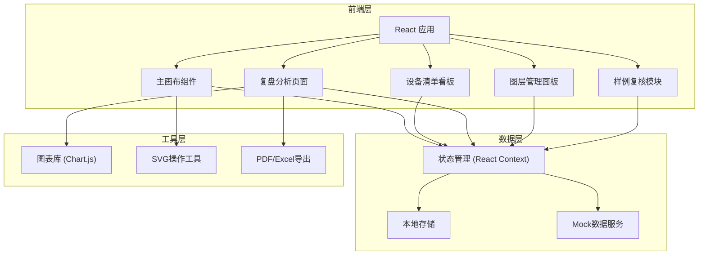
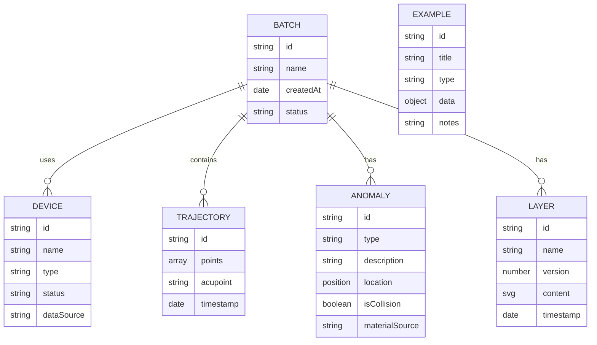

## 1. 架构设计



## 2. 技术描述

- **前端框架**: React@18 + TypeScript + Vite
- **样式方案**: Tailwind CSS@3
- **状态管理**: React Context API + useReducer
- **图表库**: Chart.js + react-chartjs-2
- **构建工具**: Vite
- **导出功能**: jsPDF + xlsx
- **UI组件**: 自定义组件（避免通用AI生成的组件库）
- **测试**: 暂不需要测试框架

## 3. 路由定义

| 路由 | 页面名称 | 用途 |
|------|---------|------|
| / | 主画布页面 | 穴位标注、轨迹记录 |
| /devices | 设备清单看板 | 设备管理、脚本执行 |
| /analysis | 复盘分析页面 | 图表展示、数据导出 |
| /layers | 图层管理面板 | 版本对比、历史记录 |
| /examples | 样例复核模块 | 真实样例展示、误判案例 |

## 4. 数据模型

### 4.1 数据模型定义



### 4.2 TypeScript类型定义

```typescript
interface Point {
  x: number;
  y: number;
}

interface Acupoint {
  id: string;
  name: string;
  position: Point;
  description: string;
}

interface Trajectory {
  id: string;
  points: Point[];
  acupointId: string;
  timestamp: Date;
  operator: string;
}

interface Anomaly {
  id: string;
  type: 'collision' | 'position_error' | 'missing_data';
  description: string;
  location: Point;
  severity: 'low' | 'medium' | 'high';
  materialSource: string;
  changedResult: boolean;
}

interface Device {
  id: string;
  name: string;
  type: string;
  status: 'online' | 'offline' | 'maintenance';
  dataSource: string;
}

interface Layer {
  id: string;
  name: string;
  version: number;
  content: string;
  timestamp: Date;
  author: string;
}

interface Batch {
  id: string;
  name: string;
  status: 'draft' | 'review' | 'completed';
  devices: Device[];
  trajectories: Trajectory[];
  anomalies: Anomaly[];
  layers: Layer[];
  createdAt: Date;
}

interface Example {
  id: string;
  title: string;
  type: 'old_form' | 'supplementary' | 'missing_unit' | 'collision_example';
  data: any;
  notes: string;
  draftAnnotations?: string;
  layerOcclusion?: boolean;
}
```

## 5. 核心功能实现方案

### 5.1 主画布实现
- 使用SVG作为底层渲染层
- 实现可缩放、可平移的视口
- 穴位标注使用可交互的SVG元素
- 轨迹记录使用折线和贝塞尔曲线

### 5.2 图层管理
- 使用SVG的g元素分组不同图层
- 版本对比使用透明度叠加和差异高亮
- 历史记录通过时间轴展示

### 5.3 数据一致性
- 图表、明细、下载使用同一数据源
- 通过Context API确保全局状态同步
- 样例数据包含真实的混合场景

### 5.4 碰撞边界示例
- 预设2-3个真实改变结果的案例
- 每个案例标注具体的材料来源
- 展示误判前后的对比
