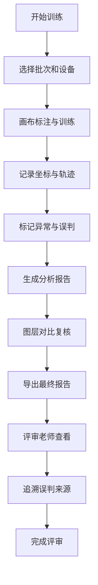

## 1. 产品概述
人体穴位练习画布是一个面向康复训练师的交互式工具，用于记录、分析和评审穴位训练过程中的底图坐标、轨迹记录和异常结论。
- 主要解决康复训练过程中穴位定位准确性问题，提供直观的可视化分析
- 目标用户包括康复训练师和评审老师，提升训练质量和复盘中的决策效率

## 2. 核心功能

### 2.1 用户角色
| 角色 | 使用方式 | 核心权限 |
|------|----------|----------|
| 康复训练师 | 直接操作 | 穴位标注、轨迹记录、图层管理、异常分析、样例复核 |
| 评审老师 | 查看复盘报告 | 查看完整报告、对比图层变化、追溯误判来源 |

### 2.2 功能模块
1. **主画布页面**：人体穴位底图、坐标标注、轨迹绘制
2. **设备清单看板**：设备状态、数据来源、批次跟踪
3. **复盘分析页面**：图表展示、明细数据、结果下载
4. **图层管理面板**：前后对比、历史版本、碰撞边界示例
5. **样例复核模块**：讲解备注、标注草稿、图层遮挡综合展示

### 2.3 页面详情
| 页面名称 | 模块名称 | 功能描述 |
|---------|---------|---------|
| 主画布页面 | 穴位底图展示 | 可交互的人体穴位图，支持缩放、平移 |
| 主画布页面 | 坐标与轨迹记录 | 实时记录穴位坐标和训练轨迹，支持撤销/重做 |
| 主画布页面 | 异常标记 | 碰撞边界误判标记，异常结论添加 |
| 设备清单看板 | 设备状态管理 | 显示当前批次使用的设备清单和状态 |
| 设备清单看板 | 脚本执行 | 预设分析脚本，一键生成初步报告 |
| 复盘分析页面 | 图表展示 | 轨迹热力图、准确率趋势图、碰撞分布图 |
| 复盘分析页面 | 明细查看 | 详细数据列表，支持筛选和导出 |
| 复盘分析页面 | 结果下载 | PDF/Excel格式报告导出 |
| 图层管理面板 | 版本对比 | 前后图层对比，高亮变化区域 |
| 样例复核模块 | 真实样例展示 | 包含旧表、补录备注、漏填单位的混合样例 |
| 样例复核模块 | 碰撞边界示例 | 2-3个真实改变结果的误判案例 |

## 3. 核心流程

康复训练师使用人体穴位练习画布的主要流程：
1. 打开主画布，选择当前训练批次
2. 在穴位底图上进行标注和训练
3. 系统自动记录坐标和轨迹数据
4. 标记异常情况和碰撞边界误判
5. 切换到设备清单看板，确认数据来源
6. 执行分析脚本，生成初步报告
7. 在图层管理中对比前后变化
8. 添加讲解备注和标注草稿
9. 导出完整报告供评审老师查看

评审老师查看报告流程：
1. 打开最终报告
2. 通过图表和明细了解整体情况
3. 查看图层对比和碰撞边界示例
4. 追溯误判来源到具体材料
5. 完成评审

## 4. 用户界面设计

### 4.1 设计风格
- **主色调**：医疗蓝 (#2563eb) 配合柔和的浅灰 (#f8fafc) 背景
- **辅助色**：绿色 (#10b981) 表示正常，橙色 (#f59e0b) 表示警告，红色 (#ef4444) 表示异常
- **按钮风格**：圆角矩形，微悬停效果，清晰的视觉层次
- **字体**：思源黑体作为主体字体，保证专业感和可读性
- **布局风格**：卡片式布局，清晰的分区，左右分栏（画布+控制面板）
- **图标风格**：线性图标，简洁明了，符合医疗行业规范

### 4.2 页面设计概述
| 页面名称 | 模块名称 | UI元素 |
|---------|---------|-------|
| 主画布页面 | 穴位底图 | SVG矢量图，支持缩放平移，穴位高亮 |
| 主画布页面 | 控制面板 | 左右侧边栏，工具按钮，属性面板 |
| 设备清单看板 | 设备卡片 | 网格布局，状态指示器，数据来源链接 |
| 复盘分析页面 | 图表区域 | 响应式图表，交互tooltip，数据筛选 |
| 复盘分析页面 | 数据表格 | 斑马纹表格，可排序列，批量操作 |
| 图层管理面板 | 版本对比 | 左右分屏对比，差异高亮，时间轴 |
| 样例复核模块 | 样例展示 | 层叠卡片，逐步展开，细节标注 |

### 4.3 响应式设计
- 桌面端优先设计，支持全功能展示
- 平板设备自适应布局，优化触控操作
- 移动端提供核心功能（查看报告、基本操作）

### 4.4 交互体验
- 画布操作流畅，支持鼠标滚轮缩放、拖拽平移
- 图层切换有平滑过渡动画
- 异常标记有明显视觉提示
- 数据加载有骨架屏占位
