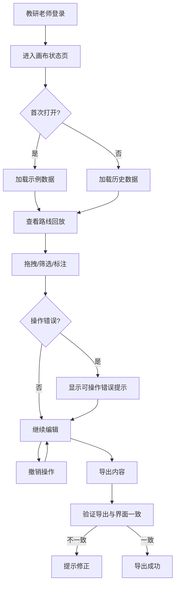

## 1. Product Overview
滑雪赛道路线回放系统是一个面向教研老师和学生的交互式教学工具，用于回放和分析滑雪比赛路线。核心解决教研老师修改讲解备注后，旧结果、新结果和学生报告不一致的问题。

## 2. Core Features

### 2.1 User Roles
| Role | Registration Method | Core Permissions |
|------|---------------------|------------------|
| 教研老师 | 账号登录 | 标注、编辑、撤销、导出、复核 |
| 学生 | 账号登录 | 查看路线回放、查看报告 |

### 2.2 Feature Module
1. **画布状态页**: 日常入口，展示路线回放画布
2. **标注工具**: 拖拽、筛选、标注功能
3. **撤销系统**: 支持操作撤销回退
4. **导出功能**: 导出内容与界面摘要一致
5. **异常标注查看**: 月底/课前查看异常标注
6. **示例数据**: 首次打开提供示例数据

### 2.3 Page Details
| Page Name | Module Name | Feature description |
|-----------|-------------|---------------------|
| 画布状态页 | 路线回放画布 | 展示滑雪赛道路线，支持拖拽查看 |
| 画布状态页 | 工具栏 | 筛选、标注、撤销、导出按钮 |
| 画布状态页 | 属性面板 | 显示当前选中元素属性 |
| 画布状态页 | 异常标注 | 月底/课前查看异常标注 |
| 画布状态页 | 评分表 | 与路线回放同步展示 |

## 3. Core Process

## 4. User Interface Design
### 4.1 Design Style
- 主色调: 深蓝色(#1e3a5f)，强调色: 橙色(#ff6b35)
- 按钮: 圆角矩形，hover效果
- 字体: Inter，标题18px，正文14px
- 布局: 左侧画布，右侧属性面板
- 图标: lucide-react

### 4.2 Page Design Overview
| Page Name | Module Name | UI Elements |
|-----------|-------------|-------------|
| 画布状态页 | 顶部导航 | Logo、用户信息、退出按钮 |
| 画布状态页 | 工具栏 | 选择工具、标注工具、撤销、导出 |
| 画布状态页 | 路线画布 | SVG渲染的赛道路线，支持缩放拖拽 |
| 画布状态页 | 属性面板 | 评分表、颜色规则、撤销状态 |
| 画布状态页 | 底部状态栏 | 当前状态提示、异常标注数量 |

### 4.3 Responsiveness
- 桌面优先设计
- 响应式布局适配平板
- 画布支持触控操作

### 4.4 Error Handling
- 处理失败时显示可操作提示（如"缺少评分表XX，请上传"）
- 避免内部错误暴露
- 提供明确的错误原因和解决步骤
