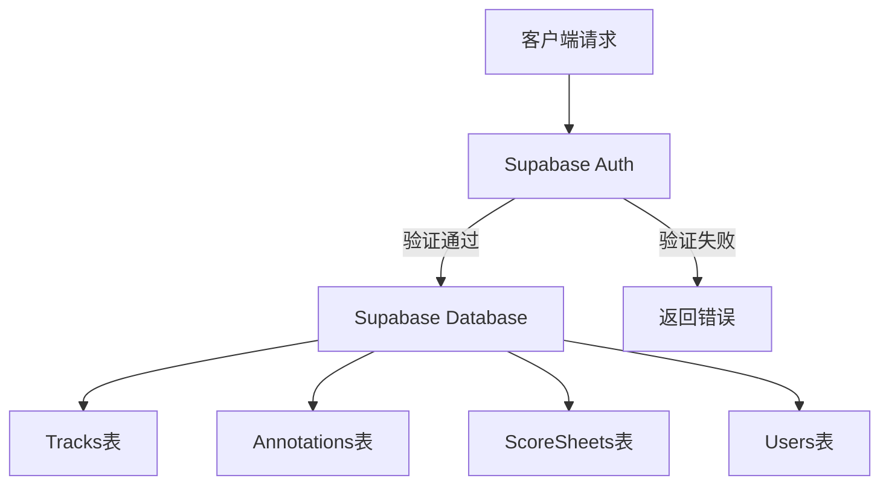
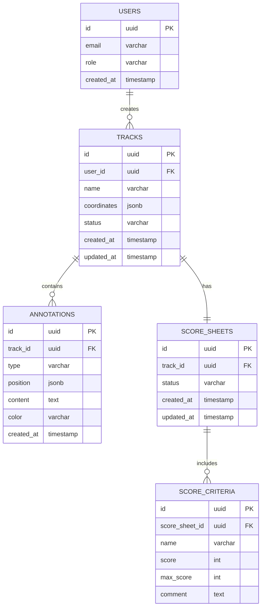

## 1. Architecture Design
```mermaid
layeredGraph LR
    subgraph Frontend[React Frontend]
        Canvas[路线画布组件]
        Toolbar[工具栏组件]
        Panel[属性面板组件]
        Status[状态栏组件]
    end
    
    subgraph State[状态管理]
        Store[Zustand Store]
    end
    
    subgraph Backend[Supabase]
        DB[(PostgreSQL)]
        Auth[Authentication]
        Storage[File Storage]
    end
    
    Canvas --> Store
    Toolbar --> Store
    Panel --> Store
    Status --> Store
    Store --> DB
    Store --> Auth
    Store --> Storage
```

## 2. Technology Description
- Frontend: React@18 + TypeScript + tailwindcss@3 + vite
- Initialization Tool: vite-init
- Backend: Supabase
- State Management: Zustand
- Icons: lucide-react

## 3. Route Definitions
| Route | Purpose |
|-------|---------|
| / | 画布状态页（主入口） |
| /login | 登录页 |

## 4. API Definitions
```typescript
interface TrackData {
  id: string;
  name: string;
  coordinates: { x: number; y: number }[];
  annotations: Annotation[];
  createdAt: Date;
  updatedAt: Date;
}

interface Annotation {
  id: string;
  trackId: string;
  type: 'point' | 'line' | 'area';
  position: { x: number; y: number };
  content: string;
  color: string;
  createdAt: Date;
}

interface ScoreSheet {
  id: string;
  trackId: string;
  criteria: ScoreCriterion[];
  status: 'draft' | 'review' | 'approved';
}

interface ScoreCriterion {
  id: string;
  name: string;
  score: number;
  maxScore: number;
  comment: string;
}

interface ErrorInfo {
  code: string;
  message: string;
  action: string;
  missingResources?: string[];
}
```

## 5. Server Architecture Diagram


## 6. Data Model

### 6.1 Data Model Definition


### 6.2 Data Definition Language
```sql
CREATE TABLE users (
    id UUID PRIMARY KEY DEFAULT uuid_generate_v4(),
    email VARCHAR(255) UNIQUE NOT NULL,
    role VARCHAR(50) DEFAULT 'student',
    created_at TIMESTAMP DEFAULT CURRENT_TIMESTAMP
);

CREATE TABLE tracks (
    id UUID PRIMARY KEY DEFAULT uuid_generate_v4(),
    user_id UUID REFERENCES users(id),
    name VARCHAR(255) NOT NULL,
    coordinates JSONB NOT NULL,
    status VARCHAR(50) DEFAULT 'draft',
    created_at TIMESTAMP DEFAULT CURRENT_TIMESTAMP,
    updated_at TIMESTAMP DEFAULT CURRENT_TIMESTAMP
);

CREATE TABLE annotations (
    id UUID PRIMARY KEY DEFAULT uuid_generate_v4(),
    track_id UUID REFERENCES tracks(id) ON DELETE CASCADE,
    type VARCHAR(50) NOT NULL,
    position JSONB NOT NULL,
    content TEXT,
    color VARCHAR(50) DEFAULT '#ff6b35',
    created_at TIMESTAMP DEFAULT CURRENT_TIMESTAMP
);

CREATE TABLE score_sheets (
    id UUID PRIMARY KEY DEFAULT uuid_generate_v4(),
    track_id UUID REFERENCES tracks(id) ON DELETE CASCADE,
    status VARCHAR(50) DEFAULT 'draft',
    created_at TIMESTAMP DEFAULT CURRENT_TIMESTAMP,
    updated_at TIMESTAMP DEFAULT CURRENT_TIMESTAMP
);

CREATE TABLE score_criteria (
    id UUID PRIMARY KEY DEFAULT uuid_generate_v4(),
    score_sheet_id UUID REFERENCES score_sheets(id) ON DELETE CASCADE,
    name VARCHAR(255) NOT NULL,
    score INT NOT NULL,
    max_score INT NOT NULL,
    comment TEXT
);

GRANT SELECT ON users TO anon;
GRANT SELECT ON tracks TO anon;
GRANT SELECT ON annotations TO anon;
GRANT SELECT ON score_sheets TO anon;
GRANT SELECT ON score_criteria TO anon;

GRANT ALL PRIVILEGES ON users TO authenticated;
GRANT ALL PRIVILEGES ON tracks TO authenticated;
GRANT ALL PRIVILEGES ON annotations TO authenticated;
GRANT ALL PRIVILEGES ON score_sheets TO authenticated;
GRANT ALL PRIVILEGES ON score_criteria TO authenticated;
```

### 6.3 Sample Data
```sql
INSERT INTO users (email, role) VALUES ('teacher@example.com', 'teacher');
INSERT INTO users (email, role) VALUES ('student@example.com', 'student');

INSERT INTO tracks (user_id, name, coordinates) 
VALUES (
    (SELECT id FROM users WHERE email = 'teacher@example.com'),
    '示例赛道',
    '[{\"x\": 100, \"y\": 50}, {\"x\": 200, \"y\": 80}, {\"x\": 300, \"y\": 60}, {\"x\": 400, \"y\": 100}]'
);

INSERT INTO annotations (track_id, type, position, content, color)
VALUES (
    (SELECT id FROM tracks WHERE name = '示例赛道'),
    'point',
    '{\"x\": 200, \"y\": 80}',
    '转弯点 - 注意减速',
    '#ff6b35'
);

INSERT INTO score_sheets (track_id, status)
VALUES (
    (SELECT id FROM tracks WHERE name = '示例赛道'),
    'approved'
);

INSERT INTO score_criteria (score_sheet_id, name, score, max_score, comment)
VALUES (
    (SELECT id FROM score_sheets WHERE track_id = (SELECT id FROM tracks WHERE name = '示例赛道')),
    '路线选择',
    85,
    100,
    '路线选择合理，流畅度高'
);
```
