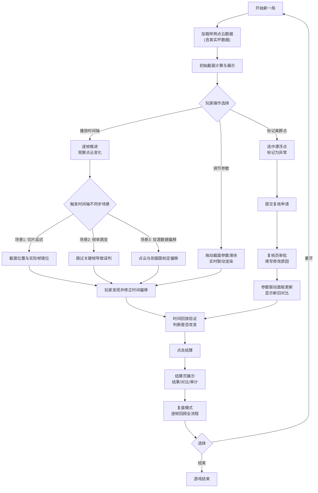

## 1. 产品概述

立体几何截面课堂是一款面向运维组的浏览器交互式教学演示工具，围绕"点云切片"核心主线，通过可操作的游戏化界面帮助运维人员理解三维点云数据的截面分析流程、时间轴同步问题、离群点复核机制以及数据修改的审计追踪。

- 核心目标：让运维主管和组员在一局游戏中完整走通点云切片分析全流程
- 解决问题：时间轴不同步导致的判断偏差、离群点修改缺乏可追溯性、新旧结论对比不直观
- 目标用户：运维主管、运维组数据分析人员

## 2. 核心特性

### 2.1 用户角色

| 角色 | 注册方式 | 核心权限 |
|------|----------|----------|
| 操作员 | 本地模拟登录 | 开始/暂停/重开、调整截面参数、标记离群点 |
| 复核员 | 本地模拟登录 | 审核离群点修改、批准/驳回、填写修改原因 |
| 观察者 | 直接访问 | 观看结算和复盘、查看审计历史 |

### 2.2 功能模块

1. **主控台页面**：开始/暂停/重开控制、时间轴播放、进度指示
2. **3D 点云场景**：点云渲染、动态截面平面、离群点高亮标记
3. **参数联动面板**：截面位置/角度/厚度实时调节、参数前后对比视图
4. **离群点复核区**：漂浮点标记、复核审批流程、修改原因记录
5. **结算与复盘页**：一局结果展示、时间轴回放、新旧结论并排对比、审计日志

### 2.3 页面详情

| 页面名称 | 模块名称 | 功能描述 |
|-----------|-------------|---------------------|
| 主控台 | 游戏控制栏 | 开始按钮、暂停按钮、重开按钮、结算按钮 |
| 主控台 | 时间轴播放器 | 进度条、播放速度控制、帧步进、关键帧标记 |
| 主控台 | 3D 点云视口 | Three.js 渲染点云、可交互截面平面、鼠标旋转缩放 |
| 主控台 | 参数联动面板 | 截面 XYZ 位置滑块、法向角度滑块、厚度滑块；修改前后参数并排对比 |
| 主控台 | 离群点列表 | 漂浮点卡片、选中高亮、标记/取消标记、提交复核 |
| 结算页 | 结果总览 | 本局判定结果、正确/错误统计、耗时统计 |
| 结算页 | 新旧结论对比 | 修改前截面图 vs 修改后截面图并排展示、参数差异高亮 |
| 结算页 | 时间轴复盘 | 可拖动回放全流程、关键决策点标记、不同步场景说明 |
| 结算页 | 审计日志 | 每条修改记录：操作人、时间戳、修改原因、修改前后值 |

## 3. 核心流程

## 4. 用户界面设计

### 4.1 设计风格

- **主色调**：深空蓝 `#0a1628`（背景）+ 科技青 `#00e5ff`（强调）+ 警示橙 `#ff6b35`（离群点/异常）
- **辅助色**：成功绿 `#00ff88`、对比黄 `#ffd93d`
- **按钮风格**：切角矩形（斜切右上角 8px）、半透明玻璃态背景、悬停时发光边框
- **字体**：标题用 `Orbitron`（等宽科技感），正文用 `JetBrains Mono`（代码等宽），数据展示用等宽字体
- **布局风格**：三栏式仪表板布局（左参数 / 中 3D 视口 / 右离群点+时间轴），HUD 风格叠加层
- **图标风格**：Lucide 线性图标 + 发光描边效果，所有图标统一 2px 线宽

### 4.2 页面设计概览

| 页面名称 | 模块名称 | UI 元素 |
|-----------|-------------|----------|
| 主控台 | 顶部控制栏 | 切角按钮组、当前局数/状态徽章、角色切换器、玻璃态背景 |
| 主控台 | 中央 3D 视口 | 四角 HUD 信息（坐标/帧率/截面参数）、扫描线动画、点云发光效果 |
| 主控台 | 左侧参数面板 | 分组卡片、滑块带实时数值、修改前后双列对比、差异高亮闪烁 |
| 主控台 | 右侧面板 | 离群点卡片列表、时间轴带关键帧标记、播放速度切换 |
| 结算页 | 结果头部 | 大字判定结果（正确/误判）、数据统计网格、脉冲动画 |
| 结算页 | 新旧对比区 | 左右分屏、中间可拖动分割线、同步缩放/平移 |
| 结算页 | 审计日志 | 时间线样式、头像、操作类型徽章、修改前后 diff 展示 |
| 结算页 | 复盘播放器 | 逐帧按钮、关键节点跳转、决策点气泡说明 |

### 4.3 响应式

- 桌面端优先设计（最低 1280px 宽度）
- 三栏布局在 <1024px 时折叠为上下堆叠
- 3D 视口始终保持 16:9 比例
- 触屏设备支持双指缩放点云视图

### 4.4 3D 场景指引

- **环境**：纯深空背景 + 微弱网格地面、无 HDRI、冷色调雾气
- **光照**：半球光（青蓝）+ 方向光（45° 侧上方）+ 点光源随截面平面移动
- **相机**：初始 45° 俯视角、PerspectiveCamera、阻尼旋转、自动聚焦截面区域
- **构图**：点云居中偏上、截面平面半透明高亮、离群点外发光脉冲动画
- **交互**：鼠标左键旋转、右键平移、滚轮缩放、点击选中离群点、拖动截面平面
- **后处理**：Bloom 发光（离群点/截面边缘）、轻微胶片颗粒、扫描线效果
