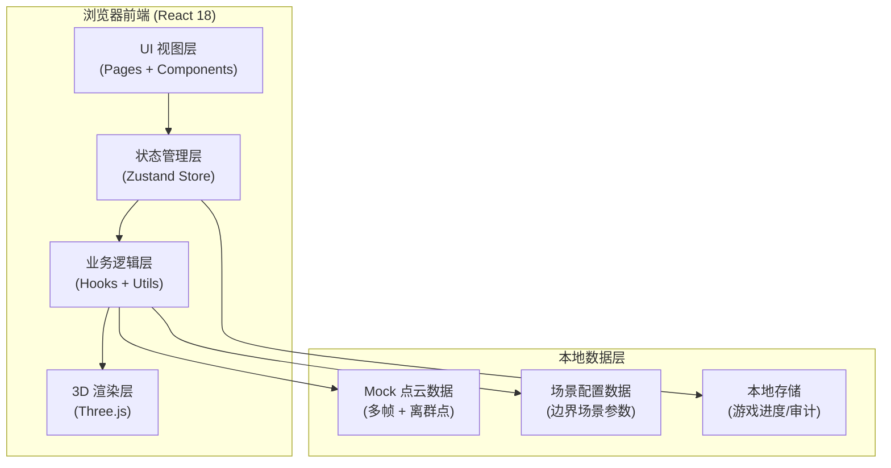
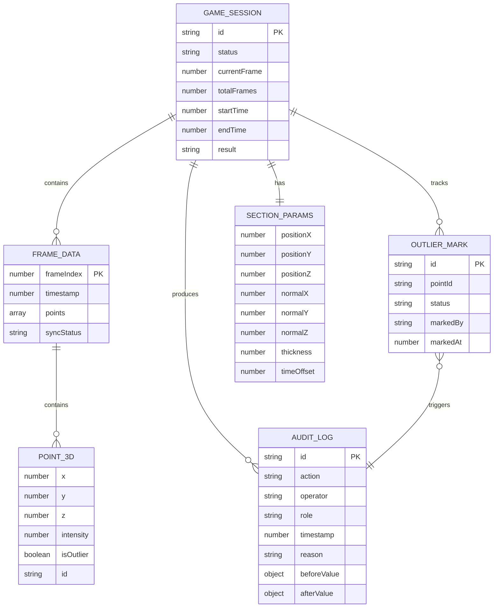

## 1. 架构设计



## 2. 技术说明

- **前端框架**: React@18 + TypeScript@5 + Vite@6
- **状态管理**: Zustand@4（集中管理游戏状态、点云数据、审计日志）
- **3D 渲染**: Three@0.160 + @react-three/fiber@8 + @react-three/drei@9 + @react-three/postprocessing@2
- **样式**: TailwindCSS@3 + CSS Variables（主题化设计令牌）
- **图标**: lucide-react@0.294
- **路由**: react-router-dom@6
- **后端**: 无（纯前端，所有数据 Mock 化，审计日志存 localStorage）
- **数据库**: localStorage（持久化游戏进度和审计记录）

## 3. 路由定义

| 路由 | 用途 |
|-------|---------|
| `/` | 主控台页面（游戏主界面，含 3D 视口、参数面板、时间轴） |
| `/result` | 结算与复盘页面（结果展示、新旧对比、审计日志、时间轴回放） |

## 4. 数据模型

### 4.1 数据模型定义



### 4.2 TypeScript 类型定义

```typescript
// 点云数据点
interface Point3D {
  id: string;
  x: number;
  y: number;
  z: number;
  intensity: number;
  isOutlier: boolean;
  originalFrame: number;
}

// 帧数据
interface FrameData {
  frameIndex: number;
  timestamp: number;
  points: Point3D[];
  syncStatus: 'synced' | 'delayed' | 'skipped' | 'offset';
  syncOffsetMs?: number;
}

// 截面参数
interface SectionParams {
  positionX: number;
  positionY: number;
  positionZ: number;
  normalX: number;
  normalY: number;
  normalZ: number;
  thickness: number;
  timeOffset: number;
}

// 参数快照（用于新旧对比）
interface ParamSnapshot {
  params: SectionParams;
  timestamp: number;
  operator: string;
  reason?: string;
}

// 离群点标记
interface OutlierMark {
  id: string;
  pointId: string;
  status: 'pending' | 'approved' | 'rejected';
  markedBy: string;
  markedAt: number;
  reviewedBy?: string;
  reviewedAt?: number;
  reviewReason?: string;
}

// 审计日志
interface AuditLog {
  id: string;
  action: 'param_change' | 'outlier_mark' | 'outlier_approve' | 'outlier_reject' | 'frame_skip' | 'sync_fix';
  operator: string;
  role: 'operator' | 'reviewer';
  timestamp: number;
  reason: string;
  beforeValue: Record<string, unknown>;
  afterValue: Record<string, unknown>;
}

// 游戏会话
interface GameSession {
  id: string;
  status: 'idle' | 'playing' | 'paused' | 'finished';
  currentFrame: number;
  totalFrames: number;
  startTime: number | null;
  endTime: number | null;
  result: 'correct' | 'wrong' | null;
  playSpeed: number;
  currentParams: SectionParams;
  paramHistory: ParamSnapshot[];
  outlierMarks: OutlierMark[];
  auditLogs: AuditLog[];
}

// 边界场景
interface BoundaryScene {
  id: string;
  name: string;
  description: string;
  triggerFrame: number;
  type: 'delay' | 'skip' | 'offset';
  expectedFix: Partial<SectionParams>;
  consequence: string;
}
```

## 5. 目录结构

```
src/
├── components/
│   ├── console/
│   │   ├── ControlBar.tsx        # 顶部控制栏（开始/暂停/重开/结算）
│   │   ├── TimelinePlayer.tsx    # 时间轴播放器
│   │   ├── ParamPanel.tsx        # 参数联动面板（含新旧对比）
│   │   ├── OutlierPanel.tsx      # 离群点列表面板
│   │   └── RoleSwitcher.tsx      # 角色切换器
│   ├── scene3d/
│   │   ├── PointCloudScene.tsx   # 3D 场景主组件
│   │   ├── PointCloud.tsx        # 点云渲染组件
│   │   ├── SectionPlane.tsx      # 截面平面组件
│   │   └── OutlierPoints.tsx     # 离群点高亮组件
│   ├── result/
│   │   ├── ResultHeader.tsx      # 结算结果头部
│   │   ├── CompareView.tsx       # 新旧结论并排对比
│   │   ├── AuditTimeline.tsx     # 审计日志时间线
│   │   └── ReplayPlayer.tsx      # 复盘播放器
│   └── ui/
│       ├── GlowButton.tsx        # 发光按钮
│       ├── HudCard.tsx           # HUD 风格卡片
│       ├── Slider.tsx            # 自定义滑块
│       └── DiffHighlight.tsx     # 差异高亮展示
├── pages/
│   ├── ConsolePage.tsx           # 主控台页面
│   └── ResultPage.tsx            # 结算复盘页面
├── hooks/
│   ├── useGameEngine.ts          # 游戏引擎核心逻辑
│   ├── useTimeSync.ts            # 时间同步处理
│   ├── useSectionCalculation.ts  # 截面计算
│   └── useAuditLog.ts            # 审计日志 Hook
├── store/
│   └── useGameStore.ts           # Zustand 全局状态
├── utils/
│   ├── pointCloudGenerator.ts    # 点云数据生成（含坏数据）
│   ├── sectionMath.ts            # 截面几何计算
│   ├── boundaryScenes.ts         # 边界场景配置
│   └── storage.ts                # localStorage 封装
├── types/
│   └── index.ts                  # 全局类型定义
├── styles/
│   └── theme.css                 # CSS 变量与全局样式
├── App.tsx
├── main.tsx
└── index.css
```
