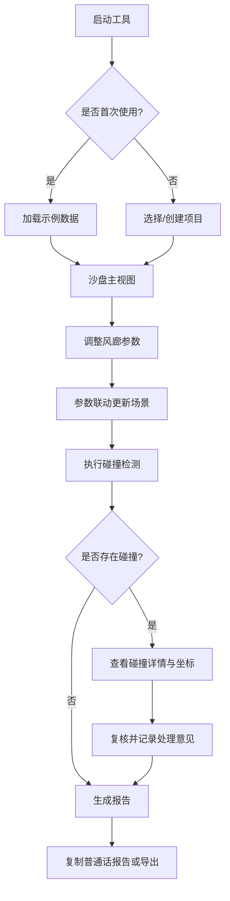

## 1. 产品概述

城市风廊体块沙盘是一款面向规划设计师的专业三维可视化工具，用于城市风廊规划方案的体块建模、碰撞检测、参数联动分析及施工交底辅助。产品解决了传统工作中依赖截图、手写备注和测量记录进行方案核对的低效问题，提供统一的数据处理链路和可追溯的历史记录机制。

- 核心目标：让规划设计师在施工交底前能快速、准确地完成风廊体块方案的碰撞校验、参数调整和成果汇报
- 目标用户：城市规划设计师、建筑工程师、规划方案评审人员
- 产品价值：统一参数联动与碰撞检测的数据源、提供即时可视化解释、生成可直接用于沟通的普通话报告、建立完整的操作追溯链条

## 2. 核心功能

### 2.1 用户角色
| 角色 | 登录方式 | 核心权限 |
|------|----------|----------|
| 规划设计师 | 本地启动即用 | 创建/编辑体块模型、调整风廊参数、执行碰撞检测、生成报告、查看操作历史 |
| 评审工程师 | 本地启动即用 | 查看模型与检测结果、复核碰撞记录、导出报告 |

### 2.2 功能模块
1. **沙盘主视图**：三维体块模型展示区、相机控制、风廊可视化效果、实时参数解释面板
2. **参数联动面板**：风廊宽度/高度/角度等参数滑块、体块属性编辑器、参数联动规则配置
3. **碰撞检测中心**：一键碰撞检测、碰撞列表、碰撞详情（含设备坐标）、复核记录
4. **历史追溯面板**：操作时间线、变更人/时间/原因记录、异常回溯链路
5. **报告生成器**：自动生成含普通话解释的检测报告、一键复制文本、导出功能
6. **首次引导示例**：内置示例数据（含典型相机视角丢失记录场景）、使用引导

### 2.3 页面详情
| 页面名称 | 模块名称 | 功能描述 |
|----------|----------|----------|
| 沙盘主视图 | 三维场景 | 支持旋转/缩放/平移的3D体块模型，风廊路径高亮，选中体块显示坐标与属性 |
| 沙盘主视图 | 参数解释气泡 | 鼠标悬停参数时自动弹出1-2句专业解释，便于向他人讲解 |
| 参数联动面板 | 参数滑块组 | 风廊宽度、高度、偏角、建筑退距等参数，修改后实时联动三维场景与碰撞数据 |
| 参数联动面板 | 联动规则 | 展示参数间的约束关系（如宽度变化自动影响相邻退距） |
| 碰撞检测中心 | 检测执行 | 一键执行碰撞检测，使用与参数面板相同的数据源，确保结果一致性 |
| 碰撞检测中心 | 碰撞列表 | 按严重程度排序的碰撞项，点击可跳转至三维场景对应位置 |
| 碰撞检测中心 | 复核操作 | 碰撞记录可标记为"已复核通过"，需填写复核人、时间、复核说明 |
| 历史追溯面板 | 时间线视图 | 展示所有操作的时间轴，包含参数变更、碰撞检测、复核操作 |
| 历史追溯面板 | 异常回溯 | 从任一异常记录出发，可回溯查看当时的设备坐标、参数快照、处理意见 |
| 报告生成器 | 普通话报告 | 自动生成包含检测结论、问题说明、建议方案的普通话文本，支持一键复制 |
| 报告生成器 | 导出功能 | 支持导出PDF/Markdown格式报告 |
| 首次引导 | 示例数据 | 首次打开自动加载含相机视角丢失记录、模型重叠等典型场景的示例项目 |

## 3. 核心流程

### 3.1 日常工作流程
规划设计师打开工具 → 加载/创建项目 → 调整风廊参数（三维场景实时联动）→ 执行碰撞检测（共用参数数据源）→ 查看碰撞详情与坐标 → 复核并记录处理意见 → 生成含普通话解释的报告 → 复制给同事或导出

### 3.2 异常追溯流程
验收时发现问题 → 在历史面板定位异常记录 → 查看关联的设备坐标快照 → 查看当时的参数配置 → 查看处理意见与复核人 → 追溯完整变更链路

### 3.3 首次使用流程
首次启动 → 自动加载示例项目（含相机视角丢失场景）→ 引导查看示例参数、碰撞记录与历史 → 设计师快速理解工具用法

## 4. 用户界面设计

### 4.1 设计风格
- **主色调**：深青蓝色系（#0F2A3A 作为主背景，#2DD4BF 作为科技感强调色），营造专业城市规划的冷静科技感
- **辅助色**：橙红色（#F97316）标记碰撞警告，翠绿色（#10B981）标记复核通过
- **字体**：标题使用 "Noto Serif SC" 衬线体增强专业感，正文使用 "JetBrains Mono" 等宽字体保证坐标数据可读性
- **按钮风格**：微立体圆角矩形，hover 时有发光边效，危险操作使用橙红渐变
- **布局风格**：左侧参数面板 + 中央三维沙盘 + 右侧检测/历史面板的三栏式布局，顶部工具栏
- **图标风格**：使用 Lucide 线性图标，配合科技感的微发光效果

### 4.2 页面设计概述
| 页面名称 | 模块名称 | UI元素 |
|----------|----------|--------|
| 沙盘主视图 | 三维场景 | 深色渐变背景 + 网格地面 + 半透明体块 + 风廊发光路径 |
| 沙盘主视图 | 参数解释气泡 | 毛玻璃背景卡片，带小三角指向，淡入淡出动画 |
| 参数联动面板 | 参数滑块组 | 深色卡片容器，自定义滑块轨道，数值实时显示 |
| 碰撞检测中心 | 碰撞列表 | 行式列表，严重程度色条标识，点击高亮联动场景 |
| 历史追溯面板 | 时间线 | 垂直时间线，节点带状态颜色，悬停显示详情预览 |
| 报告生成器 | 报告预览 | 类纸张白色卡片，排版清晰，复制按钮固定悬浮 |

### 4.3 响应式
- 桌面端优先设计（最小宽度 1280px），三栏等高布局
- 面板支持拖拽调整宽度，可折叠为图标模式
- 三维场景始终占据最大可视区域

### 4.4 三维场景指导
- **环境**：深色星空渐变背景，地面使用科技感网格线，营造专业沙盘氛围
- **光照**：两盏方向光模拟日光 + 环境光补光，体块边缘添加轮廓光强调空间感
- **相机设置**：默认45度俯视视角，支持轨道控制，视角状态可保存/恢复
- **风廊可视化**：使用半透明发光体积光柱表示风廊路径，流动粒子动画模拟气流
- **交互效果**：鼠标悬停体块时高亮描边，选中体块显示坐标轴与尺寸标注
- **碰撞标记**：碰撞位置使用脉冲式红色标记点，点击显示详细信息
