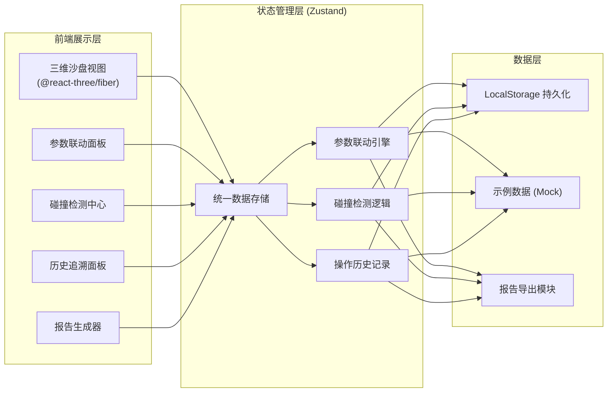
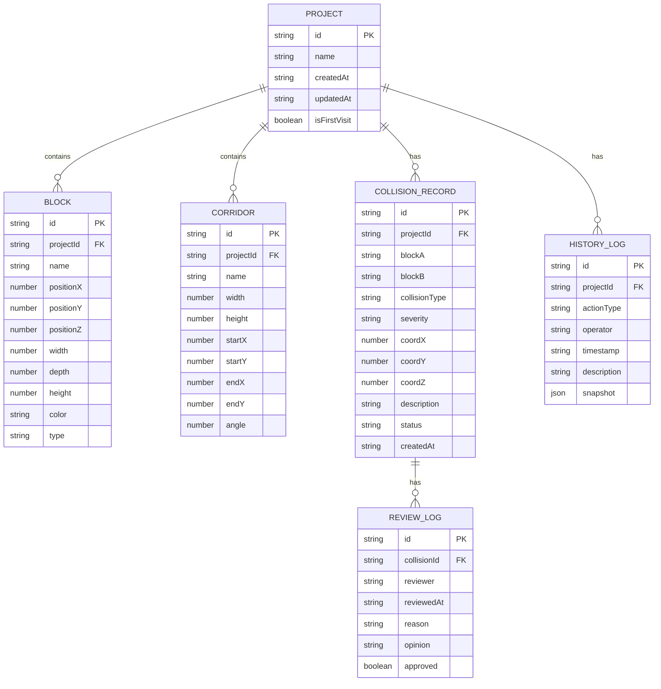

## 1. 架构设计



## 2. 技术描述

- **前端框架**: React 18 + TypeScript + Vite
- **三维渲染**: three.js + @react-three/fiber + @react-three/drei + @react-three/postprocessing
- **样式方案**: Tailwind CSS 3
- **状态管理**: Zustand（统一数据源，参数联动与碰撞检测共用同一份状态）
- **图标库**: Lucide React
- **持久化**: LocalStorage（存储项目数据、操作历史）
- **后端**: 无（纯前端单页应用，数据本地存储）
- **数据库**: 无，使用 LocalStorage + Mock 示例数据

## 3. 路由定义

| 路由 | 用途 |
|------|------|
| / | 沙盘主工作台（包含所有功能模块的单页应用） |

本项目为单页工作台应用，不使用多页面路由，所有功能模块在同一页面内通过面板切换组织。

## 4. 数据模型

### 4.1 数据模型定义



### 4.2 核心类型定义

```typescript
interface Project {
  id: string;
  name: string;
  createdAt: string;
  updatedAt: string;
  blocks: Block[];
  corridors: Corridor[];
  collisions: CollisionRecord[];
  history: HistoryLog[];
  isFirstVisit: boolean;
}

interface Block {
  id: string;
  name: string;
  position: { x: number; y: number; z: number };
  size: { width: number; depth: number; height: number };
  color: string;
  type: 'building' | 'green' | 'infrastructure';
}

interface Corridor {
  id: string;
  name: string;
  width: number;
  height: number;
  startPoint: { x: number; y: number };
  endPoint: { x: number; y: number };
  angle: number;
}

interface CollisionRecord {
  id: string;
  blockA: string;
  blockB: string;
  collisionType: 'overlap' | 'corridor_violation' | 'setback_insufficient';
  severity: 'high' | 'medium' | 'low';
  coordinates: { x: number; y: number; z: number };
  description: string;
  status: 'pending' | 'reviewed';
  createdAt: string;
  review?: ReviewLog;
}

interface ReviewLog {
  id: string;
  reviewer: string;
  reviewedAt: string;
  reason: string;
  opinion: string;
  approved: boolean;
}

interface HistoryLog {
  id: string;
  actionType: 'param_change' | 'collision_detect' | 'review' | 'camera_loss' | 'project_create';
  operator: string;
  timestamp: string;
  description: string;
  snapshot: {
    parameters?: Record<string, number>;
    coordinates?: { x: number; y: number; z: number };
    collisionId?: string;
  };
}

interface SandboxStore {
  currentProject: Project;
  selectedBlockId: string | null;
  selectedCollisionId: string | null;
  isDetecting: boolean;
  updateCorridorParam: (id: string, key: string, value: number) => void;
  updateBlockPosition: (id: string, position: Partial<Block['position']>) => void;
  runCollisionDetection: () => void;
  reviewCollision: (collisionId: string, review: Omit<ReviewLog, 'id' | 'reviewedAt'>) => void;
  addHistoryLog: (log: Omit<HistoryLog, 'id' | 'timestamp'>) => void;
  generateReport: () => string;
  loadSampleData: () => void;
}
```

## 5. 核心模块划分

### 5.1 目录结构
```
src/
├── components/
│   ├── Sandbox/
│   │   ├── Scene3D.tsx          # 三维场景主容器
│   │   ├── BuildingBlock.tsx    # 建筑体块组件
│   │   ├── CorridorPath.tsx     # 风廊路径可视化
│   │   ├── CollisionMarker.tsx  # 碰撞标记点
│   │   └── GroundGrid.tsx       # 地面网格
│   ├── Panels/
│   │   ├── ParameterPanel.tsx   # 参数联动面板
│   │   ├── CollisionPanel.tsx   # 碰撞检测面板
│   │   ├── HistoryPanel.tsx     # 历史追溯面板
│   │   └── ReportPanel.tsx      # 报告生成面板
│   ├── Common/
│   │   ├── Tooltip.tsx          # 参数解释气泡
│   │   ├── Timeline.tsx         # 时间线组件
│   │   └── Slider.tsx           # 自定义参数滑块
│   └── Layout/
│       └── Workspace.tsx        # 三栏工作台布局
├── store/
│   └── useSandboxStore.ts       # Zustand 统一状态管理
├── utils/
│   ├── collisionDetector.ts     # 碰撞检测算法
│   ├── paramLinkage.ts          # 参数联动规则引擎
│   ├── reportGenerator.ts       # 普通话报告生成
│   └── sampleData.ts            # 示例数据（含相机视角丢失场景）
├── types/
│   └── index.ts                 # 类型定义
├── App.tsx
└── main.tsx
```

### 5.2 关键设计决策
1. **统一数据源原则**: 参数联动面板、碰撞检测、三维场景渲染全部从 Zustand store 的同一份 `currentProject` 状态读取/写入，避免各模块各算各的。
2. **操作不可变记录**: 每次参数变更、碰撞检测、复核操作都会创建不可变的 `HistoryLog`，包含当时的参数快照与坐标信息，确保验收追溯链路完整。
3. **碰撞检测共用数据**: `runCollisionDetection` 直接从 store 读取最新的 blocks 和 corridors 状态，确保检测结果与界面显示完全一致。
4. **首次访问检测**: 通过 `isFirstVisit` 标记判断是否首次打开，首次自动调用 `loadSampleData()` 加载含典型场景的示例数据。
