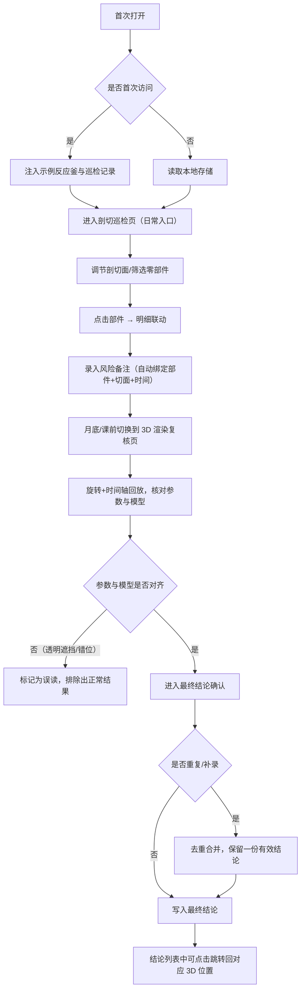

## 1. 产品概述

化工反应釜视角巡检系统，面向展馆讲解员和评审人员，用于以三维交互方式完成化工反应釜的虚拟巡检、问题记录和结论复核。解决传统巡检方式中"只看最后一页"、"时间参数与三维模型错位"、"透明遮挡误读混入正常结果"、"重复导入造成结论混乱"等痛点。

- 核心目标：让展馆讲解员在日常剖切查看与月底/课前 3D 渲染复核之间无缝切换，确保同一件事只有一份有效结论。

## 2. 核心特性

### 2.1 用户角色

| 角色 | 注册方式 | 核心权限 |
|------|----------|----------|
| 展馆讲解员 | 本地默认登录 | 剖切巡检、录入风险备注、补录结论、导出复核报告 |
| 评审人员 | 本地默认登录 | 全量 3D 渲染复核、筛选、跳转溯源、去重审计 |

### 2.2 功能模块

1. **剖切巡检页（日常入口）**：默认视图，包含剖切面控制、零部件筛选、对象明细、风险备注快捷录入。
2. **3D 渲染复核页（月底/课前入口）**：全视角旋转、时间轴回放、透明遮挡修正、结论最终确认。
3. **巡检记录管理**：风险备注列表、最终结论列表、双向跳转、去重校验。
4. **数据导入测试页**：重复导入场景测试、补录场景测试、冲突告警可视化。
5. **首次引导页**：内置示例反应釜与示例巡检记录，零数据可直接体验。

### 2.3 页面详情

| 页面名称 | 模块名称 | 功能描述 |
|----------|----------|----------|
| 剖切巡检页 | 3D 场景画布 | 鼠标旋转、滚轮缩放、右键平移；默认启用 X/Y/Z 三轴剖切 |
| 剖切巡检页 | 剖切控制条 | 三轴滑块、剖切开关、当前切面高度显示、一键重置 |
| 剖切巡检页 | 零部件筛选器 | 按系统（搅拌/加热/密封/测温）筛选、按风险等级高亮、单击定位 |
| 剖切巡检页 | 对象明细面板 | 显示选中部件的编号、规格、上次巡检时间、当前状态、关联记录数 |
| 剖切巡检页 | 快捷备注栏 | 风险等级选择、备注输入、与当前部件/切面自动绑定、时间戳自动写入 |
| 3D 渲染复核页 | 全视角控制器 | 轨道球旋转、正交/透视切换、自动旋转开关、视角预设按钮 |
| 3D 渲染复核页 | 时间轴与参数联动 | 拖动时间轴同步模型状态与参数面板，高亮错位项并禁止混入正常结果 |
| 3D 渲染复核页 | 透明遮挡修正 | 遮挡物半透明开关、遮挡区域轮廓描边、误读标记一键排除 |
| 3D 渲染复核页 | 结论确认区 | 逐条确认风险备注、生成最终结论、重复项自动合并提示 |
| 巡检记录管理 | 风险备注列表 | 分页、按部件/时间/等级过滤、点击跳转回 3D 场景对应部件与切面 |
| 巡检记录管理 | 最终结论列表 | 与风险备注双向关联、重复/补录标记、冲突项可视化 |
| 数据导入测试页 | 重复导入测试 | 一键模拟重复导入同一条巡检记录，观察是否触发去重拦截与告警 |
| 数据导入测试页 | 补录测试 | 在已有结论上追加补录，验证不会产生两份最终结论 |
| 首次引导页 | 示例数据加载 | 首次打开自动注入示例反应釜模型与 5 条示例巡检记录 |

## 3. 核心流程

## 4. 用户界面设计

### 4.1 设计风格

- **主色调**：深青蓝 `#0B1F2A`（工业/化工安全底色），搭配警示橙 `#FF8A3D` 与通过绿 `#2ECC71`、危险红 `#E74C3C`。
- **次要色**：钢灰 `#3A4A5A`、浅灰蓝 `#C8D6E5`。
- **按钮风格**：扁平+细描边，圆角 6px；危险操作为实心红色；主要 CTA 为实心青蓝。
- **字体**：标题使用 **Space Grotesk**（工业几何感），正文使用 **Noto Sans SC**，代码/编号使用 **JetBrains Mono**。
- **布局风格**：三栏式——左筛选/列表、中 3D 画布、右明细/备注；顶部全局导航与状态指示。
- **图标**：`lucide-react`，线性风格，1.5px 描边。

### 4.2 页面设计概览

| 页面名称 | 模块名称 | UI 元素 |
|----------|----------|---------|
| 剖切巡检页 | 3D 画布 | 深色背景、环境光、金属质感材质、三轴剖切平面高亮描边、选中部件发光描边 |
| 剖切巡检页 | 控制条 | 悬浮于画布底部、毛玻璃背景、滑块带刻度、按钮带 hover 阴影 |
| 剖切巡检页 | 对象明细 | 右侧抽屉、卡片式、键值对网格、关联记录折叠列表 |
| 3D 渲染复核页 | 时间轴 | 画布底部线性时间轴、带刻度与事件点、悬停气泡显示参数快照 |
| 3D 渲染复核页 | 误读标记 | 黄色虚线轮廓、角标"误读待排除"、一键排除按钮 |
| 巡检记录管理 | 双向跳转 | 行内"定位到 3D"按钮、点击后自动切换页并定位到对应部件+切面 |
| 数据导入测试页 | 冲突可视化 | 重复项红色背景、告警图标、合并前后 diff 展示 |

### 4.3 响应式

- 桌面端优先（最小 1280×800）。
- 平板端折叠左右侧栏为底部抽屉。
- 移动端仅保留 3D 画布+简化控制，完整功能提示切换到桌面。

### 4.4 3D 场景指引

- **环境与氛围**：室内工业环境光 + 两盏方向光（主光冷白、补光暖橙），无 HDRI，突出金属反应釜质感。
- **光照设置**：AmbientLight (0.3) + DirectionalLight ×2，开启阴影，阴影贴图 1024。
- **相机设置**：PerspectiveCamera FOV 45，初始距离 12m，OrbitControls 启用阻尼；内置"正视/侧视/俯视/透视"四个预设视角。
- **构图与焦点**：反应釜居中，高 6m，半径 2m；初始焦点落在搅拌轴中部。
- **交互与动画**：选中部件 0.3s 发光脉冲；剖切平面切换使用 0.4s 缓动；旋转阻尼 0.08。
- **后处理**：Bloom（阈值 0.8，强度 0.6）用于选中高亮；FXAA 抗锯齿。
- **资源来源与性能预算**：全部使用程序化几何体构建反应釜（无需外部模型），面数控制在 5 万内，60fps。
