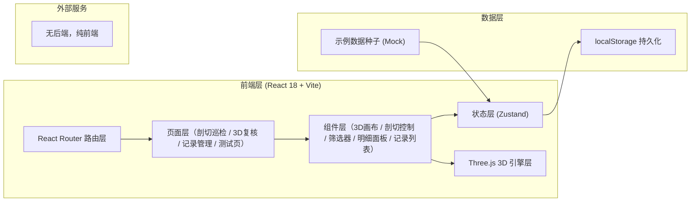
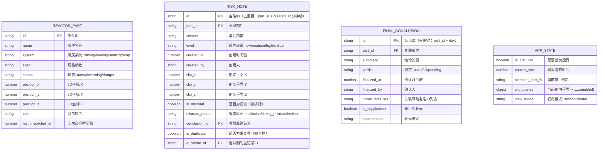

## 1. 架构设计



## 2. 技术描述

- **前端**：React@18 + TypeScript@5 + Vite@5 + TailwindCSS@3 + Zustand@4 + React Router@6
- **3D 引擎**：three@0.160 + @react-three/fiber@8 + @react-three/drei@9 + @react-three/postprocessing@2
- **初始化工具**：vite-init（react-ts 模板）
- **后端**：无（纯前端应用，数据存储于 localStorage）
- **数据库**：localStorage（浏览器本地存储）
- **图标**：lucide-react
- **数据**：首次访问自动注入 Mock 示例数据（反应釜部件 + 5 条巡检记录）

## 3. 路由定义

| 路由 | 页面 | 用途 |
|------|------|------|
| `/` | 重定向到 `/section` | 根路径 |
| `/section` | 剖切巡检页 | 日常入口（默认页） |
| `/render` | 3D 渲染复核页 | 月底/课前全量复核 |
| `/records` | 巡检记录管理 | 风险备注与最终结论双向管理 |
| `/test` | 数据导入测试页 | 重复导入/补录冲突测试 |

## 4. 数据模型

### 4.1 数据模型定义



### 4.2 去重与补录规则（核心业务逻辑）

1. **风险备注去重键**：`part_id + floor(created_at / 60000)`（同一部件 1 分钟内的重复录入视为重复）。
2. **最终结论去重键**：`part_id + date(YYYY-MM-DD)`（同一部件同一天只允许一条最终结论，补录仅追加 `supplements` 字段，不创建新记录）。
3. **重复导入拦截**：导入前按去重键查询，命中则标记 `is_duplicate=true`、写入 `duplicate_of`，并在 UI 高亮冲突但不污染正常列表。
4. **误读标记**：`is_misread=true` 的记录在"正常结果"中默认过滤，仅在"全部/误读"筛选下可见，不参与最终结论统计。

## 5. 模块划分（src 目录结构）

```
src/
├── main.tsx                # 入口
├── App.tsx                 # 路由与全局布局
├── index.css               # Tailwind + 自定义主题
├── router/
│   └── index.tsx           # 路由定义
├── store/
│   ├── useReactorStore.ts  # 反应釜部件与 3D 状态
│   ├── useRecordsStore.ts  # 风险备注与最终结论（含去重逻辑）
│   └── useAppStore.ts      # 全局 UI 状态
├── pages/
│   ├── SectionPage.tsx     # 剖切巡检页
│   ├── RenderPage.tsx      # 3D 渲染复核页
│   ├── RecordsPage.tsx     # 巡检记录管理
│   └── TestPage.tsx        # 数据导入测试页
├── components/
│   ├── three/              # 3D 相关组件
│   │   ├── ReactorScene.tsx
│   │   ├── ReactorPart.tsx
│   │   ├── ClipPlanes.tsx
│   │   ├── CameraPresets.tsx
│   │   └── TimeAxis.tsx
│   ├── layout/
│   │   ├── AppHeader.tsx
│   │   └── SidePanel.tsx
│   ├── section/
│   │   ├── ClipControlBar.tsx
│   │   ├── PartFilter.tsx
│   │   └── PartDetailPanel.tsx
│   ├── records/
│   │   ├── RiskNoteList.tsx
│   │   ├── ConclusionList.tsx
│   │   └── NoteQuickInput.tsx
│   └── ui/                 # 基础 UI 组件
│       ├── Badge.tsx
│       ├── Button.tsx
│       └── Slider.tsx
├── data/
│   ├── mockReactor.ts      # 示例反应釜部件
│   └── mockRecords.ts      # 示例巡检记录
├── utils/
│   ├── dedupe.ts           # 去重/补录核心算法
│   ├── storage.ts          # localStorage 封装
│   └── format.ts           # 日期/数字格式化
└── types/
    └── index.ts            # 全局类型定义
```

## 6. 状态管理（Zustand）关键切片

- **useReactorStore**：`parts[]`、`selectedPartId`、`clipPlanes{x,y,z,enabled}`、`cameraPreset`；动作：`selectPart(id)`、`setClip(axis, value)`、`focusPart(id)`。
- **useRecordsStore**：`riskNotes[]`、`conclusions[]`；动作：`addRiskNote(payload)`（内部去重）、`markMisread(id, reason)`、`finalizeConclusion(payload)`（内部去重+补录合并）、`jumpTo3D(id)`（设置选中部件与剖切平面并切换路由）。
- **useAppStore**：`isFirstRun`、`viewMode`、`toast[]`；动作：`bootstrapSampleData()`（仅首次）。

## 7. 测试策略

- **手动测试路径**（`/test` 页内置）：
  1. 导入完全相同的风险备注两次 → 第二条被标记重复，列表仅主记录参与统计。
  2. 同一部件同一天生成两条最终结论 → 第二条合并为补录，不新增记录。
  3. 标记一条风险备注为"遮挡误读" → 默认筛选下不可见，结论统计自动排除。
  4. 从结论列表"定位到 3D" → 路由跳转到 `/section`，选中部件、剖切平面同步设置。
- **代码级验证**：`utils/dedupe.ts` 配合浏览器控制台断言；`npm run build` 通过类型检查。
