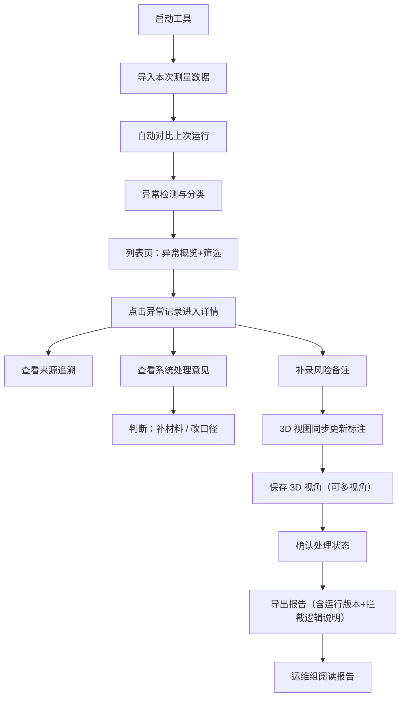

## 1. 产品概述

"细胞器三维拼装"是面向水利工程师的专业测量记录审查工具，用于对三维拼装测量数据进行异常检测、复核标注、视角保存与导出报告。核心解决时间轴不同步导致返工的问题，将数据来龙去脉沉淀在工具内。

- 目标用户：水利工程师（主要使用者）、运维组（报告阅读者）
- 核心价值：异常可视化、处理路径明确化、运行版本可追溯、报告自解释

---

## 2. 核心功能

### 2.1 用户角色

| 角色 | 登录方式 | 核心权限 |
|------|----------|----------|
| 水利工程师 | 本地桌面启动 | 数据导入、异常筛选、详情查看、视角保存、风险备注、3D查看、结果导出 |
| 运维组 | 阅读导出报告 | 通过报告理解异常原因（坐标系混用等被拦截的原因） |

### 2.2 功能模块

1. **测量记录列表页**：导入数据、异常筛选、异常分类概览、运行版本切换、下载导出
2. **测量详情页**：来源追溯、处理意见、异常明细、风险备注、保存视角
3. **3D 视图区**：三维渲染、视角切换、风险标注同步刷新、边栏明细解释
4. **导出报告**：区分本次/上次运行、自解释异常原因（如坐标系混用拦截逻辑）

### 2.3 页面详情

| 页面名称 | 模块名称 | 功能描述 |
|----------|----------|----------|
| 测量记录列表页 | 顶部操作栏 | 导入按钮、运行版本下拉（本次/上次）、下载按钮 |
| 测量记录列表页 | 异常筛选区 | 按异常类型筛选（坐标系混用/时间轴不同步/精度超限/数据缺失）、按处理状态筛选（待补材料/待改口径/已处理） |
| 测量记录列表页 | 异常概览面板 | 各异常类型数量+下一步行动提示（而非仅红色数字），例如"坐标系混用 3 条 → 待改口径" |
| 测量记录列表页 | 记录表格 | 记录ID、时间戳、异常类型、处理状态、来源、操作（查看详情） |
| 测量详情页 | 来源追溯区 | 展示该条测量的上游数据来源、采集时间、采集设备、操作员 |
| 测量详情页 | 处理意见区 | 系统建议+人工备注，明确"补材料"或"改口径" |
| 测量详情页 | 异常明细区 | 具体数据差异、阈值、超出范围 |
| 测量详情页 | 风险备注补录 | 文本输入，保存后驱动 3D 渲染更新标注 |
| 测量详情页 | 视角保存 | 保存当前 3D 视角，非一次性，可命名、可列表切换 |
| 3D 视图区 | 三维画布 | 细胞器拼装模型渲染、异常位置高亮 |
| 3D 视图区 | 边栏明细 | 对高亮部分给出文字解释：颜色含义、数据值、与标准偏差，不依赖颜色猜 |
| 3D 视图区 | 视角列表 | 已保存视角点击切换 |
| 导出报告 | 内容 | 运行版本标识、异常明细、拦截逻辑说明（如坐标系混用为何被拦截）、处理建议 |
| 导出报告 | 文件名 | 包含运行时间戳与版本标识，例：`organelle-report-20260609-1530-run2.pdf` |

---

## 3. 核心流程

### 3.1 主流程描述

水利工程师启动工具 → 导入本次测量数据（自动对比上次运行）→ 工具自动检测异常并分类 → 工程师在列表中按异常类型/处理状态筛选 → 点击进入某条异常详情 → 查看数据来源与系统处理意见 → 补录风险备注 → 在 3D 视图中确认异常位置（边栏查看明细解释）→ 保存视角供复核 → 确认该异常是"补材料"还是"改口径" → 批量导出包含本次/上次对比的报告给运维组。

### 3.2 Mermaid 流程图

---

## 4. 用户界面设计

### 4.1 设计风格

- **主色调**：深青灰 `#1F2A33`（专业稳重），辅助色：钢蓝 `#3A6EA5`、琥珀警示 `#D4A017`、错误砖红 `#B84A3F`、成功墨绿 `#3E7B58`
- **按钮风格**：直角微圆角（2px），实心按钮有轻微下阴影，体现工业工具感
- **字体**：标题用 "JetBrains Mono"（等宽，工程感），正文用 "Noto Sans SC"（清晰可读中文）
- **布局风格**：左列表 + 右详情/3D 分栏，卡片式模块，细线分割，信息密度偏高但分区清晰
- **图标风格**：线性简洁图标（Lucide），避免花哨 emoji

### 4.2 页面设计概述

| 页面名称 | 模块名称 | UI 要素 |
|----------|----------|---------|
| 测量记录列表页 | 顶部操作栏 | 深色背景、导入按钮（钢蓝实心）、版本下拉、下载按钮（右侧） |
| 测量记录列表页 | 异常概览面板 | 四张横向卡片，每张显示：异常类型名称 + 数量数字 + 底部一行"下一步：xxx"文字，不同类型用左侧细色条区分 |
| 测量记录列表页 | 筛选与表格 | 筛选条件在表格上方横向排列，表格斑马纹、行高紧凑、异常类型列带色块标签 |
| 测量详情页 | 左右分栏 | 左侧：来源+处理意见+异常明细+风险备注（滚动区）；右侧：3D 视图 + 视角列表 |
| 测量详情页 | 风险备注 | 多行文本框，下方"保存并更新 3D"按钮 |
| 测量详情页 | 视角保存 | "保存当前视角"按钮 + 已保存视角列表（可点击切换、可重命名、可删除） |
| 3D 视图区 | 画布 | 深色背景，模型线框+半透明面，异常部位高亮并带编号标记 |
| 3D 视图区 | 边栏明细 | 与高亮点编号对应的列表，每项含：编号、部位名称、测量值、标准值、偏差、颜色图例文字说明 |
| 导出报告 | 版式 | 标题含时间戳与 run 编号，每类异常前有"拦截原因"说明段落，坐标系混用附判定规则 |

### 4.3 响应式

- 桌面端优先（1280px+），采用固定左右分栏
- 平板端：上下布局，3D 视图在上，详情在下
- 触摸优化：3D 画布支持手势旋转缩放，按钮最小 44px

### 4.4 3D 场景指引

- **环境/HDRI**：深色渐变背景，无真实环境贴图，突出模型本身
- **光照**：两盏方向光（顶光+侧光）+ 柔和环境光，模型边缘清晰
- **相机设置**：默认等距视角，可自由旋转/平移/缩放，支持保存相机矩阵
- **构图与焦点**：异常部位自动进入视野并加发光描边
- **交互与动画**：补录风险备注后，对应部位高亮色闪烁一次（0.3s）
- **后处理**：轻微泛光（仅异常部位）、FXAA 抗锯齿
- **资源与性能**：使用内置几何体拼装示例模型，不依赖外部资源，单帧 <16ms
