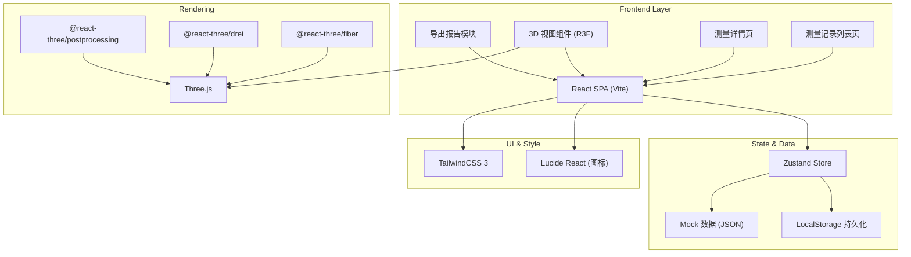
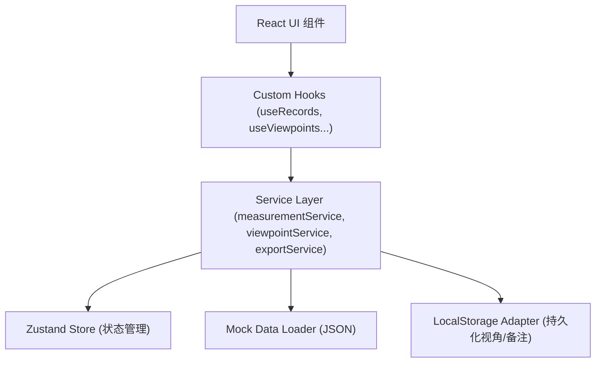
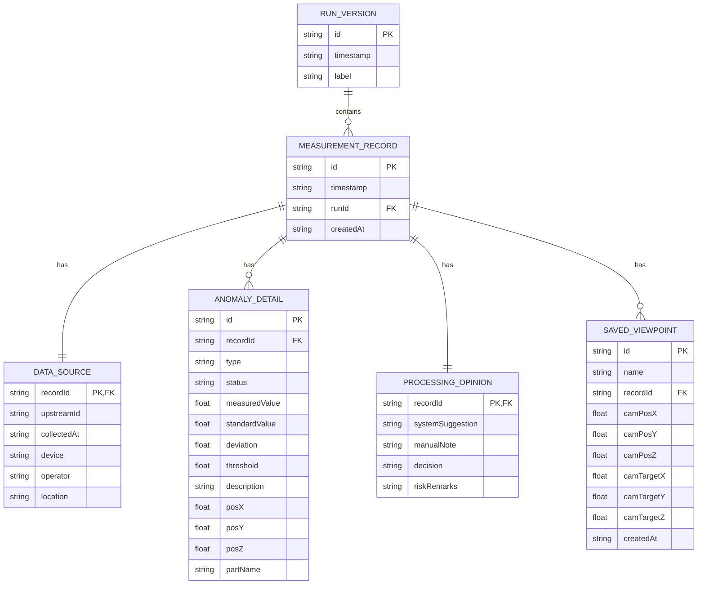

## 1. 架构设计



---

## 2. 技术说明

- **前端框架**：React@18 + TypeScript + Vite@5
- **3D 渲染**：Three@0.160 + @react-three/fiber@8 + @react-three/drei@9 + @react-three/postprocessing@2
- **状态管理**：Zustand@4（轻量，支持持久化 middleware）
- **样式方案**：TailwindCSS@3（自定义工业风主题）
- **路由**：React Router DOM@6
- **图标**：Lucide React
- **导出**：jsPDF（生成 PDF 报告），浏览器原生 File API
- **后端**：无后端，使用本地 Mock 数据 + LocalStorage 模拟运行版本
- **数据格式**：JSON（测量记录、异常数据、视角矩阵）

---

## 3. 路由定义

| 路由 | 用途 |
|------|------|
| `/` | 重定向至 `/records` |
| `/records` | 测量记录列表页（导入、筛选、异常概览、下载） |
| `/records/:id` | 测量详情页（来源追溯、处理意见、风险备注、3D 视图、视角保存） |

---

## 4. API 定义（无后端，本地 Mock 接口封装）

### 4.1 TypeScript 类型定义

```typescript
// 异常类型
export type AnomalyType = 'coordinate_mismatch' | 'timing_desync' | 'precision_overrun' | 'data_missing';

// 处理状态
export type ProcessStatus = 'need_material' | 'need_calibration' | 'resolved';

// 运行版本
export interface RunVersion {
  id: string;
  timestamp: string;
  label: '本次运行' | '上次运行';
}

// 数据来源
export interface DataSource {
  upstreamId: string;
  collectedAt: string;
  device: string;
  operator: string;
  location: string;
}

// 异常明细
export interface AnomalyDetail {
  id: string;
  recordId: string;
  type: AnomalyType;
  status: ProcessStatus;
  measuredValue: number;
  standardValue: number;
  deviation: number;
  threshold: number;
  description: string;
  position3d: { x: number; y: number; z: number };
  partName: string;
}

// 处理意见
export interface ProcessingOpinion {
  systemSuggestion: string;
  manualNote: string;
  decision: ProcessStatus | null;
  riskRemarks: string;
}

// 测量记录
export interface MeasurementRecord {
  id: string;
  timestamp: string;
  runId: string;
  anomalies: AnomalyDetail[];
  source: DataSource;
  opinion: ProcessingOpinion;
  createdAt: string;
}

// 保存视角
export interface SavedViewpoint {
  id: string;
  name: string;
  recordId: string;
  camera: {
    position: [number, number, number];
    target: [number, number, number];
  };
  createdAt: string;
}

// 拦截规则说明（用于导出报告）
export interface InterceptionRule {
  anomalyType: AnomalyType;
  ruleName: string;
  ruleDescription: string;
  criteria: string;
  consequence: string;
}
```

### 4.2 本地服务层接口

```typescript
// src/services/measurementService.ts
export interface MeasurementService {
  listRecords(filters?: { anomalyType?: AnomalyType; status?: ProcessStatus; runId?: string }): Promise<MeasurementRecord[]>;
  getRecord(id: string): Promise<MeasurementRecord | null>;
  importRecords(file: File): Promise<{ inserted: number; anomalies: number }>;
  updateRiskRemarks(recordId: string, remarks: string): Promise<void>;
  updateDecision(recordId: string, decision: ProcessStatus): Promise<void>;
  getAnomalySummary(runId?: string): Promise<Record<AnomalyType, { count: number; nextAction: string }>>;
  getInterceptionRules(): Promise<InterceptionRule[]>;
  listVersions(): Promise<RunVersion[]>;
}
```

```typescript
// src/services/viewpointService.ts
export interface ViewpointService {
  listViewpoints(recordId: string): Promise<SavedViewpoint[]>;
  saveViewpoint(vp: Omit<SavedViewpoint, 'id' | 'createdAt'>): Promise<SavedViewpoint>;
  renameViewpoint(id: string, name: string): Promise<void>;
  deleteViewpoint(id: string): Promise<void>;
}
```

```typescript
// src/services/exportService.ts
export interface ExportService {
  generateReportPDF(runId: string): Promise<Blob>;
  getReportFileName(runId: string): string;
}
```

---

## 5. 服务架构（无后端，本地分层）



---

## 6. 数据模型

### 6.1 E-R 图



### 6.2 LocalStorage 键约定

| Key | 内容 |
|-----|------|
| `organelle:records` | 测量记录数组 JSON |
| `organelle:viewpoints` | 保存视角数组 JSON |
| `organelle:versions` | 运行版本数组 JSON |
| `organelle:currentRunId` | 当前选中运行 ID |

### 6.3 Mock 初始数据

内置两条运行版本（`run-001` 上次运行、`run-002` 本次运行），每条运行 6~8 条测量记录，覆盖四种异常类型，包含完整的来源、异常明细、处理意见骨架数据，以及至少 2 个预置保存视角。
