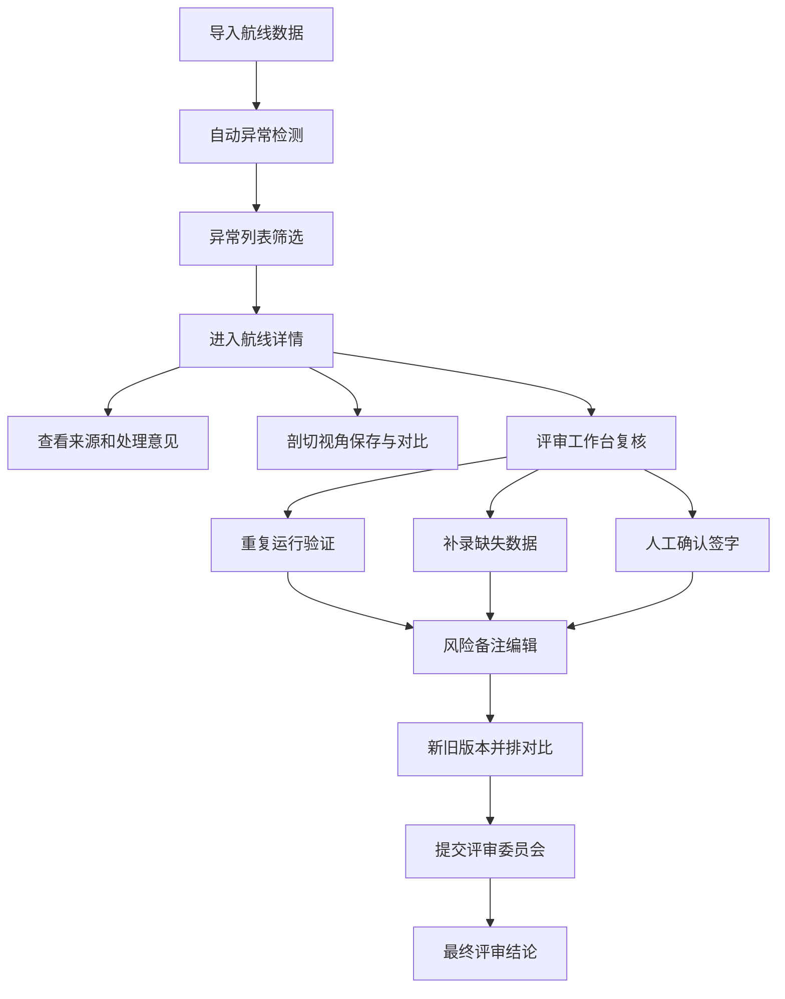
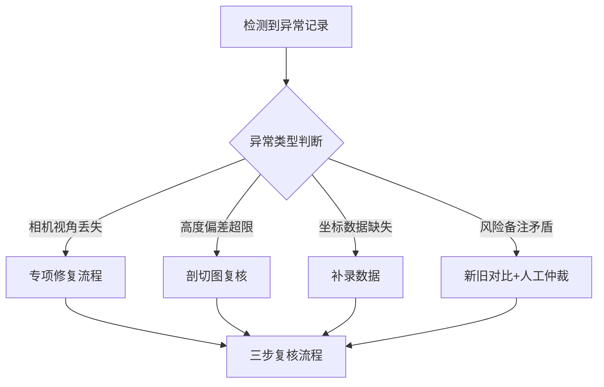

## 1. 产品概述

无人机航线高度沙盒是面向仿真工程师和评审委员会的专业风险评估工具。核心解决传统表格方式中风险备注、设备坐标与剖面图分散核对的效率问题，提供一体化的异常筛选、详情溯源、剖切对比和多人评审工作流。

- 目标用户：仿真工程师、评审委员会成员
- 核心价值：将分散的风险数据整合为可追溯、可对比、可复核的评审工作空间，消除表格拼凑带来的信息断层

## 2. 核心功能

### 2.1 用户角色

| 角色 | 注册方式 | 核心权限 |
|------|----------|----------|
| 仿真工程师 | 本地登录 | 数据导入、异常筛选、补录数据、人工确认、风险备注编辑 |
| 评审委员 | 本地登录 | 查看所有数据、剖切对比、评审结论查看、历史版本回溯 |

### 2.2 功能模块

1. **数据导入页**：批量导入航线数据（含风险备注、设备坐标、剖面图），导入后自动进行异常检测
2. **航线总览列表**：筛选异常数据、多维度过滤、状态追踪
3. **航线详情页**：来源信息、风险备注、处理意见、剖切视图、视角保存与对比
4. **评审工作台**：重复运行验证、补录数据、人工确认流程、新旧结论并排对比
5. **历史版本对比**：风险备注修改前后的差异并排展示

### 2.3 页面详情

| 页面名称 | 模块名称 | 功能描述 |
|----------|----------|----------|
| 数据导入页 | 上传区域 | 拖拽/点击上传JSON/CSV格式数据文件，含进度反馈和格式校验 |
| 数据导入页 | 导入预览 | 显示即将导入的数据条目数、预估异常数、风险等级分布 |
| 数据导入页 | 异常检测报告 | 导入后即时展示检测出的异常类型和数量统计 |
| 航线总览列表 | 筛选栏 | 按风险等级、异常类型、确认状态、数据来源多维度筛选 |
| 航线总览列表 | 数据表格 | 展示航线ID、坐标范围、高度偏差、风险等级、状态标签 |
| 航线总览列表 | 批量操作 | 批量标记、批量导出、批量发起复核 |
| 航线详情页 | 信息总览 | 航线基础信息、来源追溯链、当前状态时间线 |
| 航线详情页 | 风险备注对比 | 旧备注与新备注并排展示，差异高亮标注 |
| 航线详情页 | 剖切查看器 | 2D剖面图表，支持视角保存、前后视角叠加对比 |
| 航线详情页 | 处理意见区 | 自动建议+人工输入，含历史处理记录 |
| 评审工作台 | 三栏复核 | 重复运行结果、补录数据、人工确认三个区域并列展示 |
| 评审工作台 | 相机视角修复 | 针对视角丢失记录的专项修复流程和状态追踪 |
| 评审工作台 | 评审结论 | 综合判断结论、签字确认、导出评审报告 |

## 3. 核心流程

### 3.1 主工作流

仿真工程师导入航线数据文件 → 系统自动检测异常并标记 → 工程师在列表中筛选异常条目 → 进入详情查看来源和处理意见 → 保存剖切视角前后对比 → 在评审工作台执行重复运行、补录、人工确认三步复核 → 编辑风险备注（系统记录新旧版本）→ 提交评审委员会 → 评审委员查看历史对比和剖切分析 → 形成最终结论

### 3.2 流程图

### 3.3 异常数据处理流程

## 4. 用户界面设计

### 4.1 设计风格

- **主色调**：深邃工业蓝 `#0B1929` 为背景，警戒橙 `#FF6B35` 标记高风险，校验绿 `#2EC4B6` 标记已确认，警示黄 `#FFD166` 标记待处理
- **辅助色**：钢蓝 `#1E3A5F` 作面板底色，冷灰 `#8D99AE` 作次要文字
- **按钮风格**：方形微圆角（3px），实心填充+细边框，按下有明显凹陷反馈
- **字体**：标题使用 JetBrains Mono 等宽字体增强工程感，正文使用 IBM Plex Sans
- **布局风格**：高密度信息面板式布局，面板间用细线分割，强调数据密度而非留白
- **图标风格**：线性细描边图标（1.5px），保持工程图纸的严谨感

### 4.2 页面设计概述

| 页面名称 | 模块名称 | UI元素 |
|----------|----------|--------|
| 数据导入页 | 上传区域 | 虚线边框拖拽区、文件格式说明、上传进度条、异常检测结果卡片矩阵 |
| 航线总览列表 | 筛选栏 | 标签式风险筛选器、下拉筛选、搜索框、筛选条件面包屑 |
| 航线总览列表 | 数据表格 | 斑马纹行、风险色块标记、状态角标、行悬停展开快捷操作 |
| 航线详情页 | 双栏布局 | 左侧信息面板（时间线+来源链），右侧剖切查看器+风险对比 |
| 航线详情页 | 剖切查看器 | 暗色图表背景、网格参考线、双视角叠加（实线/虚线）、视角保存按钮 |
| 航线详情页 | 风险对比区 | 左右并排双卡片，差异文字高亮红色背景，修改人/时间戳 |
| 评审工作台 | 三栏复核区 | 三列等宽卡片，每栏独立状态灯和进度指示，底部汇总状态 |
| 评审工作台 | 视角修复区 | 修复状态时间线、相机参数对比表、修复前后预览缩略图 |

### 4.3 响应式

- 桌面端优先（1440px+），主操作区最小宽度1200px
- 剖切查看器等画布组件固定比例缩放
- 列表页在1024px以下隐藏次要列，提供横向滚动

### 4.4 数据可视化指导

- **剖切图**：SVG/Canvas绘制2D高度剖面图，X轴为航线距离，Y轴为海拔高度
- **视角叠加**：前一视角用蓝色虚线，当前视角用橙色实线，差异区域半透明填充
- **风险热力**：航线高度偏差用颜色渐变（蓝→黄→红）表示风险递增
- **状态指示**：数据行左侧用5px色条快速标识状态（绿确认/黄待处理/红异常/灰已归档）
- **时间线**：垂直时间线展示数据变更历史，节点用不同图标区分操作类型
