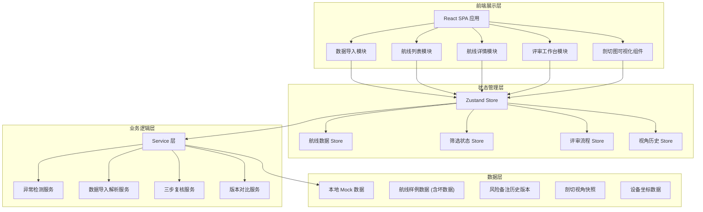

## 1. 架构设计



## 2. 技术描述

- **前端框架**: React 18 + TypeScript + Vite 5
- **样式方案**: TailwindCSS 3 + 自定义 CSS 变量 (工业风格主题)
- **状态管理**: Zustand (轻量级状态管理，避免 Redux 过度设计)
- **路由**: React Router v6
- **数据可视化**: 原生 Canvas API + 自定义 SVG 组件 (剖切图绘制，避免引入大型图表库)
- **数据处理**: 纯前端 Mock 数据，使用 TypeScript 类型定义数据模型
- **图标**: Lucide React (线性细描边图标库，符合工程风格)
- **动画**: Framer Motion (页面切换和微交互动画)

## 3. 路由定义

| 路由 | 页面组件 | 用途 |
|------|----------|------|
| `/` | Redirect to `/routes` | 根路径重定向 |
| `/import` | ImportPage | 数据导入页 |
| `/routes` | RouteListPage | 航线总览列表 |
| `/routes/:id` | RouteDetailPage | 航线详情页 |
| `/routes/:id/review` | ReviewWorkbenchPage | 评审工作台 |

## 4. 数据模型

### 4.1 TypeScript 类型定义

```typescript
// 风险等级
type RiskLevel = 'low' | 'medium' | 'high' | 'critical';

// 异常类型
type AnomalyType = 
  | 'camera_view_lost'      // 相机视角丢失
  | 'height_deviation'      // 高度偏差超限
  | 'coordinate_missing'    // 坐标数据缺失
  | 'risk_note_conflict'    // 风险备注矛盾
  | 'profile_incomplete';   // 剖面图不完整

// 确认状态
type ConfirmationStatus = 'pending' | 'rerun_done' | 'supplemented' | 'manually_confirmed' | 'all_completed';

// 坐标点
interface CoordinatePoint {
  x: number;       // 经度或航线距离 (米)
  y: number;       // 纬度
  z: number;       // 海拔高度 (米)
  timestamp?: string;
}

// 剖切视角快照
interface ViewSnapshot {
  id: string;
  name: string;
  createdAt: string;
  createdBy: string;
  cameraParams: {
    panX: number;
    panY: number;
    zoom: number;
    visibleRange: [number, number];
  };
  notes?: string;
}

// 风险备注版本
interface RiskNoteVersion {
  id: string;
  version: number;
  content: string;
  createdAt: string;
  createdBy: string;
  conclusion: 'safe' | 'warning' | 'dangerous' | 'pending';
}

// 处理意见
interface HandlingOpinion {
  id: string;
  type: 'auto_suggestion' | 'manual_input';
  content: string;
  createdAt: string;
  createdBy: string;
  status: 'proposed' | 'accepted' | 'rejected';
}

// 三步复核记录
interface ThreeStepReview {
  rerun: {
    status: 'not_started' | 'running' | 'passed' | 'failed';
    executedAt?: string;
    executedBy?: string;
    result?: string;
    deviationBefore?: number;
    deviationAfter?: number;
  };
  supplement: {
    status: 'not_started' | 'in_progress' | 'completed' | 'not_needed';
    supplementedAt?: string;
    supplementedBy?: string;
    supplementedFields?: string[];
  };
  manualConfirm: {
    status: 'not_started' | 'confirmed' | 'rejected';
    confirmedAt?: string;
    confirmedBy?: string;
    signature?: string;
    comments?: string;
  };
}

// 航线数据主模型
interface FlightRoute {
  id: string;
  routeCode: string;
  missionName: string;
  createdAt: string;
  dataSource: string;           // 数据来源
  sourceChain: string[];        // 来源追溯链

  // 坐标数据
  coordinates: CoordinatePoint[];
  profileData: number[];        // 剖面高度数据数组

  // 风险信息
  riskLevel: RiskLevel;
  heightDeviation: number;      // 高度偏差 (米)
  anomalyTypes: AnomalyType[];  // 检测到的异常类型

  // 状态
  status: ConfirmationStatus;
  isArchived: boolean;

  // 视角历史
  viewSnapshots: ViewSnapshot[];
  currentViewId?: string;

  // 风险备注历史
  riskNoteHistory: RiskNoteVersion[];
  currentNoteId?: string;

  // 处理意见
  handlingOpinions: HandlingOpinion[];

  // 三步复核
  threeStepReview: ThreeStepReview;

  // 相机视角问题专用字段
  cameraViewIssue?: {
    isReported: boolean;
    lostParams?: string[];
    repairAttempts: number;
    lastRepairAt?: string;
    repairHistory: Array<{
      attemptedAt: string;
      attemptedBy: string;
      result: 'success' | 'failed';
      method: string;
    }>;
  };
}
```

### 4.2 异常检测规则

```typescript
// 异常检测逻辑（前端模拟）
const DETECTION_RULES = {
  // 高度偏差超过 15 米标记为异常
  HEIGHT_DEVIATION_THRESHOLD: 15,
  
  // 坐标点缺失率超过 10% 标记异常
  COORDINATE_MISSING_RATE: 0.1,
  
  // 剖面数据点数量不足
  MIN_PROFILE_POINTS: 50,
  
  // 风险备注版本结论不一致标记矛盾
  CHECK_NOTE_CONSISTENCY: true,
};
```

### 4.3 样例坏数据设计

为了让仿真工程师的复核体验真实，预置以下类型的"坏数据"样例：

1. **相机视角丢失记录**: `FLIGHT-2024-0087` — 视角参数 `panX`/`panY` 为 `null`，历史修复尝试 2 次均失败
2. **高度偏差超限**: `FLIGHT-2024-0092` — 最大偏差 23.7 米，剖面在 1200-1500 米区段有断崖式下降
3. **坐标数据缺失**: `FLIGHT-2024-0103` — 航线中段连续 18 个点缺失坐标，偏差数据前后不一致
4. **风险备注矛盾**: `FLIGHT-2024-0115` — v1 结论 "安全"，v2 结论 "危险"，备注内容差异超过 60%
5. **剖面图不完整**: `FLIGHT-2024-0121` — 只有前 40% 剖面数据，尾部截断
