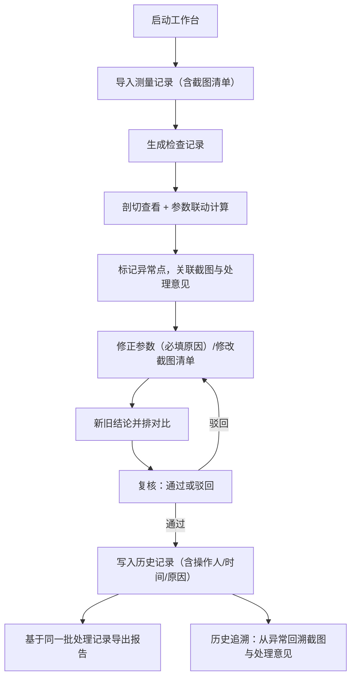

## 1. 产品概述

面向舞台统筹的地下车库净空检查本地 Web 工作台，统一管理测量记录、截图清单、模型重叠判断、修正历史与导出报告，解决临时补材料导致结论作废、界面与报告数据不一致、新旧结论对比困难、责任追溯不清晰等核心痛点。

## 2. 核心功能

### 2.1 用户角色

| 角色 | 登录方式 | 核心权限 |
|------|----------|----------|
| 舞台统筹 | 本地单机登录 | 全部权限：创建检查、导入测量、修正参数、复核、导出、查看历史 |
| 复核人员 | 本地单机登录 | 复核修正、查看历史与对比、导出 |

### 2.2 功能模块

1. **检查记录列表页**：项目列表、状态筛选、搜索、导入入口、导出入口
2. **检查详情页**：基础信息、剖切查看、参数联动面板、截图清单、异常标记、处理意见
3. **修正与复核页**：参数修正表单、单位换算校验、修正原因、新旧结论并排对比
4. **历史追溯页**：变更时间线、操作人、变更原因、变更内容 diff、回退至截图清单与处理意见
5. **说明文档页**：启动、导入测量、查看异常、导出结果 四步操作指南
6. **报告下载**：生成统一批次的 PDF/Excel 报告，与剖切查看共用同一批处理记录

### 2.3 页面详情

| 页面名称 | 模块名称 | 功能描述 |
|----------|----------|----------|
| 检查记录列表页 | 顶部操作栏 | 新建检查、导入测量记录（JSON/CSV）、搜索、状态筛选（待检查/检查中/待复核/已完成） |
| 检查记录列表页 | 记录卡片列表 | 项目名、检查日期、净空异常数、状态标签、最后修改人/时间、进入详情、下载报告 |
| 检查详情页 | 基础信息区 | 项目名称、车库编号、检查范围、测量单位、创建时间 |
| 检查详情页 | 剖切查看区 | 2D 剖面图展示（SVG）、可切换剖面线、与参数面板联动实时重算净空 |
| 检查详情页 | 参数联动面板 | 梁高、管线直径、吊顶厚度、最小净空要求等参数，修改即时触发重算并高亮异常 |
| 检查详情页 | 截图清单 | 每条测量点截图、坐标、测量值、状态标记、处理意见入口 |
| 修正与复核页 | 修正表单 | 参数修改、单位换算自动校验（m/cm/mm）、修正原因必填 |
| 修正与复核页 | 新旧结论并排对比 | 左旧右新双栏布局：截图、参数、净空计算值、异常判定、处理意见 |
| 修正与复核页 | 复核操作 | 通过/驳回、复核意见、签名（本地用户名） |
| 历史追溯页 | 变更时间线 | 按时间倒序展示所有变更节点：参数修改、截图增删、结论变更、复核操作 |
| 历史追溯页 | 变更详情 | 操作人、操作时间、变更原因、前后值 diff、关联截图清单条目、关联处理意见 |
| 说明文档页 | 快速开始 | 启动服务、登录（单机）、导入测量记录三步 |
| 说明文档页 | 查看异常 | 如何定位异常点、切换剖面、联动参数、查看截图清单 |
| 说明文档页 | 导出结果 | 报告格式、导出内容与批次一致性说明 |

## 3. 核心流程

## 4. 用户界面设计

### 4.1 设计风格

- **主色调**：工业深青 `#0F4C5C`（专业、冷静、工程感）
- **辅助色**：警示橙 `#E36414`（异常/修正）、通过绿 `#5FAD41`（正常/复核通过）
- **中性色**：石墨灰 `#1F2937` / 石板灰 `#6B7280` / 米白 `#F8F8F5`
- **按钮风格**：直角微倒角 2px，实心主色按钮配细下划线，悬停微上浮 + 阴影加深
- **字体**：标题用 Space Grotesk（几何工业感），正文用 IBM Plex Sans（工程可读性强），等宽数据用 JetBrains Mono
- **布局**：左侧导航栏 + 右侧内容区，卡片式数据面板，数据表格斑马纹
- **图标**：Lucide 线性图标，统一 18px 尺寸，异常项加红色微描边

### 4.2 页面设计概览

| 页面名称 | 模块名称 | UI 元素 |
|----------|----------|---------|
| 列表页 | 顶部操作栏 | 深青背景、白色图标按钮、搜索框嵌入左侧 |
| 列表页 | 记录卡片 | 米白底、浅灰边框、异常数红色角标、状态胶囊标签、卡片悬停阴影 |
| 详情页 | 剖切查看区 | 大尺寸 SVG 剖面、可拖动剖切线、异常点红色圆点闪烁 |
| 详情页 | 参数面板 | 右侧固定、分组折叠、数值输入带单位切换、异常值红框高亮 |
| 修正页 | 新旧对比 | 50/50 左右双栏、中间分隔线带"对比"标签、不同处黄色底色标记 |
| 历史页 | 时间线 | 左侧竖线、节点圆点（绿/橙/灰对应状态）、内容卡片右对齐 |

### 4.3 响应式

桌面端优先（最小 1280px 宽），参数面板在窄屏下折叠为抽屉；对比视图在 900px 以下切换为上下布局。

### 4.4 数据联动一致性

所有剖切计算、参数修改、报告导出均读取同一批次的 `batchId` 记录，前端状态与后端数据库通过 Zustand + REST API 实时同步，杜绝界面与报告各算各的。
