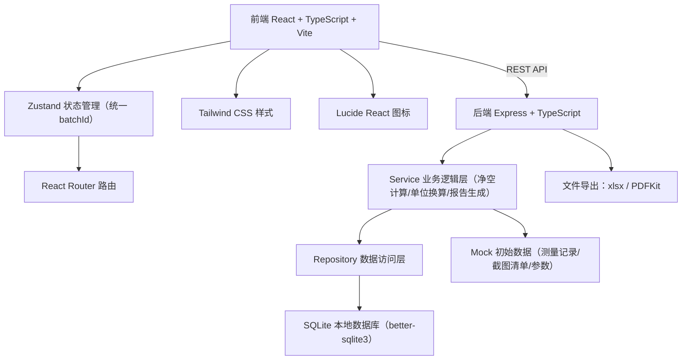
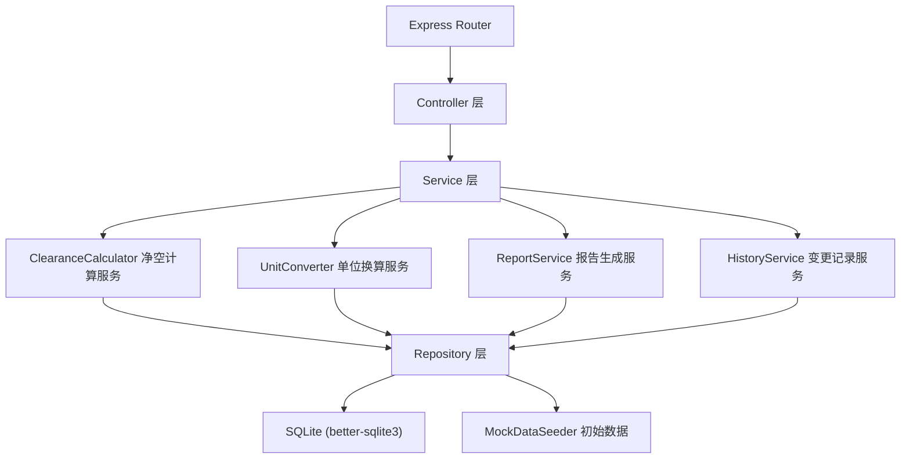
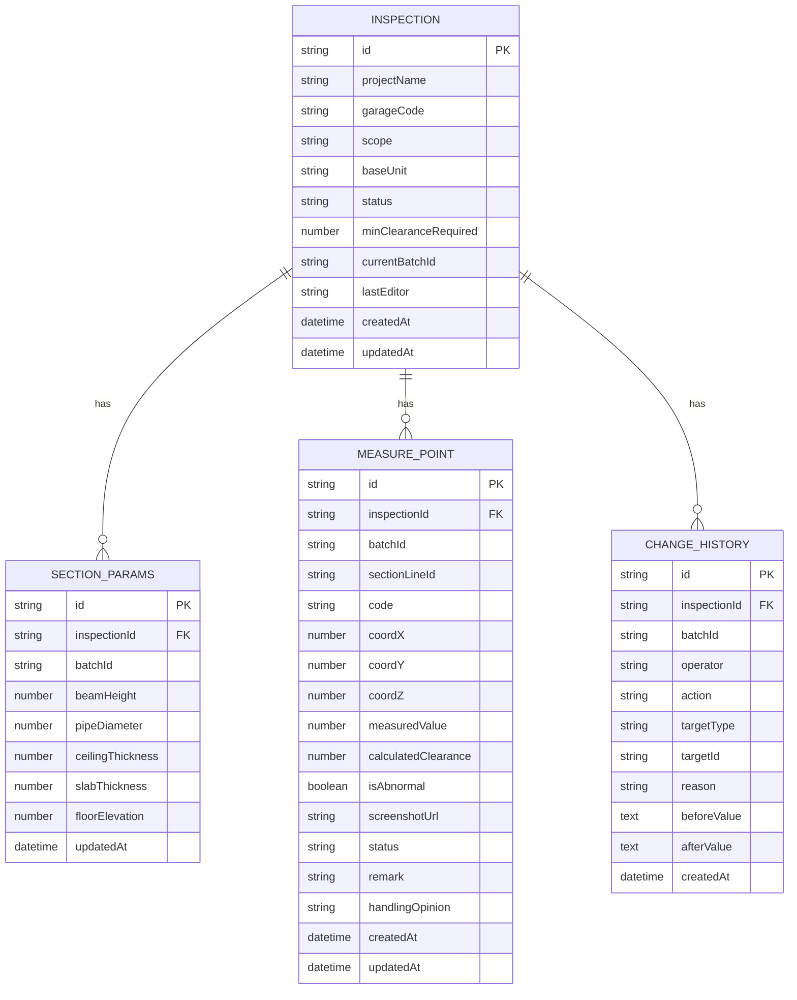

## 1. 架构设计



## 2. 技术描述

- **前端**：React 18 + TypeScript 5 + Vite 5 + Tailwind CSS 3 + Zustand 4 + React Router 6 + Lucide React
- **初始化工具**：vite-init，使用 `react-express-ts` 模板
- **后端**：Express 4 + TypeScript
- **数据库**：SQLite（better-sqlite3），本地文件存储，无需额外服务
- **状态管理**：Zustand，以 `batchId` 为核心确保剖切、参数、报告共用同一批次数据
- **报告导出**：ExcelJS（Excel）、PDFKit（PDF）
- **SVG 剖面图**：原生 SVG + React，实现可拖动剖切线与异常点联动高亮

## 3. 路由定义

| 路由 | 用途 |
|------|------|
| `/` | 跳转至检查记录列表 |
| `/inspections` | 检查记录列表页 |
| `/inspections/:id` | 检查详情页（剖切+参数+截图清单） |
| `/inspections/:id/revise` | 修正与复核页（新旧对比） |
| `/inspections/:id/history` | 历史追溯页（变更时间线 + 回溯） |
| `/docs` | 说明文档页 |

## 4. API 定义

```typescript
// 检查记录
interface Inspection {
  id: string;
  projectName: string;
  garageCode: string;
  scope: string;
  baseUnit: 'm' | 'cm' | 'mm';
  status: 'pending' | 'checking' | 'reviewing' | 'completed';
  minClearanceRequired: number;
  batchId: string;
  createdAt: string;
  updatedAt: string;
  lastEditor: string;
}

// 剖面参数
interface SectionParams {
  id: string;
  inspectionId: string;
  batchId: string;
  beamHeight: number;
  pipeDiameter: number;
  ceilingThickness: number;
  slabThickness: number;
  floorElevation: number;
  updatedAt: string;
}

// 测量点（截图清单条目）
interface MeasurePoint {
  id: string;
  inspectionId: string;
  batchId: string;
  sectionLineId: string;
  code: string;
  coordinate: { x: number; y: number; z: number };
  measuredValue: number;
  calculatedClearance: number;
  isAbnormal: boolean;
  screenshotUrl: string;
  status: 'normal' | 'abnormal' | 'revised' | 'confirmed';
  remark: string;
  handlingOpinion: string;
  createdAt: string;
  updatedAt: string;
}

// 变更历史
interface ChangeHistory {
  id: string;
  inspectionId: string;
  batchId: string;
  operator: string;
  action: 'param_update' | 'point_add' | 'point_delete' | 'point_revise' | 'conclusion_change' | 'review_pass' | 'review_reject';
  targetType: 'params' | 'measure_point' | 'conclusion';
  targetId: string;
  reason: string;
  beforeValue: Record<string, unknown>;
  afterValue: Record<string, unknown>;
  createdAt: string;
}
```

| 方法 | 路径 | 说明 |
|------|------|------|
| GET | `/api/inspections` | 获取检查记录列表（支持筛选/搜索） |
| GET | `/api/inspections/:id` | 获取单条检查详情（含最新 batch 参数与截图清单） |
| POST | `/api/inspections` | 新建检查记录 |
| POST | `/api/inspections/import` | 导入测量记录（JSON/CSV），生成 batch |
| GET | `/api/inspections/:id/params` | 获取当前 batch 的剖面参数 |
| PUT | `/api/inspections/:id/params` | 更新剖面参数（生成新 batch，触发重算） |
| GET | `/api/inspections/:id/points` | 获取截图清单（测量点列表） |
| PUT | `/api/inspections/:id/points/:pointId` | 修正测量点（必填修正原因） |
| GET | `/api/inspections/:id/history` | 获取变更历史时间线 |
| GET | `/api/inspections/:id/compare?beforeBatch=xxx&afterBatch=yyy` | 新旧批次对比数据 |
| POST | `/api/inspections/:id/review` | 复核（通过/驳回，写入历史） |
| GET | `/api/inspections/:id/export?format=xlsx\|pdf` | 导出报告（基于当前 batch） |

## 5. 服务端架构图



## 6. 数据模型

### 6.1 ER 图



### 6.2 DDL

```sql
-- 检查记录表
CREATE TABLE IF NOT EXISTS inspections (
  id TEXT PRIMARY KEY,
  project_name TEXT NOT NULL,
  garage_code TEXT NOT NULL,
  scope TEXT,
  base_unit TEXT NOT NULL DEFAULT 'mm',
  status TEXT NOT NULL DEFAULT 'pending',
  min_clearance_required REAL NOT NULL DEFAULT 2200,
  current_batch_id TEXT,
  last_editor TEXT NOT NULL,
  created_at TEXT NOT NULL,
  updated_at TEXT NOT NULL
);

-- 剖面参数表（每个 batch 一条）
CREATE TABLE IF NOT EXISTS section_params (
  id TEXT PRIMARY KEY,
  inspection_id TEXT NOT NULL,
  batch_id TEXT NOT NULL,
  beam_height REAL NOT NULL DEFAULT 600,
  pipe_diameter REAL NOT NULL DEFAULT 150,
  ceiling_thickness REAL NOT NULL DEFAULT 50,
  slab_thickness REAL NOT NULL DEFAULT 200,
  floor_elevation REAL NOT NULL DEFAULT 0,
  updated_at TEXT NOT NULL,
  FOREIGN KEY (inspection_id) REFERENCES inspections(id)
);

-- 测量点表（截图清单）
CREATE TABLE IF NOT EXISTS measure_points (
  id TEXT PRIMARY KEY,
  inspection_id TEXT NOT NULL,
  batch_id TEXT NOT NULL,
  section_line_id TEXT,
  code TEXT NOT NULL,
  coord_x REAL NOT NULL,
  coord_y REAL NOT NULL,
  coord_z REAL NOT NULL,
  measured_value REAL NOT NULL,
  calculated_clearance REAL,
  is_abnormal INTEGER NOT NULL DEFAULT 0,
  screenshot_url TEXT,
  status TEXT NOT NULL DEFAULT 'normal',
  remark TEXT,
  handling_opinion TEXT,
  created_at TEXT NOT NULL,
  updated_at TEXT NOT NULL,
  FOREIGN KEY (inspection_id) REFERENCES inspections(id)
);

-- 变更历史表
CREATE TABLE IF NOT EXISTS change_history (
  id TEXT PRIMARY KEY,
  inspection_id TEXT NOT NULL,
  batch_id TEXT NOT NULL,
  operator TEXT NOT NULL,
  action TEXT NOT NULL,
  target_type TEXT NOT NULL,
  target_id TEXT NOT NULL,
  reason TEXT NOT NULL,
  before_value TEXT,
  after_value TEXT,
  created_at TEXT NOT NULL,
  FOREIGN KEY (inspection_id) REFERENCES inspections(id)
);

-- 索引
CREATE INDEX IF NOT EXISTS idx_measure_points_inspection ON measure_points(inspection_id);
CREATE INDEX IF NOT EXISTS idx_measure_points_batch ON measure_points(batch_id);
CREATE INDEX IF NOT EXISTS idx_history_inspection ON change_history(inspection_id);
CREATE INDEX IF NOT EXISTS idx_history_batch ON change_history(batch_id);
```
