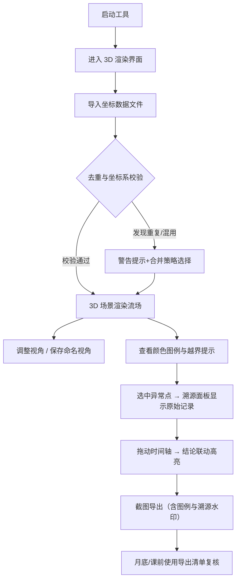

## 1. 产品概述

海洋涡旋三维流场是面向工程评审员的专业数据可视化与复核工具，用于承接三维模型中存在的不规范记录，提供流场数据的三维渲染、评审标注与结论追溯能力。

- 核心目标：让工程评审员在评审或讲解场景中，通过清晰的视角保存、颜色图例、越界提示与截图导出来高效沟通，同时确保每条结论均可溯源至原始记录。
- 目标用户：海洋工程评审员、数据复核人员、课程讲师。

## 2. 核心功能

### 2.1 用户角色

| 角色 | 注册方式 | 核心权限 |
|------|----------|----------|
| 工程评审员 | 本地启动即使用 | 数据导入、3D 渲染、视角管理、标注复核、截图导出、结论追溯 |

### 2.2 功能模块

1. **3D 渲染主界面**：三维流场可视化、视角控制、相机操作、颜色映射
2. **数据导入与管理**：坐标数据导入、去重校验、脏数据标记、坐标系识别
3. **视角与截图**：视角命名保存、一键恢复、截图导出、图例自动嵌入
4. **记录溯源面板**：原始行号、图片名、来源备注展示、点击跳转原始表
5. **结论与时间参数联动**：时间轴播放、参数-结论双向跳转、复核历史
6. **越界与异常提示**：数据越界高亮、坐标系混用警告、重复结论检测

### 2.3 页面详情

| 页面名称 | 模块名称 | 功能描述 |
|----------|----------|----------|
| 3D 渲染主界面 | 三维场景 | 涡旋粒子/流线渲染、相机 OrbitControls、自动旋转开关 |
| 3D 渲染主界面 | 颜色图例 | 速度/温度/压力颜色条、值域范围、悬浮数值提示 |
| 3D 渲染主界面 | 视角工具栏 | 保存视角（命名+备注）、视角列表切换、删除视角 |
| 3D 渲染主界面 | 越界提示 | 越界数据点红色闪烁、悬浮卡片显示越界字段与原始行号 |
| 数据导入面板 | 文件导入 | CSV/JSON 拖拽上传、预览前 20 行、字段映射 |
| 数据导入面板 | 去重校验 | 基于设备 ID+坐标+时间戳的指纹比对、重复记录合并策略 |
| 数据导入面板 | 坐标系检测 | 自动识别经纬度/笛卡尔/本地坐标系、混用记录警告标记 |
| 记录溯源面板 | 溯源列表 | 选中数据点→显示原始行号、来源文件名、导入批次、备注 |
| 记录溯源面板 | 双向跳转 | 点击溯源项→3D 场景定位+高亮；点击 3D 点→溯源面板聚焦 |
| 时间参数面板 | 时间轴 | 时间步长滑块、播放/暂停、关键帧书签 |
| 时间参数面板 | 结论联动 | 点击结论条目→跳转到对应时间帧+参数值；点击时间帧→显示对应结论 |
| 截图导出 | 导出配置 | 是否嵌入图例、是否叠加溯源信息水印、分辨率选择 |
| 截图导出 | 讲解检查 | 月底/课前导出清单：每张截图自动检查视角、图例、越界提示是否齐全 |

## 3. 核心流程

评审员日常使用流程：打开工具进入 3D 渲染 → 导入坐标数据（自动去重与坐标系检测）→ 调整视角并保存常用视角 → 发现异常/越界记录 → 通过溯源面板查看原始行号与来源 → 调整时间参数验证结论 → 截图导出（自动嵌入图例与溯源水印）→ 月底/课前使用导出清单检查讲解材料完整性。

## 4. 用户界面设计

### 4.1 设计风格

- **主色**：深海蓝 `#0A1628` 背景，配合青蓝 `#00D4FF` 作为数据主色
- **辅色**：暖橙 `#FF8A3D` 用于越界/警告，薄荷绿 `#3DDC97` 用于正常/通过
- **按钮风格**：细边框圆角按钮（4px），hover 时发光
- **字体**：标题使用 JetBrains Mono（等宽科技感），正文使用 Inter
- **布局**：左侧数据/溯源面板、中央 3D 画布、右侧时间/结论面板、底部状态栏
- **图标风格**：lucide-react 线性图标，统一 16px/20px

### 4.2 页面设计概述

| 页面名称 | 模块名称 | UI 元素 |
|----------|----------|---------|
| 3D 渲染主界面 | 三维场景 | 深色背景+网格地板、粒子发光效果、流线抗锯齿、相机控制提示角标 |
| 3D 渲染主界面 | 颜色图例 | 右侧悬浮垂直色条、上下极值标签、鼠标跟随数值气泡 |
| 3D 渲染主界面 | 视角工具栏 | 顶部胶囊式按钮组、当前视角名称标签、下拉视角列表 |
| 3D 渲染主界面 | 越界提示 | 红色脉冲光晕点、点击弹出详情浮层（含原始行号跳转链接） |
| 数据导入面板 | 文件导入 | 左侧拖拽区域（虚线边框+上传图标）、右侧预览表格（斑马纹） |
| 数据导入面板 | 去重校验 | 校验结果摘要卡片（重复数/合单数/跳过数）、每条重复记录可展开对比 |
| 记录溯源面板 | 溯源列表 | 两列：左侧数据点 ID 列表、右侧详情卡片（行号、文件名、批次、备注） |
| 时间参数面板 | 时间轴 | 底部滑块+播放控件、关键帧书签标记、结论气泡悬浮在时间轴上方 |
| 截图导出 | 导出配置 | 模态弹窗：分辨率下拉、图例开关、水印开关、文件名前缀输入 |
| 截图导出 | 讲解检查 | 清单视图：每行显示缩略图+检查项（视角✓/图例✓/越界提示✓）+缺失警告 |

### 4.3 响应性

- 桌面端优先设计（1440×900 基准）
- 面板可折叠/展开，3D 画布自适应剩余空间
- 窄屏时左右面板自动收起为侧边抽屉

### 4.4 3D 场景指引

- **环境**：纯深色（#0A1628）背景 + 微弱径向渐变光晕，模拟深海环境
- **光照**：主光方向光（冷白，强度 0.8）+ 两盏点光源（青蓝色，分别位于左上和右下，强度 0.4）+ 环境光（强度 0.2）
- **相机**：PerspectiveCamera，fov 50，初始距离 15 单位，目标点 (0,0,0)
- **相机运动**：OrbitControls，启用阻尼，禁用平移，最小距离 5，最大距离 50
- **构图**：XYZ 三色坐标轴在左下角（参考线，不抢视线），网格地板半透明（#1E3A5F，透明度 0.3）
- **交互**：点击粒子高亮+外发光；hover 显示坐标/数值；视角保存记录 camera position 和 target
- **后处理**：Bloom（阈值 0.8，强度 0.6）+ 轻微 FXAA，让发光粒子有辉光感
- **性能预算**：粒子数 ≤ 5000 时保持 60fps，流线 ≤ 200 条时保持 60fps
