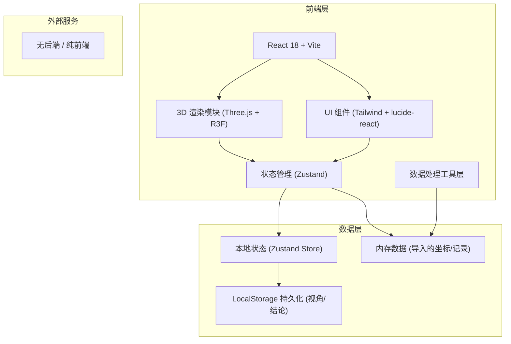
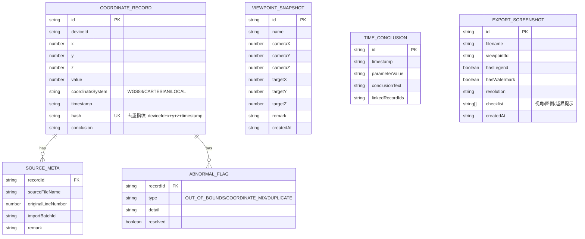

## 1. 架构设计



## 2. 技术描述

- **前端**：React 18 + TypeScript + Tailwind CSS 3 + Vite
- **初始化工具**：vite-init（react-ts 模板）
- **3D 渲染**：three + @react-three/fiber + @react-three/drei + @react-three/postprocessing
- **状态管理**：zustand
- **图标**：lucide-react
- **后端**：无（纯前端工具，数据在浏览器内存中处理）
- **数据库**：无（使用 LocalStorage 持久化视角、结论、导出历史）
- **Mock 数据**：内置示例海洋涡旋数据，便于评审员开箱即用

## 3. 路由定义

| Route | 用途 |
|-------|------|
| / | 3D 渲染主界面（默认路由，日常入口） |
| /export-review | 截图导出与讲解检查清单（月底/课前入口） |

## 4. 数据模型

### 4.1 数据模型定义



### 4.2 核心数据结构（TypeScript）

```typescript
// 坐标记录（含原始溯源信息）
interface CoordinateRecord {
  id: string;
  deviceId: string;
  x: number;
  y: number;
  z: number;
  value: number;          // 流场数值（速度/温度等）
  coordinateSystem: 'WGS84' | 'CARTESIAN' | 'LOCAL' | 'UNKNOWN';
  timestamp: string;
  hash: string;           // 去重指纹
  conclusion?: string;
  sourceMeta: SourceMeta;
  abnormalFlags: AbnormalFlag[];
}

interface SourceMeta {
  sourceFileName: string;
  originalLineNumber: number;
  importBatchId: string;
  remark?: string;
}

interface AbnormalFlag {
  type: 'OUT_OF_BOUNDS' | 'COORDINATE_MIX' | 'DUPLICATE';
  detail: string;
  resolved: boolean;
}

// 视角快照
interface ViewpointSnapshot {
  id: string;
  name: string;
  camera: { x: number; y: number; z: number };
  target: { x: number; y: number; z: number };
  remark?: string;
  createdAt: string;
}

// 时间参数与结论联动
interface TimeConclusion {
  id: string;
  timestamp: string;
  parameterValue: number;
  conclusionText: string;
  linkedRecordIds: string[];
}

// 截图导出记录
interface ExportScreenshot {
  id: string;
  filename: string;
  viewpointId?: string;
  hasLegend: boolean;
  hasWatermark: boolean;
  resolution: '1080p' | '2K' | '4K';
  checklist: { viewpoint: boolean; legend: boolean; outOfBounds: boolean };
  createdAt: string;
}
```

## 5. 核心模块目录

```
src/
├── components/
│   ├── three/              # 3D 场景相关组件
│   │   ├── FlowFieldScene.tsx      # 主场景
│   │   ├── EddyParticles.tsx       # 涡旋粒子
│   │   ├── FlowLines.tsx           # 流线
│   │   ├── ColorLegend.tsx         # 颜色图例（R3F Html）
│   │   ├── AxisGrid.tsx            # 坐标轴与网格
│   │   └── OutOfBoundsMarker.tsx   # 越界标记点
│   ├── ui/                 # 非 3D UI 组件
│   │   ├── ViewpointToolbar.tsx    # 视角保存工具栏
│   │   ├── DataImportPanel.tsx     # 数据导入面板
│   │   ├── TraceabilityPanel.tsx   # 溯源面板
│   │   ├── TimeSlider.tsx          # 时间轴
│   │   ├── ConclusionLink.tsx      # 结论跳转组件
│   │   ├── ScreenshotExportModal.tsx # 截图导出弹窗
│   │   └── ExportReviewList.tsx    # 导出清单（月底/课前）
│   └── layout/
│       └── AppLayout.tsx           # 三栏布局
├── store/
│   ├── useDataStore.ts     # 坐标记录、去重、异常
│   ├── useViewStore.ts     # 视角、相机状态
│   └── useExportStore.ts   # 截图导出、结论
├── utils/
│   ├── hash.ts             # 去重指纹计算
│   ├── coordinate.ts       # 坐标系检测与转换
│   ├── colorScale.ts       # 颜色映射（viridis/jet）
│   └── screenshot.ts       # 截图与水印工具
├── hooks/
│   ├── useCameraSync.ts    # 视角保存/恢复
│   └── useTimeLinkedConclusion.ts  # 时间-结论联动
├── pages/
│   ├── RenderView.tsx      # / 日常入口：3D 渲染
│   └── ExportReview.tsx    # /export-review 月底/课前入口
├── data/
│   └── mockEddyData.ts     # 内置示例数据
└── types/
    └── index.ts            # 全局类型定义
```
