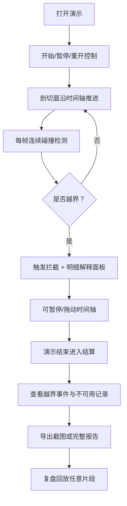

## 1. 产品概述

矿山边坡稳定演示是一款面向矿山安全评审场景的交互式浏览器应用，通过3D点云可视化边坡剖面，模拟剖切过程中的越界检测与连续碰撞判定，让评审会直观理解边坡稳定性风险。

- 解决问题：评审会无法直观理解剖切面越界为何被拦截、碰撞检测的时间维度逻辑
- 目标用户：矿山安全评审专家、边坡监测工程师、月底项目转交评审人员
- 核心价值：将枯燥的边坡监测数据转化为可交互演示，附带明细解释与可导出的证据报告

## 2. 核心功能

### 2.1 用户角色

| 角色 | 登录方式 | 核心权限 |
|------|---------|----------|
| 评审专家 | 直接访问（无需登录） | 运行演示、查看明细、导出报告、复盘回放 |

### 2.2 功能模块

1. **主演示页面**：3D点云边坡场景 + 剖切面实时演示 + 控制栏 + 时间轴
2. **明细解释面板**：碰撞检测数据、越界判定依据、时间参数记录、风险等级说明
3. **结算复盘页面**：本局演示结果总览、关键事件时间线、越界拦截记录、不可用记录标注
4. **导出报告模块**：带时间戳截图、越界明细表格、检测逻辑说明文档

### 2.3 页面详情

| 页面名称 | 模块名称 | 功能描述 |
|---------|---------|----------|
| 主演示页 | 3D点云场景 | 渲染边坡点云模型，支持旋转/缩放/平移，实时显示移动剖切面 |
| 主演示页 | 剖切面可视化 | 显示半透明剖切平面，标注安全边界与越界区域，带距离数值 |
| 主演示页 | 控制栏 | 开始/暂停/重开按钮，播放速度调节（0.5x/1x/2x） |
| 主演示页 | 时间轴 | 可拖动进度条，显示关键事件标记（碰撞点、越界点） |
| 主演示页 | 左侧明细面板 | 实时显示当前帧检测数据：点云数量、剖切面位置、最小距离、碰撞状态 |
| 主演示页 | 右侧风险说明 | 当前风险等级解释、越界判定阈值、拦截原因逐条说明 |
| 结算复盘页 | 结果总览 | 本局演示总时长、越界次数、最大风险等级、不可用记录数 |
| 结算复盘页 | 事件时间线 | 按时间顺序展示所有碰撞/越界事件，点击跳转对应帧 |
| 结算复盘页 | 不可用记录标注 | 高亮标注数据缺失、传感器异常、参数缺失等不可用记录及原因 |
| 结算复盘页 | 复盘回放控件 | 支持按事件跳转、逐帧前进/后退、重新播放本局 |
| 导出报告 | 截图导出 | 导出当前帧PNG，自动叠加时间参数与检测数值水印 |
| 导出报告 | 完整报告 | 导出HTML/PDF报告，包含所有越界事件截图、明细表、判定逻辑说明 |

## 3. 核心流程

评审专家打开应用 → 点击「开始演示」→ 剖切面沿时间轴推进 → 每帧连续检测碰撞距离 → 检测到越界时立即拦截并显示明细解释 → 可随时暂停/拖动时间轴查看任意帧 → 演示结束进入结算页 → 查看所有越界事件与不可用记录 → 导出带时间戳的截图或完整报告 → 可复盘回放任意片段

## 4. 用户界面设计

### 4.1 设计风格

- **主色**：矿岩橙 #E87722（边坡岩土感）+ 深矿蓝 #1B3A5C（专业安全）+ 警示红 #D7263D（越界预警）+ 安全绿 #2E7D32
- **辅助色**：中性灰 #4A5568、浅灰背景 #F7FAFC
- **按钮风格**：方形微圆角（4px），点击有下沉效果，主要按钮使用矿岩橙渐变
- **字体**：显示字体使用 "Space Grotesk"（工程感），正文字体使用 "IBM Plex Sans"（清晰可读）
- **布局风格**：暗色仪表盘风格，3D场景居中占主要区域，左右两侧为信息面板，底部时间轴与控制栏
- **图标风格**：线性工程图标，使用 Lucide Icons 风格

### 4.2 页面设计概览

| 页面名称 | 模块名称 | UI元素 |
|---------|---------|--------|
| 主演示页 | 3D场景 | 深色背景带噪声纹理，点云粒子发光效果，剖切面半透明橙红色，越界区域红色闪烁标注 |
| 主演示页 | 左侧明细面板 | 深色卡片，数据指标用大字号 monospace 字体，实时刷新数字滚动动画 |
| 主演示页 | 右侧说明面板 | 白色卡片，风险等级用色块 + 文字说明双标识，判定逻辑用有序列表清晰呈现 |
| 主演示页 | 底部控制区 | 深灰背景栏，时间轴用蓝-橙-红渐变表示风险递增，关键事件用菱形标记 |
| 结算复盘页 | 顶部统计区 | 四个数据卡片，关键数值用大号彩色字体展示 |
| 结算复盘页 | 时间线区域 | 竖向时间线，事件节点用不同颜色区分，悬停显示摘要 |
| 结算复盘页 | 不可用记录区 | 红色边框警示卡片，逐条列出不可用原因与影响范围 |

### 4.3 响应式设计

- 桌面端优先（≥1280px），三栏布局：左侧明细 + 中间3D场景 + 右侧说明
- 平板端（768-1279px）：上下布局，3D场景在上，信息面板折叠为可切换标签
- 移动端（<768px）：单列布局，3D场景自适应，面板可通过底部导航切换

### 4.4 3D场景指引

- **环境**：暗蓝夜空渐变背景 + 微弱地面网格，营造专业监测室氛围
- **光照**：主方向光 + 环境光，点云粒子自发光以增强可读性
- **相机**：默认45°俯视边坡，支持轨道控制（OrbitControls）
- **焦点元素**：移动中的剖切面始终保持高亮，越界瞬间有脉冲发光动画
- **交互**：鼠标悬停点云粒子显示该点坐标与高度，点击暂停并跳转明细
- **后处理**：轻微泛光（Bloom）效果增强科技感，越界时增加红色色偏闪烁
- **性能**：点云使用 Points 几何体批量渲染，控制在 5000-10000 个点以保证 60fps
