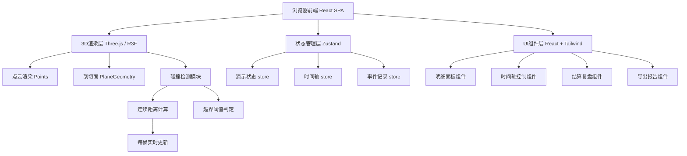

## 1. 架构设计



## 2. 技术描述

- **前端框架**: React@18 + TypeScript
- **构建工具**: Vite@5
- **样式方案**: Tailwind CSS@3
- **3D渲染**: three@0.160 + @react-three/fiber@8 + @react-three/drei@9
- **后处理效果**: @react-three/postprocessing@2
- **状态管理**: zustand@4
- **图标库**: lucide-react@0.300
- **图表展示**: recharts@2
- **截图导出**: html2canvas@1.4 + 原生 Canvas API
- **报告导出**: 纯HTML模板生成（无需额外服务端）
- **后端**: 无（纯前端静态应用，Mock数据内置）

## 3. 路由定义

| 路由 | 用途 |
|-----|------|
| / | 主演示页面（默认入口，包含3D场景+控制面板+明细） |
| /review | 结算复盘页面（展示本局结果、时间线、不可用记录） |

## 4. 数据模型

### 4.1 核心数据结构

```typescript
// 边坡点云数据点
interface SlopePoint {
  id: string;
  x: number;
  y: number;
  z: number;
  height: number;
  riskLevel: 'safe' | 'warning' | 'danger';
  sensorId?: string;
}

// 剖切面状态
interface CuttingPlane {
  position: number; // 沿X轴推进位置
  normal: [number, number, number];
  thickness: number;
  isOutOfBounds: boolean;
  minDistance: number; // 到最近危险点的距离
}

// 检测事件
interface DetectionEvent {
  id: string;
  timestamp: number; // 演示时间（秒）
  frameIndex: number;
  type: 'collision' | 'out-of-bounds' | 'warning' | 'data-missing';
  planePosition: number;
  minDistance: number;
  threshold: number;
  involvedPoints: string[];
  description: string;
  isRecordUsable: boolean;
  unusableReason?: string;
}

// 演示会话状态
interface DemoSession {
  id: string;
  startTime: Date;
  status: 'idle' | 'playing' | 'paused' | 'finished';
  currentTime: number; // 当前演示进度（秒）
  totalDuration: number;
  playSpeed: 0.5 | 1 | 2;
  plane: CuttingPlane;
  events: DetectionEvent[];
  outOfBoundsCount: number;
  maxRiskLevel: 'safe' | 'warning' | 'danger';
  unusableRecords: DetectionEvent[];
}
```

### 4.2 Mock数据配置

内置以下Mock数据集：
- 边坡点云：约8000个模拟点，覆盖30m×20m×15m区域，含预设的危险区域
- 越界阈值配置：安全距离 ≥ 2.0m，预警距离 1.0-2.0m，越界 < 1.0m
- 预设事件：5个越界事件、3个数据缺失/传感器异常事件、8个预警事件
- 不可用记录：标注传感器离线（2条）、点云数据缺失（1条）、参数未校准（1条）

## 5. 核心算法

### 5.1 连续碰撞检测（非一次性）
- 每帧更新剖切面位置后，计算所有点云点到平面的有符号距离
- 维护一个"最小距离时间序列"，用于趋势判断而非单点判断
- 越界判定条件：连续3帧最小距离 < 阈值（避免单点误报）

### 5.2 点云距离计算
```
点P到平面ax + by + cz + d = 0的距离：
distance = |a*Px + b*Py + c*Pz + d| / sqrt(a² + b² + c²)
```

### 5.3 剖切面推进逻辑
- 沿X轴从 -15m 匀速推进至 +15m，总时长30秒（默认1倍速）
- 位置 = 起始位置 + (推进速度 × 当前时间)
- 支持拖动时间轴跳转到任意帧并重算检测结果
```
