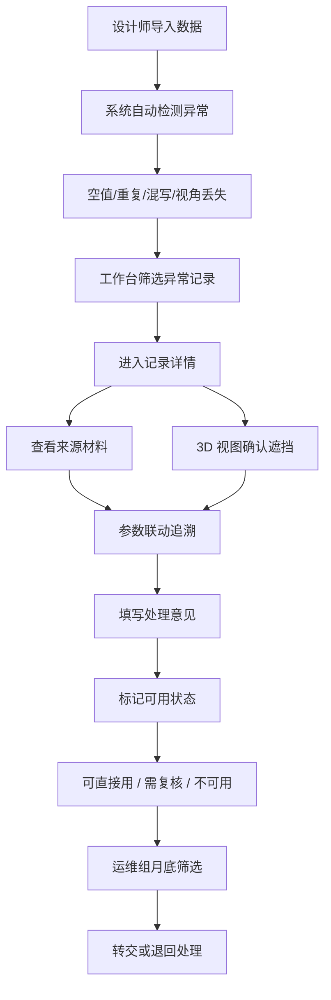

## 1. 产品概述

音乐厅声线遮挡模型管理系统，面向规划设计师和运维组，解决声线遮挡处理过程中记录散乱、前后差异易丢失、异常数据难追溯的问题。系统以数据质量为核心，导入即筛选异常，明细与3D联动呈现，让运维组在月底转交时能一眼区分"直接可用"与"需设计师复核"的记录。

## 2. 核心功能

### 2.1 用户角色

| 角色 | 使用场景 | 核心诉求 |
|------|----------|----------|
| 规划设计师 | 日常导入声线数据、处理异常、记录处理意见 | 导入快、异常清、联动稳，不用再靠便签记过程 |
| 运维组 | 月底批量复核、转交记录 | 一眼区分哪些记录能用、哪些要退回，不被无效数据淹没 |

### 2.2 功能模块

1. **数据工作台**：数据导入、异常筛选、记录列表、状态一览
2. **记录详情**：来源材料、处理意见、参数联动、变更痕迹
3. **3D 声线视图**：音乐厅模型渲染、声线可视化、相机视角管理

### 2.3 页面详情

| 页面名称 | 模块名称 | 功能描述 |
|----------|----------|----------|
| 数据工作台 | 导入区 | 支持 JSON/CSV 批量导入，内置重复导入测试用例，导入时即时检测空值、重复坐标、备注混写 |
| 数据工作台 | 异常筛选器 | 按异常类型（空坐标/重复记录/备注混写/相机视角丢失）筛选，按可用状态（可直接用/需复核/不可用）筛选 |
| 数据工作台 | 记录列表 | 每行显示记录 ID、来源批次、异常标签、可用状态、最近处理人，支持批量标记状态 |
| 记录详情 | 来源材料面板 | 展示原始导入数据、导入时间、导入批次，参数变更时高亮联动回来源字段 |
| 记录详情 | 处理意见面板 | 规划设计师填写处理结论、修改建议、复核状态，支持多轮备注留痕 |
| 记录详情 | 参数联动区 | 修改结论参数时，自动追溯并高亮来源材料中的对应字段，前后差异对比显示 |
| 3D 声线视图 | 模型渲染 | Three.js 加载音乐厅几何模型与声线数据，支持旋转/缩放/平移 |
| 3D 声线视图 | 视角管理 | 预设视角快速切换，相机视角异常记录标注"视角丢失"警告标记 |
| 3D 声线视图 | 遮挡高亮 | 点击声线段时高亮对应的遮挡面与来源参数，与详情面板联动 |

## 3. 核心流程

规划设计师导入一批声线数据 → 系统自动检测异常（空值/重复/备注混写/视角丢失）→ 设计师在列表中筛选异常 → 点击进入详情查看来源材料 → 在 3D 视图中确认声线遮挡情况 → 填写处理意见并标记可用状态 → 运维组月底筛选"需复核"和"不可用"记录 → 转交或退回处理。

## 4. 用户界面设计

### 4.1 设计风格

- **主色**：深空蓝 `#0B1B2E` — 呼应声学工程的严谨与专业
- **辅色**：琥珀橙 `#F59E0B`（异常标记）、翡翠绿 `#10B981`（可直接用）、玫瑰红 `#F43F5E`（不可用）、灰蓝 `#64748B`（需复核）
- **按钮风格**：方角、细边框、低饱和度，hover 时轻微上浮+边框高亮
- **字体**：标题用 `Space Grotesk` 几何无衬线体现工程感，正文用 `IBM Plex Sans` 保证数据表格可读性
- **布局风格**：三栏式工作台（左筛选/中列表/右详情预览），详情页双栏（左数据/右3D）
- **图标风格**：线性细描边图标，统一 1.5px 线宽，不使用 emoji

### 4.2 页面设计概览

| 页面名称 | 模块名称 | UI 要点 |
|----------|----------|----------|
| 数据工作台 | 整体布局 | 深色背景，顶部窄导航+左侧筛选+中间数据表格+右侧浮动预览卡，状态标签用彩色圆角胶囊 |
| 数据工作台 | 异常筛选器 | 复选框按异常类型分组，选中时标签背景填充对应色，支持"只看异常"一键切换 |
| 数据工作台 | 记录列表 | 斑马纹+行hover高亮，异常记录左侧显示竖条色标（橙/红），可用状态列用圆点+文字 |
| 记录详情 | 来源材料面板 | 等宽字体显示原始数据，参数联动时目标字段黄色闪烁高亮，变更前/后用删除线+下划线对比 |
| 记录详情 | 处理意见面板 | 时间线式留言卡，每轮处理显示头像+时间+状态标签，最新一条置顶 |
| 3D 声线视图 | 渲染区 | 占满右栏，底部悬浮工具栏（视角切换/重置/截图），左上角显示当前视角名称与异常警告 |
| 3D 声线视图 | 视角丢失提示 | 红色边框闪烁 + 顶部警告条，提示"该记录相机视角已丢失，请设计师重新标定" |

### 4.3 响应式

- Desktop-first，最小支持宽度 1280px
- 1280~1440px：三栏压缩间距，表格减少次要列
- <1280px：右侧预览改为弹窗，3D 视图切换到独立标签页

### 4.4 3D 场景指引

- **环境**：纯深色背景，微弱环境光 + 两盏平行光模拟音乐厅舞台照明
- **光照**：Key Light 从左上 45° 打向舞台区域，Fill Light 从右下方补光，声线本身使用自发光材质
- **相机设置**：默认 PerspectiveCamera，fov 50，近平面 0.1，远平面 1000；初始视角为厅内中轴偏后位置
- **交互**：OrbitControls 允许自由旋转/缩放，阻尼开启；双击声线段触发与详情面板的联动高亮
- **后期处理**：轻微 Bloom 让声线有发光感，FXAA 抗锯齿
- **性能预算**：单场景三角形 < 50万，声线条数 < 2000 条时保持 60fps
