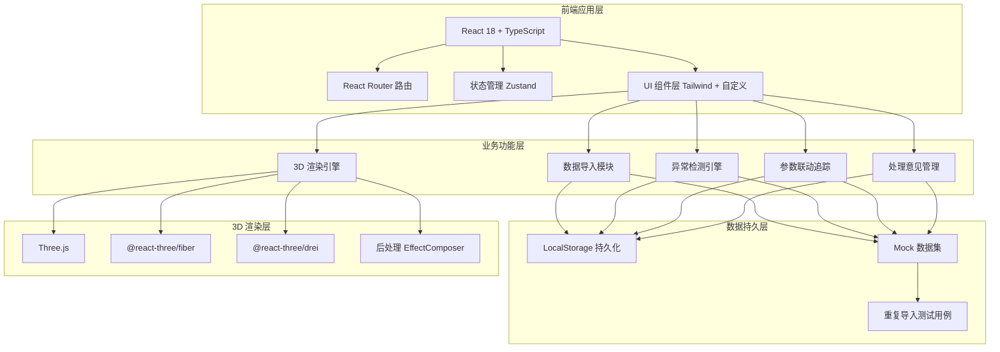
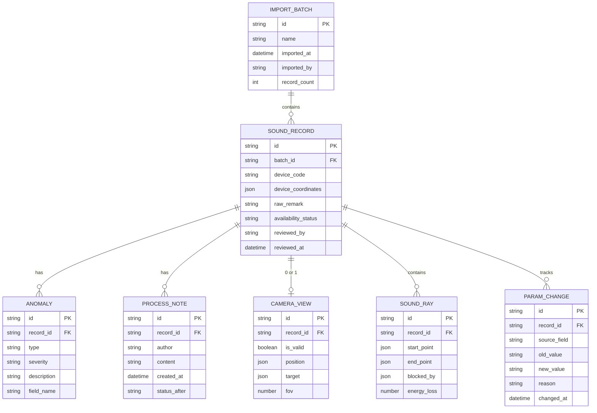

## 1. 架构设计



## 2. 技术栈说明

- **前端框架**：React 18 + TypeScript + Vite 5
- **路由**：React Router v6（Hash 模式，纯前端部署）
- **状态管理**：Zustand — 轻量、无 Provider 嵌套，适合多面板联动场景
- **样式**：Tailwind CSS 3 + CSS Variables 主题系统
- **3D 渲染**：three @0.160 + @react-three/fiber @8.15 + @react-three/drei @9.92 + @react-three/postprocessing
- **数据导入**：papaparse（CSV 解析）+ 原生 FileReader
- **工具库**：lodash-es（去重/深比较）、date-fns（时间格式化）、lucide-react（图标）
- **数据持久化**：localStorage + zustand persist 中间件
- **无后端**：全部数据本地 Mock，内置重复导入、视角丢失等典型异常测试用例

## 3. 路由定义

| 路由 | 页面 | 说明 |
|------|------|------|
| `/` | 数据工作台 | 默认页，三栏布局：左筛选 / 中列表 / 右浮动预览 |
| `/record/:id` | 记录详情页 | 双栏布局：左来源材料+处理意见 / 右3D视图 |
| `/test/reimport` | 重复导入测试页 | 预置场景，用于验证重复导入去重逻辑是否正常 |

## 4. 数据模型

### 4.1 数据模型 ER 图



### 4.2 TypeScript 类型定义

```typescript
export type AvailabilityStatus = 'usable' | 'review_needed' | 'unusable';
export type AnomalyType = 'empty_coordinate' | 'duplicate_record' | 'remark_mixed' | 'camera_view_lost';
export type AnomalySeverity = 'warning' | 'error';

export interface ImportBatch {
  id: string;
  name: string;
  importedAt: string;
  importedBy: string;
  recordCount: number;
}

export interface DeviceCoordinates {
  x: number | null;
  y: number | null;
  z: number | null;
}

export interface SoundRecord {
  id: string;
  batchId: string;
  deviceCode: string;
  deviceCoordinates: DeviceCoordinates;
  rawRemark: string;
  availabilityStatus: AvailabilityStatus;
  reviewedBy?: string;
  reviewedAt?: string;
  anomalies: Anomaly[];
  processNotes: ProcessNote[];
  cameraView?: CameraView;
  soundRays: SoundRay[];
  paramChanges: ParamChange[];
}

export interface Anomaly {
  id: string;
  recordId: string;
  type: AnomalyType;
  severity: AnomalySeverity;
  description: string;
  fieldName?: string;
}

export interface ProcessNote {
  id: string;
  recordId: string;
  author: string;
  content: string;
  createdAt: string;
  statusAfter: AvailabilityStatus;
}

export interface CameraView {
  id: string;
  recordId: string;
  isValid: boolean;
  position: [number, number, number];
  target: [number, number, number];
  fov: number;
}

export interface SoundRay {
  id: string;
  recordId: string;
  startPoint: [number, number, number];
  endPoint: [number, number, number];
  blockedBy?: string;
  energyLoss: number;
}

export interface ParamChange {
  id: string;
  recordId: string;
  sourceField: string;
  oldValue: string;
  newValue: string;
  reason: string;
  changedAt: string;
}
```

### 4.3 异常检测规则

| 异常类型 | 检测规则 | 严重级别 |
|----------|----------|----------|
| 空坐标（empty_coordinate） | deviceCoordinates 中 x/y/z 任意一项为 null 或 undefined | error |
| 重复记录（duplicate_record） | 同一批次内 deviceCode 重复 或 坐标三元组 (x,y,z) 完全重复 | error |
| 备注混写（remark_mixed） | rawRemark 中同时包含中文、英文、数字且无分隔符，或含特殊符号（/ \ | 等）超过 2 个 | warning |
| 相机视角丢失（camera_view_lost） | cameraView 不存在或 cameraView.isValid === false | error |

## 5. 状态管理结构（Zustand Store）

```typescript
// store/records.ts
interface RecordsState {
  batches: ImportBatch[];
  records: SoundRecord[];
  selectedRecordId: string | null;
  filters: {
    anomalyTypes: AnomalyType[];
    statuses: AvailabilityStatus[];
    onlyWithAnomalies: boolean;
    keyword: string;
  };
  // actions
  importBatch: (file: File) => Promise<{ batch: ImportBatch; newRecords: SoundRecord[] }>;
  detectAnomalies: (records: SoundRecord[]) => Anomaly[];
  setSelectedRecord: (id: string | null) => void;
  toggleAnomalyFilter: (type: AnomalyType) => void;
  toggleStatusFilter: (status: AvailabilityStatus) => void;
  setOnlyWithAnomalies: (v: boolean) => void;
  addProcessNote: (recordId: string, note: Omit<ProcessNote, 'id' | 'createdAt'>) => void;
  updateAvailabilityStatus: (recordId: string, status: AvailabilityStatus) => void;
}
```

## 6. 目录结构

```
src/
├── components/
│   ├── layout/          # 顶部导航、三栏布局容器
│   ├── filters/         # 异常筛选器组件
│   ├── table/           # 记录列表表格组件
│   ├── record/          # 详情页：来源材料、处理意见、参数联动
│   ├── three/           # 3D 场景：Canvas 包装、音乐厅模型、声线渲染
│   └── common/          # 按钮、标签、状态徽标等通用组件
├── pages/
│   ├── Workbench.tsx    # 数据工作台
│   ├── RecordDetail.tsx # 记录详情页
│   └── ReimportTest.tsx # 重复导入测试页
├── store/
│   └── records.ts       # Zustand 全局状态 + 异常检测逻辑
├── types/
│   └── index.ts         # 全局 TypeScript 类型
├── mock/
│   ├── batches.ts       # Mock 导入批次数据
│   ├── records.ts       # Mock 声线记录（含各类异常）
│   ├── hallGeometry.ts  # 音乐厅 3D 几何数据
│   └── reimportCase.ts  # 重复导入测试用例
├── utils/
│   ├── anomalyDetector.ts # 异常检测规则引擎
│   ├── csvParser.ts     # CSV/JSON 解析
│   └── formatters.ts    # 时间、坐标格式化
├── hooks/
│   └── useParamLinkage.ts # 参数联动追踪 Hook
├── styles/
│   └── index.css        # Tailwind 指令 + 主题 CSS 变量
├── App.tsx
├── main.tsx
└── vite-env.d.ts
```
