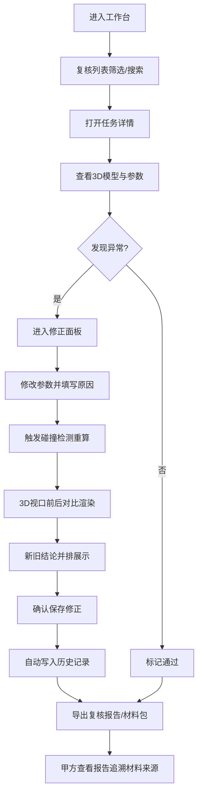

## 1. 产品概述

桥梁裂缝点云复核本地 Web 工作台，面向展馆讲解员，用于统一复核不同口径的时间参数、截图清单与三维模型材料，消除人工猜测成本。产品支持复核列表管理、详情查看、参数修正、完整历史追溯、报告下载，并在碰撞检测判断变更时提供 3D 前后差异可视化。

- 目标用户：展馆讲解员、甲方审查人员
- 核心痛点：多方材料口径不一致、人工复核成本高、变更影响范围不透明、问题来源难以追溯

## 2. 核心特性

### 2.1 用户角色

| 角色 | 注册方式 | 核心权限 |
|------|----------|----------|
| 展馆讲解员 | 本地登录/默认账号 | 列表浏览、详情查看、参数修正、历史查看、下载导出 |
| 甲方审查 | 只读模式访问 | 仅查看最终报告与材料关联追溯 |

### 2.2 功能模块

1. **复核列表页**：裂缝任务清单、状态筛选、搜索、批量操作
2. **复核详情页**：参数面板、3D 模型渲染、截图清单、时间参数对比
3. **修正面板**：时间参数/单位换算修正、碰撞检测重算、变更原因记录
4. **历史追溯页**：变更时间线、操作人、变更前后值、原因备注
5. **下载导出**：复核报告 PDF、材料清单、模型重叠定位说明

### 2.3 页面详情

| 页面名称 | 模块名称 | 功能描述 |
|----------|----------|----------|
| 复核列表页 | 顶部导航 | 工作台标题、用户切换、搜索框 |
| 复核列表页 | 筛选栏 | 状态筛选（待复核/复核中/已通过/有冲突）、桥梁编号、日期范围 |
| 复核列表页 | 数据表格 | 任务编号、桥梁名称、裂缝数、提交人、提交时间、状态、操作列 |
| 复核列表页 | 批量操作 | 批量导出、批量标记状态 |
| 复核详情页 | 左侧参数面板 | 时间参数（采集/处理/复核）、单位换算信息、碰撞检测结果 |
| 复核详情页 | 中间 3D 视口 | 三维点云渲染、裂缝高亮、前后对比切换、重叠区域标注 |
| 复核详情页 | 右侧材料清单 | 截图缩略图列表、来源材料标注、关联模型文件 |
| 复核详情页 | 底部结论对比 | 旧结论 vs 新结论并排展示、差异高亮 |
| 修正面板 | 参数编辑 | 时间参数修正、单位换算修正（带原数值回显） |
| 修正面板 | 碰撞重算 | 触发碰撞检测、显示检测过程、结果差异标注 |
| 修正面板 | 原因备注 | 必填变更原因、操作人自动填充 |
| 历史追溯页 | 时间线 | 按倒序展示所有变更操作节点 |
| 历史追溯页 | 变更详情 | 变更字段、原值/新值、操作人、操作时间、原因说明 |
| 历史追溯页 | 过滤器 | 按字段类型、操作人、时间范围过滤 |
| 下载导出 | 报告生成 | 包含结论、变更历史、材料来源、重叠定位的完整复核报告 |
| 下载导出 | 材料包 | 截图清单打包、模型文件索引、时间参数对照表 |

## 3. 核心流程

展馆讲解员从复核列表进入某条裂缝任务，查看 3D 模型与参数详情，发现单位换算或时间参数异常后进入修正模式；修正时填写变更原因并触发碰撞重算，系统在 3D 视口中同时渲染修正前后状态，并排展示新旧结论；所有操作自动写入历史记录；最终导出复核报告供甲方查看，甲方可从报告中定位模型重叠对应的原始材料。

## 4. 用户界面设计

### 4.1 设计风格

- **主色调**：工程蓝 `#1e40af`（稳重可信），警示橙 `#ea580c`（冲突/异常），通过绿 `#16a34a`
- **中性色**：深色石板灰背景 `#0f172a`，卡片 `#1e293b`，分割线 `#334155`，营造工程监控氛围
- **按钮风格**：扁平直角矩形，2px 描边，悬停时填充主色并伴随轻微位移
- **字体**：标题使用 JetBrains Mono（等宽工程感），正文使用 Noto Sans SC；字号层级：12/14/16/20/28
- **布局风格**：三栏工作台（参数栏 + 3D 视口 + 材料清单），固定顶栏，底部结论对比抽屉
- **图标风格**：lucide-react 线性图标，搭配工程感装饰线（细斜纹、栅格背景）

### 4.2 页面设计概览

| 页面名称 | 模块名称 | UI 元素 |
|----------|----------|----------|
| 复核列表页 | 数据表格 | 斑马行、状态色标签、悬停高亮、操作按钮组 |
| 复核列表页 | 筛选栏 | 下拉筛选器、日期范围、搜索输入框、重置按钮 |
| 复核详情页 | 3D 视口 | 点云渲染画布、视角控制球、层叠切换按钮、差异高亮遮罩 |
| 复核详情页 | 参数面板 | 分组折叠卡片、原值/新值对比色、编辑态高亮边框 |
| 复核详情页 | 结论对比 | 双栏并排、差异字段闪烁高亮、影响范围标记 |
| 修正面板 | 弹窗表单 | 必填项星号、原因输入框多行、操作人自动回显、提交/取消 |
| 历史追溯页 | 时间线 | 竖轴节点、圆点状态色、悬停展开详情、筛选侧栏 |
| 下载导出 | 卡片选择 | 下载类型卡片（报告/材料包/对照表）、预览缩略图、生成进度条 |

### 4.3 响应式

桌面端优先（≥1440px），三栏固定布局；1024–1440px 材料清单折叠为可展开侧栏；<1024px 转为纵向堆叠，3D 视口保持全屏宽度。所有交互支持鼠标悬停反馈与键盘 Tab 导航。

### 4.4 3D 场景指引

- **环境**：深色工程栅格地板，低饱和度雾效营造专业测量氛围
- **光照**：单方向平行光模拟工程灯 + 半球光柔化阴影，裂缝处增加点光源强调
- **相机**：默认正交投影俯视 45°，支持轨道控制、缩放、平移，预设视角快捷按钮
- **构图**：桥梁主体居中，裂缝区域自动放大并添加边框高亮，重叠区域半透明红膜覆盖
- **交互**：点击裂缝显示 ID 与参数浮层，切换"修正前/后/并排"视图模式，重叠区域点击跳转关联材料
- **后处理**：轻微 Bloom 突出裂缝高亮区，轮廓描边增强模型边缘可读性
- **资源预算**：单模型点云限制 50 万点以内，使用 InstancedMesh 优化渲染性能
