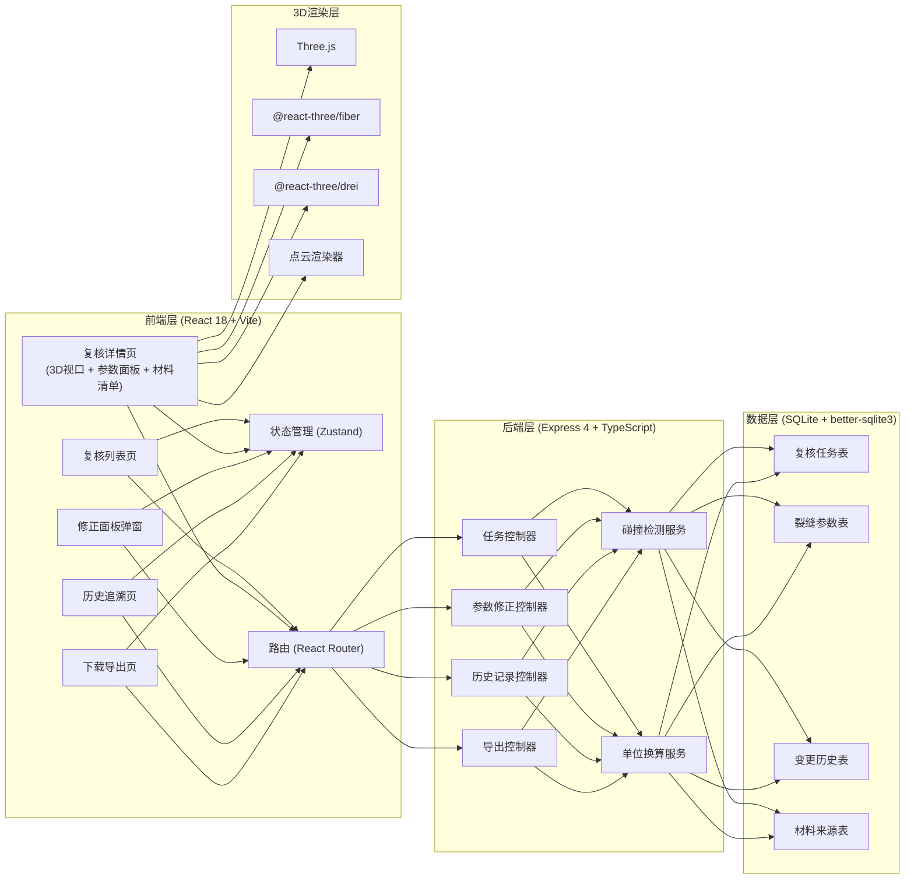
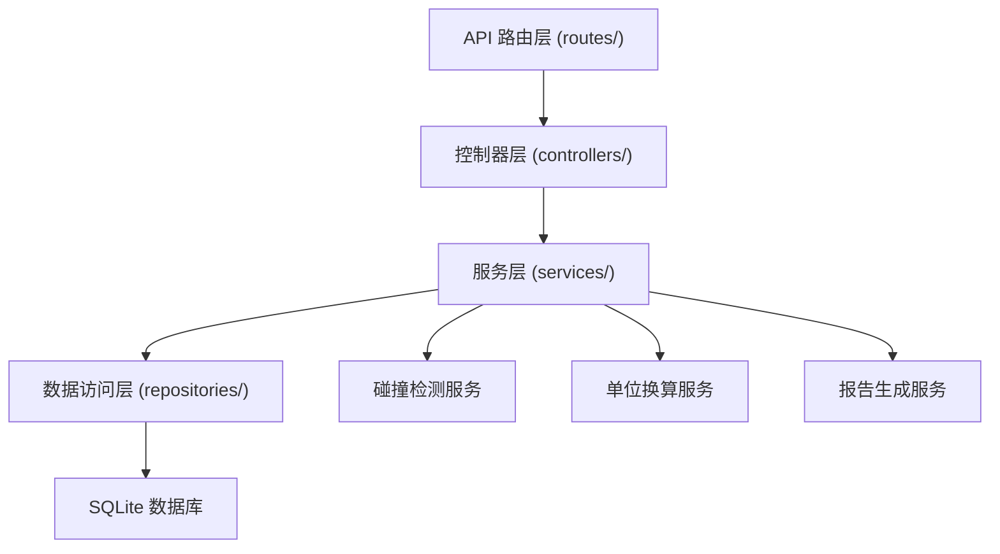
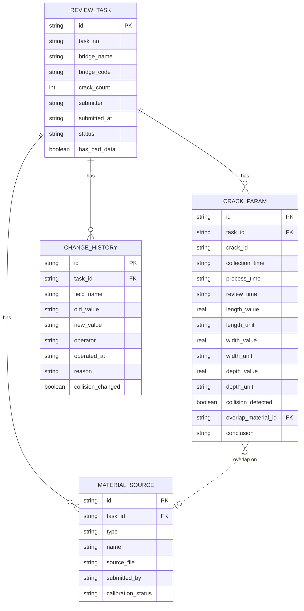

## 1. 架构设计



## 2. 技术描述

- **前端**：React@18 + TypeScript + Tailwind CSS@3 + Vite
- **初始化工具**：vite-init（react-express-ts 模板）
- **后端**：Express@4 + TypeScript + ESM
- **数据库**：SQLite（better-sqlite3），本地文件存储，含初始化 mock 数据
- **3D 渲染**：three@0.160 + @react-three/fiber@8 + @react-three/drei@9
- **状态管理**：zustand@4
- **路由**：react-router-dom@6
- **图标**：lucide-react
- **导出**：前端生成 JSON/CSV 报告，后端生成结构化数据

## 3. 路由定义

| 路由 | 用途 |
|------|------|
| `/` | 复核列表页（首页） |
| `/review/:id` | 复核详情页（含 3D 视口、参数、材料清单、结论对比） |
| `/review/:id/history` | 历史追溯页 |
| `/export` | 下载导出页 |

## 4. API 定义

```typescript
// 复核任务
interface ReviewTask {
  id: string;
  taskNo: string;
  bridgeName: string;
  bridgeCode: string;
  crackCount: number;
  submitter: string;
  submittedAt: string;
  status: 'pending' | 'reviewing' | 'passed' | 'conflict';
  hasBadData: boolean;
}

// 裂缝参数
interface CrackParams {
  id: string;
  taskId: string;
  crackId: string;
  collectionTime: string;
  processTime: string;
  reviewTime: string;
  lengthValue: number;
  lengthUnit: 'mm' | 'cm' | 'm';
  widthValue: number;
  widthUnit: 'mm' | 'cm';
  depthValue: number;
  depthUnit: 'mm' | 'cm';
  collisionDetected: boolean;
  overlapMaterialId?: string;
  conclusion: string;
}

// 变更历史
interface ChangeHistory {
  id: string;
  taskId: string;
  fieldName: string;
  oldValue: string;
  newValue: string;
  operator: string;
  operatedAt: string;
  reason: string;
  collisionChanged: boolean;
}

// 材料来源
interface MaterialSource {
  id: string;
  taskId: string;
  type: 'screenshot' | 'model' | 'time_record';
  name: string;
  sourceFile: string;
  submittedBy: string;
  calibrationStatus: 'calibrated' | 'uncalibrated' | 'conflict';
}

// API 响应
interface ApiResponse<T> {
  code: number;
  data: T;
  message?: string;
}
```

**REST 端点：**
- `GET /api/tasks` - 获取任务列表（支持筛选、搜索）
- `GET /api/tasks/:id` - 获取任务详情（含参数、材料）
- `PUT /api/tasks/:id/status` - 更新任务状态
- `PUT /api/tasks/:id/params` - 修正参数（触发碰撞重算，写入历史）
- `POST /api/tasks/:id/recalculate` - 触发碰撞检测重算
- `GET /api/tasks/:id/history` - 获取变更历史
- `GET /api/tasks/:id/materials` - 获取材料清单
- `GET /api/export/report/:id` - 导出复核报告
- `GET /api/export/materials/:id` - 导出材料包

## 5. 服务端架构图



## 6. 数据模型

### 6.1 数据模型定义



### 6.2 数据初始化脚本

数据库使用 SQLite，通过 migrations 目录下的 SQL 脚本初始化，包含：
- 4 张核心表建表语句与索引
- 5 条 mock 复核任务（其中 1 条含典型坏数据：单位换算错误 mm 误记为 cm，导致长度值夸大 10 倍）
- 对应裂缝参数与材料来源数据
- 预置 2 条历史变更记录用于演示历史追溯功能

坏数据设计（符合日常材料混入特征）：
- 裂缝 C-003 的 `length_unit` 被误写为 `cm`，实际应为 `mm`
- `collection_time` 与 `process_time` 口径不一致（一份用北京时间 UTC+8，一份用 UTC）
- 关联材料 `M-007` 的 `calibration_status` 为 `uncalibrated`，与其他材料冲突
- 碰撞检测因单位错误误报重叠区域
